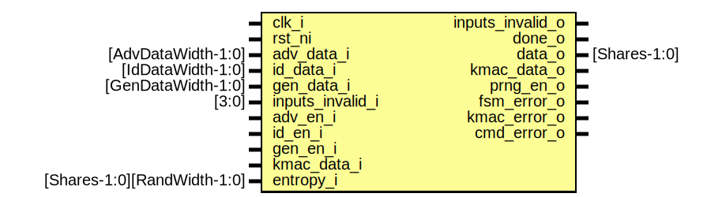

# Entity: keymgr_kmac_if

- **File**: keymgr_kmac_if.sv
## Diagram

## Description

 Copyright lowRISC contributors.
 Licensed under the Apache License, Version 2.0, see LICENSE for details.
 SPDX-License-Identifier: Apache-2.0

 Key manager interface to kmac

## Ports

| Port name        | Direction | Type                        | Description                                  |
| ---------------- | --------- | --------------------------- | -------------------------------------------- |
| clk_i            | input     |                             |                                              |
| rst_ni           | input     |                             |                                              |
| adv_data_i       | input     | [AdvDataWidth-1:0]          |  data input interfaces                       |
| id_data_i        | input     | [IdDataWidth-1:0]           |                                              |
| gen_data_i       | input     | [GenDataWidth-1:0]          |                                              |
| inputs_invalid_i | input     | [3:0]                       |                                              |
| inputs_invalid_o | output    |                             |                                              |
| adv_en_i         | input     |                             |  keymgr control to select appropriate inputs |
| id_en_i          | input     |                             |                                              |
| gen_en_i         | input     |                             |                                              |
| done_o           | output    |                             |                                              |
| data_o           | output    | [Shares-1:0]                |                                              |
| kmac_data_o      | output    |                             |  actual connection to kmac                   |
| kmac_data_i      | input     |                             |                                              |
| prng_en_o        | output    |                             |  entropy input                               |
| entropy_i        | input     | [Shares-1:0][RandWidth-1:0] |                                              |
| fsm_error_o      | output    |                             |  error outputs                               |
| kmac_error_o     | output    |                             |                                              |
| cmd_error_o      | output    |                             |                                              |
## Signals

| Name             | Type                                       | Description                                                                                                                  |
| ---------------- | ------------------------------------------ | ---------------------------------------------------------------------------------------------------------------------------- |
| id_data          | logic [MaxRounds-1:0][KmacDataIfWidth-1:0] |                                                                                                                              |
| gen_data         | logic [MaxRounds-1:0][KmacDataIfWidth-1:0] |                                                                                                                              |
| cnt              | logic [CntWidth-1:0]                       |                                                                                                                              |
| rounds           | logic [CntWidth-1:0]                       |                                                                                                                              |
| decoy_data       | logic [KmacDataIfWidth-1:0]                |                                                                                                                              |
| valid            | logic                                      |                                                                                                                              |
| last             | logic                                      |                                                                                                                              |
| strb             | logic [IfBytes-1:0]                        |                                                                                                                              |
| cnt_clr          | logic                                      |                                                                                                                              |
| cnt_set          | logic                                      |                                                                                                                              |
| cnt_en           | logic                                      |                                                                                                                              |
| start            | logic                                      |                                                                                                                              |
| inputs_invalid_d | logic [3:0]                                |                                                                                                                              |
| inputs_invalid_q | logic [3:0]                                |                                                                                                                              |
| clr_err          | logic                                      |                                                                                                                              |
| state_q          | data_state_e                               |                                                                                                                              |
| state_d          | data_state_e                               |                                                                                                                              |
| cnt_err          | logic                                      |                                                                                                                              |
| state_raw_q      | logic [StateWidth-1:0]                     |  This primitive is used to place a size-only constraint on the  flops in order to prevent FSM state encoding optimizations.  |
| adv_sel          | logic [CntWidth-1:0]                       |                                                                                                                              |
| id_sel           | logic [CntWidth-1:0]                       |                                                                                                                              |
| gen_sel          | logic [CntWidth-1:0]                       |                                                                                                                              |
| enables          | logic [2:0]                                |  the enables must be 1 hot                                                                                                   |
| enables_sub      | logic [2:0]                                |  the enables must be 1 hot                                                                                                   |
| one_hot_err_q    | logic                                      |  if a one hot error occurs, latch onto it permanently                                                                        |
| one_hot_err_d    | logic                                      |  if a one hot error occurs, latch onto it permanently                                                                        |
## Constants

| Name              | Type                | Value                                      | Description                                                                                                                                                                                                                                                                                                                                                                                                                              |
| ----------------- | ------------------- | ------------------------------------------ | ---------------------------------------------------------------------------------------------------------------------------------------------------------------------------------------------------------------------------------------------------------------------------------------------------------------------------------------------------------------------------------------------------------------------------------------- |
| StateWidth        | int                 | 10                                         |  Encoding generated with:  $ ./util/design/sparse-fsm-encode.py -d 5 -m 6 -n 10 \       -s 2292624416 --language=sv   Hamming distance histogram:    0: --   1: --   2: --   3: --   4: --   5: |||||||||||||||||||| (46.67%)   6: ||||||||||||||||| (40.00%)   7: ||||| (13.33%)   8: --   9: --  10: --   Minimum Hamming distance: 5  Maximum Hamming distance: 7  Minimum Hamming weight: 2  Maximum Hamming weight: 9   |
| AdvRem            | int                 | AdvDataWidth % KmacDataIfWidth             |                                                                                                                                                                                                                                                                                                                                                                                                                                          |
| IdRem             | int                 | IdDataWidth  % KmacDataIfWidth             |                                                                                                                                                                                                                                                                                                                                                                                                                                          |
| GenRem            | int                 | GenDataWidth % KmacDataIfWidth             |                                                                                                                                                                                                                                                                                                                                                                                                                                          |
| AdvRounds         | int                 | KmacDataIfWidth                            |  Number of kmac transactions required                                                                                                                                                                                                                                                                                                                                                                                                    |
| IdRounds          | int                 | KmacDataIfWidth                            |                                                                                                                                                                                                                                                                                                                                                                                                                                          |
| GenRounds         | int                 | KmacDataIfWidth                            |                                                                                                                                                                                                                                                                                                                                                                                                                                          |
| MaxRounds         | int                 | KDFMaxWidth  / KmacDataIfWidth             |                                                                                                                                                                                                                                                                                                                                                                                                                                          |
| CntWidth          | int                 | $clog2(MaxRounds)                          |  calculated parameters for number of roudns and interface width                                                                                                                                                                                                                                                                                                                                                                          |
| IfBytes           | int                 | KmacDataIfWidth / 8                        |                                                                                                                                                                                                                                                                                                                                                                                                                                          |
| DecoyCopies       | int                 | KmacDataIfWidth / 32                       |                                                                                                                                                                                                                                                                                                                                                                                                                                          |
| DecoyOutputCopies | int                 | Shares                                     |                                                                                                                                                                                                                                                                                                                                                                                                                                          |
| LastAdvRoundInt   | int unsigned        | AdvRounds - 1                              |                                                                                                                                                                                                                                                                                                                                                                                                                                          |
| LastIdRoundInt    | int unsigned        | IdRounds - 1                               |                                                                                                                                                                                                                                                                                                                                                                                                                                          |
| LastGenRoundInt   | int unsigned        | GenRounds - 1                              |                                                                                                                                                                                                                                                                                                                                                                                                                                          |
| LastAdvRound      | bit [CntWidth-1:0]  | undefined                                  |                                                                                                                                                                                                                                                                                                                                                                                                                                          |
| LastIdRound       | bit [CntWidth-1:0]  | undefined                                  |                                                                                                                                                                                                                                                                                                                                                                                                                                          |
| LastGenRound      | bit [CntWidth-1:0]  | undefined                                  |                                                                                                                                                                                                                                                                                                                                                                                                                                          |
| AdvByteMask       | logic [IfBytes-1:0] | undefined                                  |  byte mask for the last transfer                                                                                                                                                                                                                                                                                                                                                                                                         |
| IdByteMask        | logic [IfBytes-1:0] | undefined                                  |                                                                                                                                                                                                                                                                                                                                                                                                                                          |
| GenByteMask       | logic [IfBytes-1:0] | logic [MaxRounds-1:0][KmacDataIfWidth-1:0] |                                                                                                                                                                                                                                                                                                                                                                                                                                          |
## Types

| Name         | Type                                                                                                                                                                                                                                                                                                                                                                                                                                                     | Description |
| ------------ | -------------------------------------------------------------------------------------------------------------------------------------------------------------------------------------------------------------------------------------------------------------------------------------------------------------------------------------------------------------------------------------------------------------------------------------------------------- | ----------- |
| data_state_e | enum logic [StateWidth-1:0] {      StIdle    = 10'b1110100010,      StTx      = 10'b0010011011,      StTxLast  = 10'b0101000000,      StOpWait  = 10'b1000101001,      StClean   = 10'b1111111101,      StError   = 10'b0011101110   } |             |
## Processes
- unnamed: ( @(posedge clk_i or negedge rst_ni) )
  - **Type:** always_ff
- unnamed: (  )
  - **Type:** always_comb
- unnamed: (  )
  - **Type:** always_comb
**Description**
 The input invalid check is done whenever transactions are ongoing with kmac  once set, it cannot be unset until transactions are fully complete 
- unnamed: (  )
  - **Type:** always_comb
- unnamed: ( @(posedge clk_i or negedge rst_ni) )
  - **Type:** always_ff
## Instantiations

- u_cnt: keymgr_cnt
- u_state_regs: prim_flop
