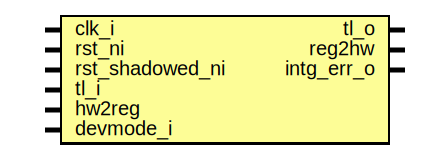

# Entity: keymgr_reg_top

- **File**: keymgr_reg_top.sv
## Diagram

## Description

 Copyright lowRISC contributors.
 Licensed under the Apache License, Version 2.0, see LICENSE for details.
 SPDX-License-Identifier: Apache-2.0

 Register Top module auto-generated by `reggen`

## Ports

| Port name       | Direction | Type | Description                                              |
| --------------- | --------- | ---- | -------------------------------------------------------- |
| clk_i           | input     |      |                                                          |
| rst_ni          | input     |      |                                                          |
| rst_shadowed_ni | input     |      |                                                          |
| tl_i            | input     |      |                                                          |
| tl_o            | output    |      |                                                          |
| reg2hw          | output    |      | Write                                                    |
| hw2reg          | input     |      | Read                                                     |
| intg_err_o      | output    |      |  Integrity check errors                                  |
| devmode_i       | input     |      | If 1, explicit error return for unmapped register access |
## Signals

| Name                              | Type               | Description                                                                                                                  |
| --------------------------------- | ------------------ | ---------------------------------------------------------------------------------------------------------------------------- |
| reg_we                            | logic              |  register signals                                                                                                            |
| reg_re                            | logic              |                                                                                                                              |
| reg_addr                          | logic [AW-1:0]     |                                                                                                                              |
| reg_wdata                         | logic [DW-1:0]     |                                                                                                                              |
| reg_be                            | logic [DBW-1:0]    |                                                                                                                              |
| reg_rdata                         | logic [DW-1:0]     |                                                                                                                              |
| reg_error                         | logic              |                                                                                                                              |
| addrmiss                          | logic              |                                                                                                                              |
| wr_err                            | logic              |                                                                                                                              |
| reg_rdata_next                    | logic [DW-1:0]     |                                                                                                                              |
| reg_busy                          | logic              |                                                                                                                              |
| tl_reg_h2d                        | tlul_pkg::tl_h2d_t |                                                                                                                              |
| tl_reg_d2h                        | tlul_pkg::tl_d2h_t |                                                                                                                              |
| intg_err                          | logic              |  incoming payload check                                                                                                      |
| intg_err_q                        | logic              |                                                                                                                              |
| tl_o_pre                          | tlul_pkg::tl_d2h_t |  outgoing integrity generation                                                                                               |
| intr_state_we                     | logic              |  Define SW related signals  Format: <reg>_<field>_{wd|we|qs}         or <reg>_{wd|we|qs} if field == 1 or 0                  |
| intr_state_qs                     | logic              |                                                                                                                              |
| intr_state_wd                     | logic              |                                                                                                                              |
| intr_enable_we                    | logic              |                                                                                                                              |
| intr_enable_qs                    | logic              |                                                                                                                              |
| intr_enable_wd                    | logic              |                                                                                                                              |
| intr_test_we                      | logic              |                                                                                                                              |
| intr_test_wd                      | logic              |                                                                                                                              |
| alert_test_we                     | logic              |                                                                                                                              |
| alert_test_fatal_fault_err_wd     | logic              |                                                                                                                              |
| alert_test_recov_operation_err_wd | logic              |                                                                                                                              |
| cfg_regwen_re                     | logic              |                                                                                                                              |
| cfg_regwen_qs                     | logic              |                                                                                                                              |
| control_we                        | logic              |                                                                                                                              |
| control_start_qs                  | logic              |                                                                                                                              |
| control_start_wd                  | logic              |                                                                                                                              |
| control_operation_qs              | logic [2:0]        |                                                                                                                              |
| control_operation_wd              | logic [2:0]        |                                                                                                                              |
| control_cdi_sel_qs                | logic              |                                                                                                                              |
| control_cdi_sel_wd                | logic              |                                                                                                                              |
| control_dest_sel_qs               | logic [2:0]        |                                                                                                                              |
| control_dest_sel_wd               | logic [2:0]        |                                                                                                                              |
| sideload_clear_we                 | logic              |                                                                                                                              |
| sideload_clear_qs                 | logic [2:0]        |                                                                                                                              |
| sideload_clear_wd                 | logic [2:0]        |                                                                                                                              |
| reseed_interval_shadowed_re       | logic              |                                                                                                                              |
| reseed_interval_shadowed_we       | logic              |                                                                                                                              |
| reseed_interval_shadowed_qs       | logic [15:0]       |                                                                                                                              |
| reseed_interval_shadowed_wd       | logic [15:0]       |                                                                                                                              |
| sw_binding_regwen_re              | logic              |                                                                                                                              |
| sw_binding_regwen_we              | logic              |                                                                                                                              |
| sw_binding_regwen_qs              | logic              |                                                                                                                              |
| sw_binding_regwen_wd              | logic              |                                                                                                                              |
| sealing_sw_binding_0_we           | logic              |                                                                                                                              |
| sealing_sw_binding_0_qs           | logic [31:0]       |                                                                                                                              |
| sealing_sw_binding_0_wd           | logic [31:0]       |                                                                                                                              |
| sealing_sw_binding_1_we           | logic              |                                                                                                                              |
| sealing_sw_binding_1_qs           | logic [31:0]       |                                                                                                                              |
| sealing_sw_binding_1_wd           | logic [31:0]       |                                                                                                                              |
| sealing_sw_binding_2_we           | logic              |                                                                                                                              |
| sealing_sw_binding_2_qs           | logic [31:0]       |                                                                                                                              |
| sealing_sw_binding_2_wd           | logic [31:0]       |                                                                                                                              |
| sealing_sw_binding_3_we           | logic              |                                                                                                                              |
| sealing_sw_binding_3_qs           | logic [31:0]       |                                                                                                                              |
| sealing_sw_binding_3_wd           | logic [31:0]       |                                                                                                                              |
| sealing_sw_binding_4_we           | logic              |                                                                                                                              |
| sealing_sw_binding_4_qs           | logic [31:0]       |                                                                                                                              |
| sealing_sw_binding_4_wd           | logic [31:0]       |                                                                                                                              |
| sealing_sw_binding_5_we           | logic              |                                                                                                                              |
| sealing_sw_binding_5_qs           | logic [31:0]       |                                                                                                                              |
| sealing_sw_binding_5_wd           | logic [31:0]       |                                                                                                                              |
| sealing_sw_binding_6_we           | logic              |                                                                                                                              |
| sealing_sw_binding_6_qs           | logic [31:0]       |                                                                                                                              |
| sealing_sw_binding_6_wd           | logic [31:0]       |                                                                                                                              |
| sealing_sw_binding_7_we           | logic              |                                                                                                                              |
| sealing_sw_binding_7_qs           | logic [31:0]       |                                                                                                                              |
| sealing_sw_binding_7_wd           | logic [31:0]       |                                                                                                                              |
| attest_sw_binding_0_we            | logic              |                                                                                                                              |
| attest_sw_binding_0_qs            | logic [31:0]       |                                                                                                                              |
| attest_sw_binding_0_wd            | logic [31:0]       |                                                                                                                              |
| attest_sw_binding_1_we            | logic              |                                                                                                                              |
| attest_sw_binding_1_qs            | logic [31:0]       |                                                                                                                              |
| attest_sw_binding_1_wd            | logic [31:0]       |                                                                                                                              |
| attest_sw_binding_2_we            | logic              |                                                                                                                              |
| attest_sw_binding_2_qs            | logic [31:0]       |                                                                                                                              |
| attest_sw_binding_2_wd            | logic [31:0]       |                                                                                                                              |
| attest_sw_binding_3_we            | logic              |                                                                                                                              |
| attest_sw_binding_3_qs            | logic [31:0]       |                                                                                                                              |
| attest_sw_binding_3_wd            | logic [31:0]       |                                                                                                                              |
| attest_sw_binding_4_we            | logic              |                                                                                                                              |
| attest_sw_binding_4_qs            | logic [31:0]       |                                                                                                                              |
| attest_sw_binding_4_wd            | logic [31:0]       |                                                                                                                              |
| attest_sw_binding_5_we            | logic              |                                                                                                                              |
| attest_sw_binding_5_qs            | logic [31:0]       |                                                                                                                              |
| attest_sw_binding_5_wd            | logic [31:0]       |                                                                                                                              |
| attest_sw_binding_6_we            | logic              |                                                                                                                              |
| attest_sw_binding_6_qs            | logic [31:0]       |                                                                                                                              |
| attest_sw_binding_6_wd            | logic [31:0]       |                                                                                                                              |
| attest_sw_binding_7_we            | logic              |                                                                                                                              |
| attest_sw_binding_7_qs            | logic [31:0]       |                                                                                                                              |
| attest_sw_binding_7_wd            | logic [31:0]       |                                                                                                                              |
| salt_0_we                         | logic              |                                                                                                                              |
| salt_0_qs                         | logic [31:0]       |                                                                                                                              |
| salt_0_wd                         | logic [31:0]       |                                                                                                                              |
| salt_1_we                         | logic              |                                                                                                                              |
| salt_1_qs                         | logic [31:0]       |                                                                                                                              |
| salt_1_wd                         | logic [31:0]       |                                                                                                                              |
| salt_2_we                         | logic              |                                                                                                                              |
| salt_2_qs                         | logic [31:0]       |                                                                                                                              |
| salt_2_wd                         | logic [31:0]       |                                                                                                                              |
| salt_3_we                         | logic              |                                                                                                                              |
| salt_3_qs                         | logic [31:0]       |                                                                                                                              |
| salt_3_wd                         | logic [31:0]       |                                                                                                                              |
| salt_4_we                         | logic              |                                                                                                                              |
| salt_4_qs                         | logic [31:0]       |                                                                                                                              |
| salt_4_wd                         | logic [31:0]       |                                                                                                                              |
| salt_5_we                         | logic              |                                                                                                                              |
| salt_5_qs                         | logic [31:0]       |                                                                                                                              |
| salt_5_wd                         | logic [31:0]       |                                                                                                                              |
| salt_6_we                         | logic              |                                                                                                                              |
| salt_6_qs                         | logic [31:0]       |                                                                                                                              |
| salt_6_wd                         | logic [31:0]       |                                                                                                                              |
| salt_7_we                         | logic              |                                                                                                                              |
| salt_7_qs                         | logic [31:0]       |                                                                                                                              |
| salt_7_wd                         | logic [31:0]       |                                                                                                                              |
| key_version_we                    | logic              |                                                                                                                              |
| key_version_qs                    | logic [31:0]       |                                                                                                                              |
| key_version_wd                    | logic [31:0]       |                                                                                                                              |
| max_creator_key_ver_regwen_we     | logic              |                                                                                                                              |
| max_creator_key_ver_regwen_qs     | logic              |                                                                                                                              |
| max_creator_key_ver_regwen_wd     | logic              |                                                                                                                              |
| max_creator_key_ver_shadowed_re   | logic              |                                                                                                                              |
| max_creator_key_ver_shadowed_we   | logic              |                                                                                                                              |
| max_creator_key_ver_shadowed_qs   | logic [31:0]       |                                                                                                                              |
| max_creator_key_ver_shadowed_wd   | logic [31:0]       |                                                                                                                              |
| max_owner_int_key_ver_regwen_we   | logic              |                                                                                                                              |
| max_owner_int_key_ver_regwen_qs   | logic              |                                                                                                                              |
| max_owner_int_key_ver_regwen_wd   | logic              |                                                                                                                              |
| max_owner_int_key_ver_shadowed_re | logic              |                                                                                                                              |
| max_owner_int_key_ver_shadowed_we | logic              |                                                                                                                              |
| max_owner_int_key_ver_shadowed_qs | logic [31:0]       |                                                                                                                              |
| max_owner_int_key_ver_shadowed_wd | logic [31:0]       |                                                                                                                              |
| max_owner_key_ver_regwen_we       | logic              |                                                                                                                              |
| max_owner_key_ver_regwen_qs       | logic              |                                                                                                                              |
| max_owner_key_ver_regwen_wd       | logic              |                                                                                                                              |
| max_owner_key_ver_shadowed_re     | logic              |                                                                                                                              |
| max_owner_key_ver_shadowed_we     | logic              |                                                                                                                              |
| max_owner_key_ver_shadowed_qs     | logic [31:0]       |                                                                                                                              |
| max_owner_key_ver_shadowed_wd     | logic [31:0]       |                                                                                                                              |
| sw_share0_output_0_re             | logic              |                                                                                                                              |
| sw_share0_output_0_qs             | logic [31:0]       |                                                                                                                              |
| sw_share0_output_0_wd             | logic [31:0]       |                                                                                                                              |
| sw_share0_output_1_re             | logic              |                                                                                                                              |
| sw_share0_output_1_qs             | logic [31:0]       |                                                                                                                              |
| sw_share0_output_1_wd             | logic [31:0]       |                                                                                                                              |
| sw_share0_output_2_re             | logic              |                                                                                                                              |
| sw_share0_output_2_qs             | logic [31:0]       |                                                                                                                              |
| sw_share0_output_2_wd             | logic [31:0]       |                                                                                                                              |
| sw_share0_output_3_re             | logic              |                                                                                                                              |
| sw_share0_output_3_qs             | logic [31:0]       |                                                                                                                              |
| sw_share0_output_3_wd             | logic [31:0]       |                                                                                                                              |
| sw_share0_output_4_re             | logic              |                                                                                                                              |
| sw_share0_output_4_qs             | logic [31:0]       |                                                                                                                              |
| sw_share0_output_4_wd             | logic [31:0]       |                                                                                                                              |
| sw_share0_output_5_re             | logic              |                                                                                                                              |
| sw_share0_output_5_qs             | logic [31:0]       |                                                                                                                              |
| sw_share0_output_5_wd             | logic [31:0]       |                                                                                                                              |
| sw_share0_output_6_re             | logic              |                                                                                                                              |
| sw_share0_output_6_qs             | logic [31:0]       |                                                                                                                              |
| sw_share0_output_6_wd             | logic [31:0]       |                                                                                                                              |
| sw_share0_output_7_re             | logic              |                                                                                                                              |
| sw_share0_output_7_qs             | logic [31:0]       |                                                                                                                              |
| sw_share0_output_7_wd             | logic [31:0]       |                                                                                                                              |
| sw_share1_output_0_re             | logic              |                                                                                                                              |
| sw_share1_output_0_qs             | logic [31:0]       |                                                                                                                              |
| sw_share1_output_0_wd             | logic [31:0]       |                                                                                                                              |
| sw_share1_output_1_re             | logic              |                                                                                                                              |
| sw_share1_output_1_qs             | logic [31:0]       |                                                                                                                              |
| sw_share1_output_1_wd             | logic [31:0]       |                                                                                                                              |
| sw_share1_output_2_re             | logic              |                                                                                                                              |
| sw_share1_output_2_qs             | logic [31:0]       |                                                                                                                              |
| sw_share1_output_2_wd             | logic [31:0]       |                                                                                                                              |
| sw_share1_output_3_re             | logic              |                                                                                                                              |
| sw_share1_output_3_qs             | logic [31:0]       |                                                                                                                              |
| sw_share1_output_3_wd             | logic [31:0]       |                                                                                                                              |
| sw_share1_output_4_re             | logic              |                                                                                                                              |
| sw_share1_output_4_qs             | logic [31:0]       |                                                                                                                              |
| sw_share1_output_4_wd             | logic [31:0]       |                                                                                                                              |
| sw_share1_output_5_re             | logic              |                                                                                                                              |
| sw_share1_output_5_qs             | logic [31:0]       |                                                                                                                              |
| sw_share1_output_5_wd             | logic [31:0]       |                                                                                                                              |
| sw_share1_output_6_re             | logic              |                                                                                                                              |
| sw_share1_output_6_qs             | logic [31:0]       |                                                                                                                              |
| sw_share1_output_6_wd             | logic [31:0]       |                                                                                                                              |
| sw_share1_output_7_re             | logic              |                                                                                                                              |
| sw_share1_output_7_qs             | logic [31:0]       |                                                                                                                              |
| sw_share1_output_7_wd             | logic [31:0]       |                                                                                                                              |
| working_state_qs                  | logic [2:0]        |                                                                                                                              |
| op_status_we                      | logic              |                                                                                                                              |
| op_status_qs                      | logic [1:0]        |                                                                                                                              |
| op_status_wd                      | logic [1:0]        |                                                                                                                              |
| err_code_we                       | logic              |                                                                                                                              |
| err_code_invalid_op_qs            | logic              |                                                                                                                              |
| err_code_invalid_op_wd            | logic              |                                                                                                                              |
| err_code_invalid_kmac_input_qs    | logic              |                                                                                                                              |
| err_code_invalid_kmac_input_wd    | logic              |                                                                                                                              |
| err_code_invalid_shadow_update_qs | logic              |                                                                                                                              |
| err_code_invalid_shadow_update_wd | logic              |                                                                                                                              |
| fault_status_cmd_qs               | logic              |                                                                                                                              |
| fault_status_kmac_fsm_qs          | logic              |                                                                                                                              |
| fault_status_kmac_op_qs           | logic              |                                                                                                                              |
| fault_status_kmac_out_qs          | logic              |                                                                                                                              |
| fault_status_regfile_intg_qs      | logic              |                                                                                                                              |
| fault_status_shadow_qs            | logic              |                                                                                                                              |
| fault_status_ctrl_fsm_intg_qs     | logic              |                                                                                                                              |
| fault_status_ctrl_fsm_cnt_qs      | logic              |                                                                                                                              |
| addr_hit                          | logic [59:0]       |                                                                                                                              |
| shadow_busy                       | logic              |  shadow busy                                                                                                                 |
| rst_done                          | logic              |                                                                                                                              |
| shadow_rst_done                   | logic              |                                                                                                                              |
| reg_busy_sel                      | logic              |  register busy                                                                                                               |
| unused_wdata                      | logic              |  Unused signal tieoff  wdata / byte enable are not always fully used  add a blanket unused statement to handle lint waivers  |
| unused_be                         | logic              |                                                                                                                              |
## Constants

| Name | Type | Value | Description |
| ---- | ---- | ----- | ----------- |
| AW   | int  | 8     |             |
| DW   | int  | 32    |             |
| DBW  | int  | DW/8  | Byte Width  |
## Processes
- unnamed: ( @(posedge clk_i or negedge rst_ni) )
  - **Type:** always_ff
- unnamed: (  )
  - **Type:** always_comb
- unnamed: (  )
  - **Type:** always_comb
**Description**
 Check sub-word write is permitted 
- unnamed: (  )
  - **Type:** always_comb
**Description**
 Read data return 
- unnamed: ( @(posedge clk_i or negedge rst_ni) )
  - **Type:** always_ff
- unnamed: ( @(posedge clk_i or negedge rst_shadowed_ni) )
  - **Type:** always_ff
- unnamed: (  )
  - **Type:** always_comb
## Instantiations

- u_chk: tlul_cmd_intg_chk
- u_rsp_intg_gen: tlul_rsp_intg_gen
- u_reg_if: tlul_adapter_reg
- u_intr_state: prim_subreg
**Description**
 Register instances
 R[intr_state]: V(False)

- u_intr_enable: prim_subreg
**Description**
 R[intr_enable]: V(False)

- u_intr_test: prim_subreg_ext
**Description**
 R[intr_test]: V(True)

- u_alert_test_fatal_fault_err: prim_subreg_ext
**Description**
 R[alert_test]: V(True)
   F[fatal_fault_err]: 0:0

- u_alert_test_recov_operation_err: prim_subreg_ext
**Description**
   F[recov_operation_err]: 1:1

- u_cfg_regwen: prim_subreg_ext
**Description**
 R[cfg_regwen]: V(True)

- u_control_start: prim_subreg
**Description**
 R[control]: V(False)
   F[start]: 0:0

- u_control_operation: prim_subreg
**Description**
   F[operation]: 6:4

- u_control_cdi_sel: prim_subreg
**Description**
   F[cdi_sel]: 7:7

- u_control_dest_sel: prim_subreg
**Description**
   F[dest_sel]: 14:12

- u_sideload_clear: prim_subreg
**Description**
 R[sideload_clear]: V(False)

- u_reseed_interval_shadowed: prim_subreg_shadow
**Description**
 R[reseed_interval_shadowed]: V(False)

- u_sw_binding_regwen: prim_subreg_ext
**Description**
 R[sw_binding_regwen]: V(True)

- u_max_creator_key_ver_regwen: prim_subreg
**Description**
 R[max_creator_key_ver_regwen]: V(False)

- u_max_creator_key_ver_shadowed: prim_subreg_shadow
**Description**
 R[max_creator_key_ver_shadowed]: V(False)

- u_max_owner_int_key_ver_regwen: prim_subreg
**Description**
 R[max_owner_int_key_ver_regwen]: V(False)

- u_max_owner_int_key_ver_shadowed: prim_subreg_shadow
**Description**
 R[max_owner_int_key_ver_shadowed]: V(False)

- u_max_owner_key_ver_regwen: prim_subreg
**Description**
 R[max_owner_key_ver_regwen]: V(False)

- u_max_owner_key_ver_shadowed: prim_subreg_shadow
**Description**
 R[max_owner_key_ver_shadowed]: V(False)

- u_working_state: prim_subreg
**Description**
 R[working_state]: V(False)

- u_op_status: prim_subreg
**Description**
 R[op_status]: V(False)

- u_err_code_invalid_op: prim_subreg
**Description**
 R[err_code]: V(False)
   F[invalid_op]: 0:0

- u_err_code_invalid_kmac_input: prim_subreg
**Description**
   F[invalid_kmac_input]: 1:1

- u_err_code_invalid_shadow_update: prim_subreg
**Description**
   F[invalid_shadow_update]: 2:2

- u_fault_status_cmd: prim_subreg
**Description**
 R[fault_status]: V(False)
   F[cmd]: 0:0

- u_fault_status_kmac_fsm: prim_subreg
**Description**
   F[kmac_fsm]: 1:1

- u_fault_status_kmac_op: prim_subreg
**Description**
   F[kmac_op]: 2:2

- u_fault_status_kmac_out: prim_subreg
**Description**
   F[kmac_out]: 3:3

- u_fault_status_regfile_intg: prim_subreg
**Description**
   F[regfile_intg]: 4:4

- u_fault_status_shadow: prim_subreg
**Description**
   F[shadow]: 5:5

- u_fault_status_ctrl_fsm_intg: prim_subreg
**Description**
   F[ctrl_fsm_intg]: 6:6

- u_fault_status_ctrl_fsm_cnt: prim_subreg
**Description**
   F[ctrl_fsm_cnt]: 7:7

