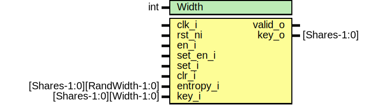

# Entity: keymgr_sideload_key

- **File**: keymgr_sideload_key.sv
## Diagram

## Description

 Copyright lowRISC contributors.
 Licensed under the Apache License, Version 2.0, see LICENSE for details.
 SPDX-License-Identifier: Apache-2.0

 Key manager sideload key

## Generics

| Generic name | Type | Value    | Description |
| ------------ | ---- | -------- | ----------- |
| Width        | int  | KeyWidth |             |
## Ports

| Port name | Direction | Type                        | Description |
| --------- | --------- | --------------------------- | ----------- |
| clk_i     | input     |                             |             |
| rst_ni    | input     |                             |             |
| en_i      | input     |                             |             |
| set_en_i  | input     |                             |             |
| set_i     | input     |                             |             |
| clr_i     | input     |                             |             |
| entropy_i | input     | [Shares-1:0][RandWidth-1:0] |             |
| key_i     | input     | [Shares-1:0][Width-1:0]     |             |
| valid_o   | output    |                             |             |
| key_o     | output    | [Shares-1:0]                |             |
## Signals

| Name    | Type                          | Description |
| ------- | ----------------------------- | ----------- |
| valid_q | logic                         |             |
| key_q   | logic [Shares-1:0][Width-1:0] |             |
## Constants

| Name          | Type | Value      | Description |
| ------------- | ---- | ---------- | ----------- |
| EntropyCopies | int  | Width / 32 |             |
## Processes
- unnamed: ( @(posedge clk_i or negedge rst_ni) )
  - **Type:** always_ff
- unnamed: ( @(posedge clk_i or negedge rst_ni) )
  - **Type:** always_ff
