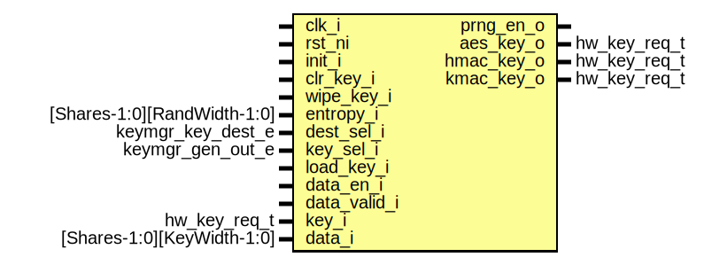

# Entity: keymgr_sideload_key_ctrl
## Diagram

## Description
Copyright lowRISC contributors.
 Licensed under the Apache License, Version 2.0, see LICENSE for details.
 SPDX-License-Identifier: Apache-2.0
 Manage all sideload keys
 
## Ports
| Port name    | Direction | Type                        | Description                                                 |
| ------------ | --------- | --------------------------- | ----------------------------------------------------------- |
| clk_i        | input     |                             |                                                             |
| rst_ni       | input     |                             |                                                             |
| init_i       | input     |                             |                                                             |
| clr_key_i    | input     |                             | clear key just deletes the key                              |
| wipe_key_i   | input     |                             | wipe key deletes and renders sideloads useless until reboot |
| entropy_i    | input     | [Shares-1:0][RandWidth-1:0] |                                                             |
| dest_sel_i   | input     | keymgr_key_dest_e           |                                                             |
| key_sel_i    | input     | keymgr_gen_out_e            |                                                             |
| load_key_i   | input     |                             |                                                             |
| data_en_i    | input     |                             |                                                             |
| data_valid_i | input     |                             |                                                             |
| key_i        | input     | hw_key_req_t                |                                                             |
| data_i       | input     | [Shares-1:0][KeyWidth-1:0]  |                                                             |
| prng_en_o    | output    |                             |                                                             |
| aes_key_o    | output    | hw_key_req_t                |                                                             |
| hmac_key_o   | output    | hw_key_req_t                |                                                             |
| kmac_key_o   | output    | hw_key_req_t                |                                                             |
## Signals
| Name              | Type              | Description |
| ----------------- | ----------------- | ----------- |
| state_q           | keymgr_sideload_e |             |
| state_d           | keymgr_sideload_e |             |
| cnt_q             | logic [3:0]       |             |
| cnt_d             | logic [3:0]       |             |
| cnt_end           | logic             |             |
| clr               | logic             |             |
| keys_en           | logic             |             |
| aes_sel           | logic             |             |
| hmac_sel          | logic             |             |
| kmac_sel          | logic             |             |
| kmac_sideload_key | hw_key_req_t      |             |
## Types
| Name              | Type                                                                                                                        | Description                    |
| ----------------- | --------------------------------------------------------------------------------------------------------------------------- | ------------------------------ |
| keymgr_sideload_e | enum logic [2:0] {     StSideloadReset,     StSideloadIdle,     StSideloadClear,     StSideloadWipe,     StSideloadStop   } | Enumeration for working state  |
## Processes
- unnamed: _( @(posedge clk_i or negedge rst_ni) )_

- unnamed: _(  )_

## Instantiations
- u_aes_key: keymgr_sideload_key
- u_hmac_key: keymgr_sideload_key
- u_kmac_key: keymgr_sideload_key
