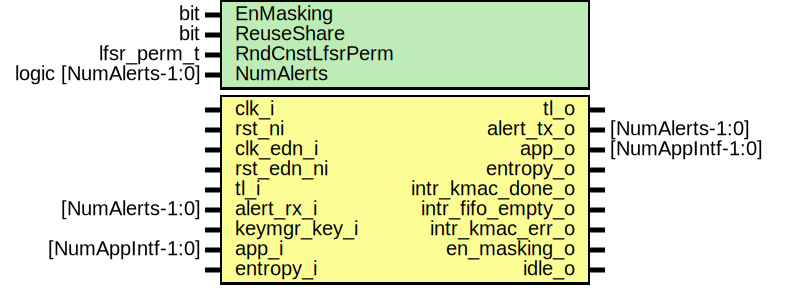

# Entity: kmac

- **File**: kmac.sv
## Diagram

## Description

 Copyright lowRISC contributors.
 Licensed under the Apache License, Version 2.0, see LICENSE for details.
 SPDX-License-Identifier: Apache-2.0

 KMAC/SHA3

## Generics

| Generic name    | Type                  | Value                  | Description                                                                                                                                                                                                                                                  |
| --------------- | --------------------- | ---------------------- | ------------------------------------------------------------------------------------------------------------------------------------------------------------------------------------------------------------------------------------------------------------ |
| EnMasking       | bit                   | 1                      |  EnMasking: Enable masking security hardening inside keccak_round  If it is enabled, the result digest will be two set of 1600bit.                                                                                                                           |
| ReuseShare      | bit                   | 0                      |  ReuseShare: If set, keccak_round logic only consumes small portion of  entropy, not 1600bit of entropy at every round. It uses adjacent shares  as entropy inside Domain-Oriented Masking AND logic.  This parameter only affects when `EnMasking` is set.  |
| RndCnstLfsrPerm | lfsr_perm_t           | RndCnstLfsrPermDefault |                                                                                                                                                                                                                                                              |
| NumAlerts       | logic [NumAlerts-1:0] | undefined              |                                                                                                                                                                                                                                                              |
## Ports

| Port name         | Direction | Type             | Description                              |
| ----------------- | --------- | ---------------- | ---------------------------------------- |
| clk_i             | input     |                  |                                          |
| rst_ni            | input     |                  |                                          |
| clk_edn_i         | input     |                  |                                          |
| rst_edn_ni        | input     |                  |                                          |
| tl_i              | input     |                  |                                          |
| tl_o              | output    |                  |                                          |
| alert_rx_i        | input     | [NumAlerts-1:0]  |  Alerts                                  |
| alert_tx_o        | output    | [NumAlerts-1:0]  |                                          |
| keymgr_key_i      | input     |                  |  KeyMgr sideload (secret key) interface  |
| app_i             | input     | [NumAppIntf-1:0] |  KeyMgr KDF data path                    |
| app_o             | output    | [NumAppIntf-1:0] |                                          |
| entropy_o         | output    |                  |  EDN interface                           |
| entropy_i         | input     |                  |                                          |
| intr_kmac_done_o  | output    |                  |  interrupts                              |
| intr_fifo_empty_o | output    |                  |                                          |
| intr_kmac_err_o   | output    |                  |                                          |
| en_masking_o      | output    |                  |  parameter consistency check with keymgr |
| idle_o            | output    |                  |  Idle signal                             |
## Signals

| Name                         | Type                                   | Description                                                                                                                                                                                                                                                     |
| ---------------------------- | -------------------------------------- | --------------------------------------------------------------------------------------------------------------------------------------------------------------------------------------------------------------------------------------------------------------- |
| kmac_st                      | kmac_st_e                              |                                                                                                                                                                                                                                                                 |
| kmac_st_d                    | kmac_st_e                              |                                                                                                                                                                                                                                                                 |
| reg2hw                       | kmac_reg2hw_t                          | ///////////  Signals // ///////////                                                                                                                                                                                                                             |
| hw2reg                       | kmac_hw2reg_t                          |                                                                                                                                                                                                                                                                 |
| devmode                      | logic                                  |  devmode ties to 1 as KMAC should be operated at the beginning for ROM_CTRL.                                                                                                                                                                                    |
| tl_win_h2d                   | tlul_pkg::tl_h2d_t                     |                                                                                                                                                                                                                                                                 |
| tl_win_d2h                   | tlul_pkg::tl_d2h_t                     |                                                                                                                                                                                                                                                                 |
| sha3_start                   | logic                                  |  SHA3 core control signals and its response.  Sequence: start --> process(multiple) --> get absorbed event --> {run -->} done                                                                                                                                   |
| sha3_run                     | logic                                  |  SHA3 core control signals and its response.  Sequence: start --> process(multiple) --> get absorbed event --> {run -->} done                                                                                                                                   |
| sha3_done                    | logic                                  |  SHA3 core control signals and its response.  Sequence: start --> process(multiple) --> get absorbed event --> {run -->} done                                                                                                                                   |
| sha3_absorbed                | logic                                  |  SHA3 core control signals and its response.  Sequence: start --> process(multiple) --> get absorbed event --> {run -->} done                                                                                                                                   |
| unused_sha3_squeeze          | logic                                  |  SHA3 core control signals and its response.  Sequence: start --> process(multiple) --> get absorbed event --> {run -->} done                                                                                                                                   |
| sha3_block_processed         | logic                                  |  Indicate one block processed                                                                                                                                                                                                                                   |
| entropy_in_keyblock          | logic                                  |  EStatus for entropy                                                                                                                                                                                                                                            |
| event_absorbed               | logic                                  |  KeyMgr interface logic generates event_absorbed from sha3_absorbed.  It is active only if SW initiates the hashing engine.                                                                                                                                     |
| sha3_fsm                     | sha3_pkg::sha3_st_e                    |                                                                                                                                                                                                                                                                 |
| reg_ns_prefix                | logic [sha3_pkg::NSRegisterSize*8-1:0] |  Prefix: kmac_pkg defines Prefix based on N size and S size.  Then computes left_encode(len(N)) size and left_encode(len(S))  For given default value 32, 256 bits, the max  encode_string(N) || encode_string(S) is 328. So 11 Prefix registers are  created.  |
| ns_prefix                    | logic [sha3_pkg::NSRegisterSize*8-1:0] |                                                                                                                                                                                                                                                                 |
| state_valid                  | logic                                  |  Output state: this is used to redirect the digest to KeyMgr or Software  depends on the configuration.                                                                                                                                                         |
| state                        | logic [sha3_pkg::StateW-1:0]           |                                                                                                                                                                                                                                                                 |
| unused_reg_state_valid       | logic                                  |  state is de-muxed in keymgr interface logic.  the output from keymgr logic goes into staterd module to be visible to SW                                                                                                                                        |
| reg_state                    | logic [sha3_pkg::StateW-1:0]           |                                                                                                                                                                                                                                                                 |
| sha3_rand_valid              | logic                                  |  SHA3 Entropy interface                                                                                                                                                                                                                                         |
| sha3_rand_consumed           | logic                                  |  SHA3 Entropy interface                                                                                                                                                                                                                                         |
| sha3_rand_data               | logic [sha3_pkg::StateW-1:0]           |                                                                                                                                                                                                                                                                 |
| msgfifo_empty                | logic                                  |  FIFO related signals                                                                                                                                                                                                                                           |
| msgfifo_full                 | logic                                  |  FIFO related signals                                                                                                                                                                                                                                           |
| msgfifo_depth                | logic [kmac_pkg::MsgFifoDepthW-1:0]    |                                                                                                                                                                                                                                                                 |
| msgfifo_valid                | logic                                  |                                                                                                                                                                                                                                                                 |
| msgfifo_data                 | logic [kmac_pkg::MsgWidth-1:0]         |                                                                                                                                                                                                                                                                 |
| msgfifo_strb                 | logic [kmac_pkg::MsgStrbW-1:0]         |                                                                                                                                                                                                                                                                 |
| msgfifo_ready                | logic                                  |                                                                                                                                                                                                                                                                 |
| tlram_req                    | logic                                  |  TL-UL Adapter(MSG_FIFO) signals                                                                                                                                                                                                                                |
| tlram_gnt                    | logic                                  |                                                                                                                                                                                                                                                                 |
| tlram_we                     | logic                                  |                                                                                                                                                                                                                                                                 |
| tlram_addr                   | logic [8:0]                            | NOT_READ                                                                                                                                                                                                                                                        |
| tlram_wdata                  | logic [31:0]                           |                                                                                                                                                                                                                                                                 |
| tlram_wmask                  | logic [31:0]                           |                                                                                                                                                                                                                                                                 |
| tlram_rdata                  | logic [31:0]                           |                                                                                                                                                                                                                                                                 |
| tlram_rvalid                 | logic                                  |                                                                                                                                                                                                                                                                 |
| tlram_rerror                 | logic [1:0]                            |                                                                                                                                                                                                                                                                 |
| tlram_wdata_endian           | logic [31:0]                           |                                                                                                                                                                                                                                                                 |
| tlram_wmask_endian           | logic [31:0]                           |                                                                                                                                                                                                                                                                 |
| sw_msg_valid                 | logic                                  |                                                                                                                                                                                                                                                                 |
| sw_msg_data                  | logic [kmac_pkg::MsgWidth-1:0]         |                                                                                                                                                                                                                                                                 |
| sw_msg_mask                  | logic [kmac_pkg::MsgWidth-1:0]         |                                                                                                                                                                                                                                                                 |
| sw_msg_ready                 | logic                                  |                                                                                                                                                                                                                                                                 |
| mux2fifo_valid               | logic                                  |  KeyMgr interface to MSG_FIFO                                                                                                                                                                                                                                   |
| mux2fifo_data                | logic [kmac_pkg::MsgWidth-1:0]         |                                                                                                                                                                                                                                                                 |
| mux2fifo_mask                | logic [kmac_pkg::MsgWidth-1:0]         |                                                                                                                                                                                                                                                                 |
| mux2fifo_ready               | logic                                  |                                                                                                                                                                                                                                                                 |
| msg_valid                    | logic                                  |  KMAC to SHA3 core                                                                                                                                                                                                                                              |
| msg_data                     | logic [kmac_pkg::MsgWidth-1:0]         |                                                                                                                                                                                                                                                                 |
| msg_strb                     | logic [kmac_pkg::MsgStrbW-1:0]         |                                                                                                                                                                                                                                                                 |
| msg_ready                    | logic                                  |                                                                                                                                                                                                                                                                 |
| reg2msgfifo_process          | logic                                  |  Process control signals  Process pulse propagates from register to SHA3 engine one by one.  Each module (MSG_FIFO, KMAC core, SHA3 core) generates the process pulse  after flushing internal data to the next module.                                         |
| msgfifo2kmac_process         | logic                                  |  Process control signals  Process pulse propagates from register to SHA3 engine one by one.  Each module (MSG_FIFO, KMAC core, SHA3 core) generates the process pulse  after flushing internal data to the next module.                                         |
| kmac2sha3_process            | logic                                  |  Process control signals  Process pulse propagates from register to SHA3 engine one by one.  Each module (MSG_FIFO, KMAC core, SHA3 core) generates the process pulse  after flushing internal data to the next module.                                         |
| sw_key_data                  | logic [MaxKeyLen-1:0]                  |  Secret Key signals                                                                                                                                                                                                                                             |
| sw_key_len                   | key_len_e                              |                                                                                                                                                                                                                                                                 |
| key_data                     | logic [MaxKeyLen-1:0]                  |                                                                                                                                                                                                                                                                 |
| key_len                      | key_len_e                              |                                                                                                                                                                                                                                                                 |
| reg_kmac_en                  | logic                                  |  SHA3 Mode, Strength, KMAC enable for app interface                                                                                                                                                                                                             |
| app_kmac_en                  | logic                                  |  SHA3 Mode, Strength, KMAC enable for app interface                                                                                                                                                                                                             |
| reg_sha3_mode                | sha3_pkg::sha3_mode_e                  |                                                                                                                                                                                                                                                                 |
| app_sha3_mode                | sha3_pkg::sha3_mode_e                  |                                                                                                                                                                                                                                                                 |
| reg_keccak_strength          | sha3_pkg::keccak_strength_e            |                                                                                                                                                                                                                                                                 |
| app_keccak_strength          | sha3_pkg::keccak_strength_e            |                                                                                                                                                                                                                                                                 |
| app_active                   | logic                                  |  Indicating AppIntf is active. This signal is used to check SW error                                                                                                                                                                                            |
| sw_cmd                       | kmac_cmd_e                             |                                                                                                                                                                                                                                                                 |
| checked_sw_cmd               | kmac_cmd_e                             |                                                                                                                                                                                                                                                                 |
| kmac_cmd                     | kmac_cmd_e                             |                                                                                                                                                                                                                                                                 |
| wait_timer_prescaler         | logic [9:0]                            |  Entropy configurations                                                                                                                                                                                                                                         |
| wait_timer_limit             | logic [15:0]                           |                                                                                                                                                                                                                                                                 |
| entropy_seed_update          | logic                                  |                                                                                                                                                                                                                                                                 |
| unused_entropy_seed_upper_qe | logic                                  |                                                                                                                                                                                                                                                                 |
| entropy_seed_data            | logic [63:0]                           |                                                                                                                                                                                                                                                                 |
| entropy_refresh_req          | logic                                  |                                                                                                                                                                                                                                                                 |
| entropy_hash_threshold       | logic [HashCntW-1:0]                   |                                                                                                                                                                                                                                                                 |
| entropy_hash_cnt             | logic [HashCntW-1:0]                   |                                                                                                                                                                                                                                                                 |
| entropy_hash_clr             | logic                                  |                                                                                                                                                                                                                                                                 |
| entropy_ready                | logic                                  |                                                                                                                                                                                                                                                                 |
| entropy_mode                 | entropy_mode_e                         |                                                                                                                                                                                                                                                                 |
| entropy_fast_process         | logic                                  |                                                                                                                                                                                                                                                                 |
| sha3_err                     | sha3_pkg::err_t                        |  SHA3 Error response                                                                                                                                                                                                                                            |
| app_err                      | kmac_pkg::err_t                        |  KeyMgr Error response                                                                                                                                                                                                                                          |
| entropy_err                  | kmac_pkg::err_t                        |  Entropy Generator Error                                                                                                                                                                                                                                        |
| errchecker_err               | kmac_pkg::err_t                        |  Error checker                                                                                                                                                                                                                                                  |
| err_processed                | logic                                  |                                                                                                                                                                                                                                                                 |
| engine_stable                | logic                                  |  Configuration Register                                                                                                                                                                                                                                         |
| else                         | end                                    |                                                                                                                                                                                                                                                                 |
| idle_o                       | begin                                  |                                                                                                                                                                                                                                                                 |
| end                          | end                                    |                                                                                                                                                                                                                                                                 |
| event_msgfifo_empty          | logic                                  | /////////////  Interrupt // /////////////                                                                                                                                                                                                                       |
| msgfifo_empty_q              | logic                                  | /////////////  Interrupt // /////////////                                                                                                                                                                                                                       |
| event_error                  | logic                                  |  Error  As of now, only SHA3 error exists. More error codes will be added.                                                                                                                                                                                      |
| gen_empty_entropy            | else                                   |                                                                                                                                                                                                                                                                 |
| unused_entropy_input         | edn_pkg::edn_rsp_t                     |                                                                                                                                                                                                                                                                 |
| unused_entropy_mode          | entropy_mode_e                         |                                                                                                                                                                                                                                                                 |
| unused_entropy_fast_process  | logic                                  |                                                                                                                                                                                                                                                                 |
| unused_sha3_rand_consumed    | logic                                  |                                                                                                                                                                                                                                                                 |
| unused_seed_update           | logic                                  |                                                                                                                                                                                                                                                                 |
| unused_seed_data             | logic [63:0]                           |                                                                                                                                                                                                                                                                 |
| unused_refresh_period        | logic [31:0]                           |                                                                                                                                                                                                                                                                 |
| unused_entropy_refresh_req   | logic                                  |                                                                                                                                                                                                                                                                 |
| unused_entropy_hash          | logic                                  |                                                                                                                                                                                                                                                                 |
| unused_entropy_status        | logic [1:0]                            |                                                                                                                                                                                                                                                                 |
| logic [NumAlerts-1:0]        | end                                    |                                                                                                                                                                                                                                                                 |
## Types

| Name        | Type                                                                                                                                                                                                                                                                                                                     | Description                                                                                                                                 |
| ----------- | ------------------------------------------------------------------------------------------------------------------------------------------------------------------------------------------------------------------------------------------------------------------------------------------------------------------------ | ------------------------------------------------------------------------------------------------------------------------------------------- |
| kmac_st_e   | enum logic [2:0] {           KmacIdle,            KmacPrefix,            KmacKeyBlock,            KmacMsgFeed,            KmacDigest    } | ///////////////  Definitions // ///////////////  This state machine is to track the current process based on SW input and  KMAC operation.  |
| tl_window_e | enum int {      WinState   = 0,      WinMsgFifo = 1   }                                                                                                                                                                                            |  Window                                                                                                                                     |
## Processes
- unnamed: (  )
  - **Type:** always_comb
 **Description**
////////////////////////////////////  Connecting Register IF to logics // ////////////////////////////////////  Function-name N and Customization input string S 
- unnamed: (  )
  - **Type:** always_comb
- unnamed: ( @(posedge clk_i or negedge rst_ni) )
  - **Type:** always_ff
 **Description**
 Secret Key  Secret key is defined as external register. So the logic latches when SW  writes to KEY_SHARE0 , KEY_SHARE1 registers. 
- unnamed: ( @(posedge clk_i or negedge rst_ni) )
  - **Type:** always_ff
- unnamed: (  )
  - **Type:** always_comb
## Instantiations

- intr_kmac_done: prim_intr_hw
 **Description**
 Hash process absorbed interrupt

- intr_fifo_empty: prim_intr_hw
- u_reg: kmac_reg_top
