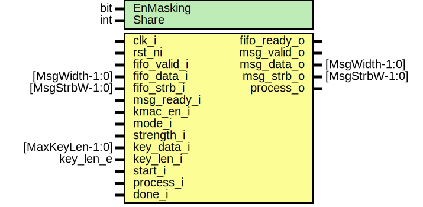

# Entity: kmac_core

- **File**: kmac_core.sv
## Diagram

## Description

 Copyright lowRISC contributors.
 Licensed under the Apache License, Version 2.0, see LICENSE for details.
 SPDX-License-Identifier: Apache-2.0

 KMAC control and padding logic

## Generics

| Generic name | Type | Value     | Description                                                                                                                         |
| ------------ | ---- | --------- | ----------------------------------------------------------------------------------------------------------------------------------- |
| EnMasking    | bit  | 0         |  EnMasking: Enable masking security hardening inside keccak_round  If it is enabled, the result digest will be two set of 1600bit.  |
| Share        | int  | undefined |  derived parameter                                                                                                                  |
## Ports

| Port name    | Direction | Type            | Description                                                                                                   |
| ------------ | --------- | --------------- | ------------------------------------------------------------------------------------------------------------- |
| clk_i        | input     |                 |                                                                                                               |
| rst_ni       | input     |                 |                                                                                                               |
| fifo_valid_i | input     |                 |  From Message FIFO                                                                                            |
| fifo_data_i  | input     | [MsgWidth-1:0]  |                                                                                                               |
| fifo_strb_i  | input     | [MsgStrbW-1:0]  |                                                                                                               |
| fifo_ready_o | output    |                 |                                                                                                               |
| msg_valid_o  | output    |                 |  to SHA3 Core                                                                                                 |
| msg_data_o   | output    | [MsgWidth-1:0]  |                                                                                                               |
| msg_strb_o   | output    | [MsgStrbW-1:0]  |                                                                                                               |
| msg_ready_i  | input     |                 |                                                                                                               |
| kmac_en_i    | input     |                 |  Configurations If kmac_en is cleared, Core logic doesn't function but forward incoming  mesage to SHA3 core  |
| mode_i       | input     |                 |                                                                                                               |
| strength_i   | input     |                 |                                                                                                               |
| key_data_i   | input     | [MaxKeyLen-1:0] |  Key input from CSR                                                                                           |
| key_len_i    | input     | key_len_e       |                                                                                                               |
| start_i      | input     |                 |  Controls : same to SHA3 core                                                                                 |
| process_i    | input     |                 |                                                                                                               |
| done_i       | input     |                 |                                                                                                               |
| process_o    | output    |                 |  Control to SHA3 core                                                                                         |
## Signals

| Name              | Type                                 | Description                                                                                                                                                                                                                                                                                                |
| ----------------- | ------------------------------------ | ---------------------------------------------------------------------------------------------------------------------------------------------------------------------------------------------------------------------------------------------------------------------------------------------------------- |
| encoded_key       | logic [MaxEncodedKeyW-1:0]           | ///////////  Signals // ///////////  represents encode_string(K)                                                                                                                                                                                                                                           |
| key_index         | logic [sha3_pkg::KeccakMsgAddrW-1:0] |  Key slice address  This signal controls the 64 bit output of the sliced secret_key.                                                                                                                                                                                                                       |
| inc_keyidx        | logic                                |                                                                                                                                                                                                                                                                                                            |
| clr_keyidx        | logic                                |                                                                                                                                                                                                                                                                                                            |
| block_addr_limit  | logic [sha3_pkg::KeccakCountW-1:0]   |  `sent_blocksize` indicates that the encoded key is sent to sha3 hashing  engine. If this hits at StKey stage, the state moves to message state.                                                                                                                                                           |
| sent_blocksize    | logic                                |                                                                                                                                                                                                                                                                                                            |
| kmac_valid        | logic                                |  Internal message signals                                                                                                                                                                                                                                                                                  |
| kmac_data         | logic [MsgWidth-1:0]                 |                                                                                                                                                                                                                                                                                                            |
| kmac_strb         | logic [MsgStrbW-1:0]                 |                                                                                                                                                                                                                                                                                                            |
| kmac_process      | logic                                |  Control SHA3 core  `kmac_process` is to forward the process signal to SHA3 core only after  the KMAC core writes the key block in case of the message is empty.  If the incoming message is empty, there's chance that the `process_i`  signal can be asserted while KMAC core processing the key block.  |
| process_latched   | logic                                |  Control SHA3 core  `kmac_process` is to forward the process signal to SHA3 core only after  the KMAC core writes the key block in case of the message is empty.  If the incoming message is empty, there's chance that the `process_i`  signal can be asserted while KMAC core processing the key block.  |
| en_key_write      | logic                                |  Indication of Secret key write stage. Only in this stage, the internal  message interface is active.                                                                                                                                                                                                      |
| en_kmac_datapath  | logic                                |                                                                                                                                                                                                                                                                                                            |
| key_sliced        | logic [MsgWidth-1:0]                 |  Encoded key has wider bits. `key_sliced` is the data to send to sha3                                                                                                                                                                                                                                      |
| unused_mode       | sha3_pkg::sha3_mode_e                |                                                                                                                                                                                                                                                                                                            |
| st                | kmac_st_e                            |                                                                                                                                                                                                                                                                                                            |
| st_d              | kmac_st_e                            |                                                                                                                                                                                                                                                                                                            |
| encoded_key_block | logic [MaxEncodedKeyW + 16 -1 :0]    |  Combine the bytepad `left_encode(w)` and the `encode_string(secret_key)`                                                                                                                                                                                                                                  |
## Constants

| Name  | Type | Value     | Description        |
| ----- | ---- | --------- | ------------------ |
| Share | int  | undefined | derived parameter  |
## Types

| Name      | Type                                                                                                                                                                                                                                                                        | Description                                      |
| --------- | --------------------------------------------------------------------------------------------------------------------------------------------------------------------------------------------------------------------------------------------------------------------------- | ------------------------------------------------ |
| kmac_st_e | enum logic [1:0] {      StKmacIdle,                           StKey,                      StKmacMsg,            StKmacFlush   } | ///////////////  Definitions // ///////////////  |
## Processes
- unnamed: ( @(posedge clk_i or negedge rst_ni) )
  - **Type:** always_ff
**Description**
 State register 
- unnamed: (  )
  - **Type:** always_comb
**Description**
 Next state and output logic 
- unnamed: (  )
  - **Type:** always_comb
- unnamed: ( @(posedge clk_i or negedge rst_ni) )
  - **Type:** always_ff
- unnamed: (  )
  - **Type:** always_comb
**Description**
 Block size based on the address.  This is used for bytepad() and also pad10*1()  assign block_addr_limit = KeccakRate[strength_i];  but below is easier to understand 
