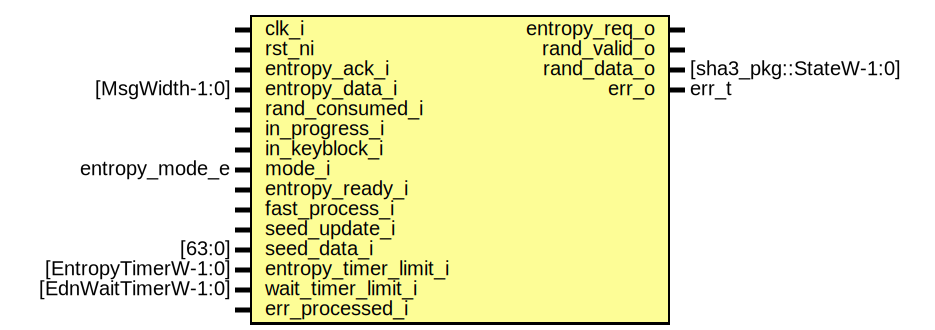

# Entity: kmac_entropy
## Diagram

## Description
Copyright lowRISC contributors.
 Licensed under the Apache License, Version 2.0, see LICENSE for details.
 SPDX-License-Identifier: Apache-2.0
 KMAC Entropy Generation module
 
## Ports
| Port name             | Direction | Type                   | Description         |
| --------------------- | --------- | ---------------------- | ------------------- |
| clk_i                 | input     |                        |                     |
| rst_ni                | input     |                        |                     |
| entropy_req_o         | output    |                        | EDN interface       |
| entropy_ack_i         | input     |                        |                     |
| entropy_data_i        | input     | [MsgWidth-1:0]         |                     |
| rand_valid_o          | output    |                        | Entropy to internal |
| rand_data_o           | output    | [sha3_pkg::StateW-1:0] |                     |
| rand_consumed_i       | input     |                        |                     |
| in_progress_i         | input     |                        | Status              |
| in_keyblock_i         | input     |                        |                     |
| mode_i                | input     | entropy_mode_e         | Configurations      |
| entropy_ready_i       | input     |                        |                     |
| fast_process_i        | input     |                        |                     |
| seed_update_i         | input     |                        |                     |
| seed_data_i           | input     | [63:0]                 |                     |
| entropy_timer_limit_i | input     | [EntropyTimerW-1:0]    |                     |
| wait_timer_limit_i    | input     | [EdnWaitTimerW-1:0]    |                     |
| err_o                 | output    | err_t                  | Error output        |
| err_processed_i       | input     |                        |                     |
## Signals
| Name                   | Type                        | Description                                                                                                                                                                                                                                                                                                   |
| ---------------------- | --------------------------- | ------------------------------------------------------------------------------------------------------------------------------------------------------------------------------------------------------------------------------------------------------------------------------------------------------------- |
| timer_sel              | timer_sel_e                 |                                                                                                                                                                                                                                                                                                               |
| timer_enable           | logic                       |                                                                                                                                                                                                                                                                                                               |
| timer_update           | logic                       |                                                                                                                                                                                                                                                                                                               |
| timer_expired          | logic                       |                                                                                                                                                                                                                                                                                                               |
| timer_limit            | logic [TimerW-1:0]          |                                                                                                                                                                                                                                                                                                               |
| timer_value            | logic [TimerW-1:0]          |                                                                                                                                                                                                                                                                                                               |
| lfsr_seed_en           | logic                       |                                                                                                                                                                                                                                                                                                               |
| lfsr_seed              | logic [EntropyLfsrW-1:0]    |                                                                                                                                                                                                                                                                                                               |
| lfsr_en                | logic                       |                                                                                                                                                                                                                                                                                                               |
| lfsr_data              | logic [EntropyLfsrW-1:0]    |                                                                                                                                                                                                                                                                                                               |
| storage_update         | logic                       | storage                                                                                                                                                                                                                                                                                                       |
| storage_idx_clear      | logic                       |                                                                                                                                                                                                                                                                                                               |
| storage_filled         | logic                       |                                                                                                                                                                                                                                                                                                               |
| in_progress_deasserted | logic                       | in_progress: check if in_progress de-asserted. It means hashing operation is completed. Entropy logic refreshes seed and prepare new entropy. de-asserting in_progress sets in_progress_deasserted, then when FSM moves to StRandEdn, it clears the de-assertion. This is to not miss the deassertion event.  |
| in_progress_clear      | logic                       | in_progress: check if in_progress de-asserted. It means hashing operation is completed. Entropy logic refreshes seed and prepare new entropy. de-asserting in_progress sets in_progress_deasserted, then when FSM moves to StRandEdn, it clears the de-assertion. This is to not miss the deassertion event.  |
| in_progress_d          | logic                       | in_progress: check if in_progress de-asserted. It means hashing operation is completed. Entropy logic refreshes seed and prepare new entropy. de-asserting in_progress sets in_progress_deasserted, then when FSM moves to StRandEdn, it clears the de-assertion. This is to not miss the deassertion event.  |
| rand_valid_set         | logic                       | Entropy valid signal FSM set and clear the valid signal, rand_consume signal clear the valid signal. Split the set, clear to make entropy valid while FSM is processing other tasks.                                                                                                                          |
| rand_valid_clear       | logic                       | Entropy valid signal FSM set and clear the valid signal, rand_consume signal clear the valid signal. Split the set, clear to make entropy valid while FSM is processing other tasks.                                                                                                                          |
| entropy_storage        | logic [EntropyStorageW-1:0] | LFSR --------------------------------------------------------------------- 320-bit storage ==========================================================                                                                                                                                                         |
| storage_idx            | logic [StorageIndexW-1:0]   |                                                                                                                                                                                                                                                                                                               |
| st                     | rand_st_e                   |                                                                                                                                                                                                                                                                                                               |
| st_d                   | rand_st_e                   |                                                                                                                                                                                                                                                                                                               |
| st_raw_q               | logic [StateWidth-1:0]      |                                                                                                                                                                                                                                                                                                               |
| entropy_req_o          | StRandEdn                   |                                                                                                                                                                                                                                                                                                               |
| lfsr_en                | end                         |                                                                                                                                                                                                                                                                                                               |
| else                   | end                         |                                                                                                                                                                                                                                                                                                               |
| st_d                   | begin                       |                                                                                                                                                                                                                                                                                                               |
| st_d                   | end                         |                                                                                                                                                                                                                                                                                                               |
| st_d                   | end                         |                                                                                                                                                                                                                                                                                                               |
| StRandErr              | end                         |                                                                                                                                                                                                                                                                                                               |
| st_d                   | end                         |                                                                                                                                                                                                                                                                                                               |
## Constants
| Name            | Type         | Value                              | Description                                         |
| --------------- | ------------ | ---------------------------------- | --------------------------------------------------- |
| EntropyLfsrW    | int unsigned | 64                                 | Timer Widths are defined in kmac_pkg storage width  |
| EntropyStorageW | int unsigned | 320                                |                                                     |
| EntropyMultiply | int unsigned | sha3_pkg::StateW / EntropyStorageW |                                                     |
| StorageEntries  | int unsigned | EntropyStorageW / EntropyLfsrW     |                                                     |
| StorageIndexW   | int unsigned | $clog2(StorageEntries)             |                                                     |
| StateWidth      | int          | 10                                 |                                                     |
| TimerW          | int unsigned | EntropyTimerW                      |                                                     |
## Types
| Name        | Type                                                                                                                                                                                                                                                                                                                                                                                                                                                                                                                                                                      | Description                                                                                                                                                                                                |
| ----------- | ------------------------------------------------------------------------------------------------------------------------------------------------------------------------------------------------------------------------------------------------------------------------------------------------------------------------------------------------------------------------------------------------------------------------------------------------------------------------------------------------------------------------------------------------------------------------- | ---------------------------------------------------------------------------------------------------------------------------------------------------------------------------------------------------------- |
| rand_st_e   | enum logic [StateWidth-1:0] {               StRandReset = 10'b 1101110011,                     StRandReady = 10'b 1001111000,                //                         //                                             StRandEdn = 10'b 0110000100,                     StSwSeedWait = 10'b 1100100111,                          StRandExpand = 10'b 1011110110,                     StRandErrWaitExpired = 10'b 0000001100,                     StRandErrIncorrectMode = 10'b 0001100011,                     //                         StRandErr = 10'b 1110010000   } | States                                                                                                                                                                                                     |
| timer_sel_e | enum logic [1:0] {     NoTimer      = 2'h 0,     EntropyTimer = 2'h 1,     EdnWaitTimer = 2'h 2   }                                                                                                                                                                                                                                                                                                                                                                                                                                                                       | "Wait Timer": This timer is in active when FSM sends entropy request to EDN If EDN does not return the entropy data until the timer expired, FSM moves to error state and report the error to the system.  |
## Processes
- unnamed: _( @(posedge clk_i or negedge rst_ni) )_
Timers ===================================================================

**Description**
Timers ===================================================================

- unnamed: _(  )_
select timer

**Description**
select timer

- unnamed: _( @(posedge clk_i or negedge rst_ni) )_

- unnamed: _(  )_

- unnamed: _( @(posedge clk_i or negedge rst_ni) )_

- unnamed: _( @(posedge clk_i or negedge rst_ni) )_

- unnamed: _( @(posedge clk_i or negedge rst_ni) )_
entropy valid

**Description**
entropy valid

- unnamed: _( @(posedge clk_i or negedge rst_ni) )_
Storage expands to StateW ------------------------------------------------
In Process Logic =========================================================

**Description**
Storage expands to StateW ------------------------------------------------
In Process Logic =========================================================

- unnamed: _( @(posedge clk_i or negedge rst_ni) )_

- unnamed: _(  )_
State: Next State and Output Logic

**Description**
State: Next State and Output Logic

## Instantiations
- u_lfsr: prim_lfsr
- u_state_regs: prim_flop
**Description**
State FF

