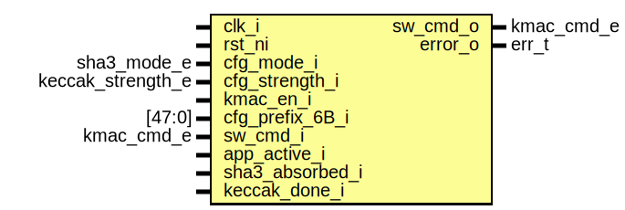

# Entity: kmac_errchk
## Diagram

## Description
Copyright lowRISC contributors.
 Licensed under the Apache License, Version 2.0, see LICENSE for details.
 SPDX-License-Identifier: Apache-2.0
 KMAC Error Checking logic
 `kmac_err` module checks the SW introduced errors.
  1. SW command sequencing error.
  2. SW configuration error.
 ## SW Command Sequencing Error
 KMAC assumes the application interface and the SW register interface to
 follow the specific sequence. It expects the requester to send the `Start`
 command then push the message body. The `Process` command follows the message
 body. The SW may issue `Run` command if it needs the digest result more than
 a block rate. Then SW completes the hash operation with `Done` command.
 This `kmac_err` module checks if the SW issues the correct command. If not,
 it reports the error via ERR_CODE register.
 However, the logic does not prevent the error-ed command to be propagated.
 The unexpected commands are filtered by each individual submodule.
 st := { Idle, MsgFeed, Processing, Absorbed, Squeeze}
 allowed := {
   Idle :      { Start     },
   MsgFeed:    { Process   },
   Processing: { None      },
   Absorbed:   { Run, Done },
   Squeeze:    { None      }
 }
 ## SW Configuration Error
 `kmac_errchk` module checks if SW configured correct combinations of the
 configuration registers when the hashing operation begins.
 1. Mode & Strength combinations
 2. Kmac Prefix
 * sideload & key_valid -> Checker in kmac_core
 
## Ports
| Port name       | Direction | Type              | Description           |
| --------------- | --------- | ----------------- | --------------------- |
| clk_i           | input     |                   |                       |
| rst_ni          | input     |                   |                       |
| cfg_mode_i      | input     | sha3_mode_e       | Configurations        |
| cfg_strength_i  | input     | keccak_strength_e |                       |
| kmac_en_i       | input     |                   |                       |
| cfg_prefix_6B_i | input     | [47:0]            | first 6B of PREFIX    |
| sw_cmd_i        | input     | kmac_cmd_e        | SW commands           |
| app_active_i    | input     |                   | Status from KMAC_APP  |
| sha3_absorbed_i | input     |                   | Status from SHA3 core |
| keccak_done_i   | input     |                   |                       |
| error_o         | output    | err_t             |                       |
## Signals
| Name               | Type  | Description                                                                                                                                          |
| ------------------ | ----- | ---------------------------------------------------------------------------------------------------------------------------------------------------- |
| st                 | st_e  |                                                                                                                                                      |
| st_d               | st_e  |                                                                                                                                                      |
| err_swsequence     | logic | `err_swsequence` occurs when SW issues wrong command                                                                                                 |
| err_modestrength   | logic | `err_modestrength` occcurs when Mode & Strength combinations are not allowed. This error does not block the hashing operation.                       |
| err_prefix         | logic | `err_prefix` occurs when the first 6B of !!PREFIX is not `encode_string("KMAC")` and kmac is enabled. This error does not block the KMAC operation.  |
| check_modestrength | end   |                                                                                                                                                      |
| err                | err_t | Return error code                                                                                                                                    |
## Types
| Name | Type                                                                                                | Description |
| ---- | --------------------------------------------------------------------------------------------------- | ----------- |
| st_e | enum logic [2:0] {     StIdle,     StMsgFeed,     StProcessing,     StAbsorbed,     StSqueezing   } |             |
## Processes
- unnamed: _(  )_
SW sequence Error
info field: Current state, Received command

**Description**
SW sequence Error
info field: Current state, Received command

- check_modestrength: _(  )_
Mode & Strength

**Description**
Mode & Strength

- check_prefix: _(  )_

- err_return: _(  )_

