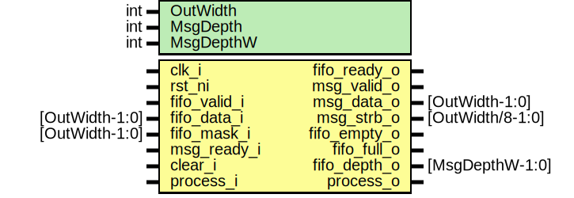

# Entity: kmac_msgfifo

- **File**: kmac_msgfifo.sv
## Diagram

## Description

 Copyright lowRISC contributors.
 Licensed under the Apache License, Version 2.0, see LICENSE for details.
 SPDX-License-Identifier: Apache-2.0

 KMAC MSG_FIFO

 This module converts TL-UL interface into MSG_FIFO interface used in KMAC.

## Generics

| Generic name | Type | Value              | Description                                                                                     |
| ------------ | ---- | ------------------ | ----------------------------------------------------------------------------------------------- |
| OutWidth     | int  | 64                 |  OutWidth is MsgFIFO data width. prim_packer converts InW to OutW prior to  pushing to MsgFIFO  |
| MsgDepth     | int  | 9                  |  Internal MsgFIFO Entry count                                                                   |
| MsgDepthW    | int  | $clog2(MsgDepth+1) |  derived parameter                                                                              |
## Ports

| Port name    | Direction | Type             | Description                                                                                               |
| ------------ | --------- | ---------------- | --------------------------------------------------------------------------------------------------------- |
| clk_i        | input     |                  |                                                                                                           |
| rst_ni       | input     |                  |                                                                                                           |
| fifo_valid_i | input     |                  |  from REG or KeyMgr Intf input                                                                            |
| fifo_data_i  | input     | [OutWidth-1:0]   |                                                                                                           |
| fifo_mask_i  | input     | [OutWidth-1:0]   |                                                                                                           |
| fifo_ready_o | output    |                  |                                                                                                           |
| msg_valid_o  | output    |                  |  MSG interface                                                                                            |
| msg_data_o   | output    | [OutWidth-1:0]   |                                                                                                           |
| msg_strb_o   | output    | [OutWidth/8-1:0] |                                                                                                           |
| msg_ready_i  | input     |                  |                                                                                                           |
| fifo_empty_o | output    |                  |                                                                                                           |
| fifo_full_o  | output    |                  |                                                                                                           |
| fifo_depth_o | output    | [MsgDepthW-1:0]  |                                                                                                           |
| clear_i      | input     |                  |  Control                                                                                                  |
| process_i    | input     |                  |  process_i --> process_o process_o asserted after all internal messages are flushed out to MSG interface  |
| process_o    | output    |                  |                                                                                                           |
## Signals

| Name               | Type                 | Description                                                                                       |
| ------------------ | -------------------- | ------------------------------------------------------------------------------------------------- |
| packer_wvalid      | logic                | ///////////  Signals // ///////////  Packer write path                                            |
| packer_wdata       | logic [OutWidth-1:0] |                                                                                                   |
| packer_wmask       | logic [OutWidth-1:0] |                                                                                                   |
| packer_wready      | logic                |                                                                                                   |
| fifo_wvalid        | logic                |  Message FIFO signals                                                                             |
| fifo_wdata         | fifo_t               |                                                                                                   |
| fifo_wready        | logic                |                                                                                                   |
| fifo_rvalid        | logic                |                                                                                                   |
| fifo_rdata         | fifo_t               |                                                                                                   |
| fifo_rready        | logic                |                                                                                                   |
| packer_flush_done  | logic                |  packer flush to msg_fifo, then msg_fifo empty out the internals  then assert msgfifo_flush_done  |
| msgfifo_flush_done | logic                |                                                                                                   |
| flush_st           | flush_st_e           |                                                                                                   |
| flush_st_d         | flush_st_e           |                                                                                                   |
## Constants

| Name      | Type | Value              | Description        |
| --------- | ---- | ------------------ | ------------------ |
| MsgDepthW | int  | $clog2(MsgDepth+1) | derived parameter  |
## Types

| Name       | Type                                                                                                                                                                                                                                                                            | Description                                      |
| ---------- | ------------------------------------------------------------------------------------------------------------------------------------------------------------------------------------------------------------------------------------------------------------------------------- | ------------------------------------------------ |
| fifo_t     | struct packed {      logic [OutWidth-1:0]   data;      logic [OutWidth/8-1:0] strb;     }                                                                              | ///////////////  Definitions // ///////////////  |
| flush_st_e | enum logic [1:0] {                FlushIdle,                      FlushPacker,            FlushFifo,                 FlushClear   } |                                                  |
## Processes
- unnamed: (  )
  - **Type:** always_comb
- unnamed: ( @(posedge clk_i or negedge rst_ni) )
  - **Type:** always_ff
- unnamed: (  )
  - **Type:** always_comb
## Instantiations

- u_packer: prim_packer
