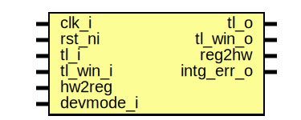

# Entity: kmac_reg_top

- **File**: kmac_reg_top.sv
## Diagram

## Description

Copyright lowRISC contributors.
 Licensed under the Apache License, Version 2.0, see LICENSE for details.
 SPDX-License-Identifier: Apache-2.0
 Register Top module auto-generated by `reggen`
 
## Ports

| Port name  | Direction | Type | Description                                              |
| ---------- | --------- | ---- | -------------------------------------------------------- |
| clk_i      | input     |      |                                                          |
| rst_ni     | input     |      |                                                          |
| tl_i       | input     |      |                                                          |
| tl_o       | output    |      |                                                          |
| tl_win_o   | output    |      | Output port for window                                   |
| tl_win_i   | input     |      |                                                          |
| reg2hw     | output    |      | Write                                                    |
| hw2reg     | input     |      | Read                                                     |
| intg_err_o | output    |      | Integrity check errors                                   |
| devmode_i  | input     |      | If 1, explicit error return for unmapped register access |
## Signals

| Name                         | Type               | Description                                                                                                               |
| ---------------------------- | ------------------ | ------------------------------------------------------------------------------------------------------------------------- |
| reg_we                       | logic              | register signals                                                                                                          |
| reg_re                       | logic              |                                                                                                                           |
| reg_addr                     | logic [AW-1:0]     |                                                                                                                           |
| reg_wdata                    | logic [DW-1:0]     |                                                                                                                           |
| reg_be                       | logic [DBW-1:0]    |                                                                                                                           |
| reg_rdata                    | logic [DW-1:0]     |                                                                                                                           |
| reg_error                    | logic              |                                                                                                                           |
| addrmiss                     | logic              |                                                                                                                           |
| wr_err                       | logic              |                                                                                                                           |
| reg_rdata_next               | logic [DW-1:0]     |                                                                                                                           |
| tl_reg_h2d                   | tlul_pkg::tl_h2d_t |                                                                                                                           |
| tl_reg_d2h                   | tlul_pkg::tl_d2h_t |                                                                                                                           |
| intg_err                     | logic              | incoming payload check                                                                                                    |
| intg_err_q                   | logic              |                                                                                                                           |
| tl_o_pre                     | tlul_pkg::tl_d2h_t | outgoing integrity generation                                                                                             |
| tl_socket_h2d                | tlul_pkg::tl_h2d_t |                                                                                                                           |
| tl_socket_d2h                | tlul_pkg::tl_d2h_t |                                                                                                                           |
| reg_steer                    | logic [1:0]        |                                                                                                                           |
| intr_state_we                | logic              | Define SW related signals Format: <reg>_<field>_{wd|we|qs} or <reg>_{wd|we|qs} if field == 1 or 0                         |
| intr_state_kmac_done_qs      | logic              |                                                                                                                           |
| intr_state_kmac_done_wd      | logic              |                                                                                                                           |
| intr_state_fifo_empty_qs     | logic              |                                                                                                                           |
| intr_state_fifo_empty_wd     | logic              |                                                                                                                           |
| intr_state_kmac_err_qs       | logic              |                                                                                                                           |
| intr_state_kmac_err_wd       | logic              |                                                                                                                           |
| intr_enable_we               | logic              |                                                                                                                           |
| intr_enable_kmac_done_qs     | logic              |                                                                                                                           |
| intr_enable_kmac_done_wd     | logic              |                                                                                                                           |
| intr_enable_fifo_empty_qs    | logic              |                                                                                                                           |
| intr_enable_fifo_empty_wd    | logic              |                                                                                                                           |
| intr_enable_kmac_err_qs      | logic              |                                                                                                                           |
| intr_enable_kmac_err_wd      | logic              |                                                                                                                           |
| intr_test_we                 | logic              |                                                                                                                           |
| intr_test_kmac_done_wd       | logic              |                                                                                                                           |
| intr_test_fifo_empty_wd      | logic              |                                                                                                                           |
| intr_test_kmac_err_wd        | logic              |                                                                                                                           |
| alert_test_we                | logic              |                                                                                                                           |
| alert_test_wd                | logic              |                                                                                                                           |
| cfg_regwen_re                | logic              |                                                                                                                           |
| cfg_regwen_qs                | logic              |                                                                                                                           |
| cfg_we                       | logic              |                                                                                                                           |
| cfg_kmac_en_qs               | logic              |                                                                                                                           |
| cfg_kmac_en_wd               | logic              |                                                                                                                           |
| cfg_kstrength_qs             | logic [2:0]        |                                                                                                                           |
| cfg_kstrength_wd             | logic [2:0]        |                                                                                                                           |
| cfg_mode_qs                  | logic [1:0]        |                                                                                                                           |
| cfg_mode_wd                  | logic [1:0]        |                                                                                                                           |
| cfg_msg_endianness_qs        | logic              |                                                                                                                           |
| cfg_msg_endianness_wd        | logic              |                                                                                                                           |
| cfg_state_endianness_qs      | logic              |                                                                                                                           |
| cfg_state_endianness_wd      | logic              |                                                                                                                           |
| cfg_sideload_qs              | logic              |                                                                                                                           |
| cfg_sideload_wd              | logic              |                                                                                                                           |
| cfg_entropy_mode_qs          | logic [1:0]        |                                                                                                                           |
| cfg_entropy_mode_wd          | logic [1:0]        |                                                                                                                           |
| cfg_entropy_fast_process_qs  | logic              |                                                                                                                           |
| cfg_entropy_fast_process_wd  | logic              |                                                                                                                           |
| cfg_entropy_ready_qs         | logic              |                                                                                                                           |
| cfg_entropy_ready_wd         | logic              |                                                                                                                           |
| cfg_err_processed_qs         | logic              |                                                                                                                           |
| cfg_err_processed_wd         | logic              |                                                                                                                           |
| cmd_we                       | logic              |                                                                                                                           |
| cmd_cmd_wd                   | logic [3:0]        |                                                                                                                           |
| cmd_entropy_req_wd           | logic              |                                                                                                                           |
| cmd_hash_cnt_clr_wd          | logic              |                                                                                                                           |
| status_re                    | logic              |                                                                                                                           |
| status_sha3_idle_qs          | logic              |                                                                                                                           |
| status_sha3_absorb_qs        | logic              |                                                                                                                           |
| status_sha3_squeeze_qs       | logic              |                                                                                                                           |
| status_fifo_depth_qs         | logic [4:0]        |                                                                                                                           |
| status_fifo_empty_qs         | logic              |                                                                                                                           |
| status_fifo_full_qs          | logic              |                                                                                                                           |
| entropy_period_we            | logic              |                                                                                                                           |
| entropy_period_prescaler_qs  | logic [9:0]        |                                                                                                                           |
| entropy_period_prescaler_wd  | logic [9:0]        |                                                                                                                           |
| entropy_period_wait_timer_qs | logic [15:0]       |                                                                                                                           |
| entropy_period_wait_timer_wd | logic [15:0]       |                                                                                                                           |
| entropy_refresh_we           | logic              |                                                                                                                           |
| entropy_refresh_threshold_qs | logic [9:0]        |                                                                                                                           |
| entropy_refresh_threshold_wd | logic [9:0]        |                                                                                                                           |
| entropy_refresh_hash_cnt_qs  | logic [9:0]        |                                                                                                                           |
| entropy_seed_lower_we        | logic              |                                                                                                                           |
| entropy_seed_lower_qs        | logic [31:0]       |                                                                                                                           |
| entropy_seed_lower_wd        | logic [31:0]       |                                                                                                                           |
| entropy_seed_upper_we        | logic              |                                                                                                                           |
| entropy_seed_upper_qs        | logic [31:0]       |                                                                                                                           |
| entropy_seed_upper_wd        | logic [31:0]       |                                                                                                                           |
| key_share0_0_we              | logic              |                                                                                                                           |
| key_share0_0_wd              | logic [31:0]       |                                                                                                                           |
| key_share0_1_we              | logic              |                                                                                                                           |
| key_share0_1_wd              | logic [31:0]       |                                                                                                                           |
| key_share0_2_we              | logic              |                                                                                                                           |
| key_share0_2_wd              | logic [31:0]       |                                                                                                                           |
| key_share0_3_we              | logic              |                                                                                                                           |
| key_share0_3_wd              | logic [31:0]       |                                                                                                                           |
| key_share0_4_we              | logic              |                                                                                                                           |
| key_share0_4_wd              | logic [31:0]       |                                                                                                                           |
| key_share0_5_we              | logic              |                                                                                                                           |
| key_share0_5_wd              | logic [31:0]       |                                                                                                                           |
| key_share0_6_we              | logic              |                                                                                                                           |
| key_share0_6_wd              | logic [31:0]       |                                                                                                                           |
| key_share0_7_we              | logic              |                                                                                                                           |
| key_share0_7_wd              | logic [31:0]       |                                                                                                                           |
| key_share0_8_we              | logic              |                                                                                                                           |
| key_share0_8_wd              | logic [31:0]       |                                                                                                                           |
| key_share0_9_we              | logic              |                                                                                                                           |
| key_share0_9_wd              | logic [31:0]       |                                                                                                                           |
| key_share0_10_we             | logic              |                                                                                                                           |
| key_share0_10_wd             | logic [31:0]       |                                                                                                                           |
| key_share0_11_we             | logic              |                                                                                                                           |
| key_share0_11_wd             | logic [31:0]       |                                                                                                                           |
| key_share0_12_we             | logic              |                                                                                                                           |
| key_share0_12_wd             | logic [31:0]       |                                                                                                                           |
| key_share0_13_we             | logic              |                                                                                                                           |
| key_share0_13_wd             | logic [31:0]       |                                                                                                                           |
| key_share0_14_we             | logic              |                                                                                                                           |
| key_share0_14_wd             | logic [31:0]       |                                                                                                                           |
| key_share0_15_we             | logic              |                                                                                                                           |
| key_share0_15_wd             | logic [31:0]       |                                                                                                                           |
| key_share1_0_we              | logic              |                                                                                                                           |
| key_share1_0_wd              | logic [31:0]       |                                                                                                                           |
| key_share1_1_we              | logic              |                                                                                                                           |
| key_share1_1_wd              | logic [31:0]       |                                                                                                                           |
| key_share1_2_we              | logic              |                                                                                                                           |
| key_share1_2_wd              | logic [31:0]       |                                                                                                                           |
| key_share1_3_we              | logic              |                                                                                                                           |
| key_share1_3_wd              | logic [31:0]       |                                                                                                                           |
| key_share1_4_we              | logic              |                                                                                                                           |
| key_share1_4_wd              | logic [31:0]       |                                                                                                                           |
| key_share1_5_we              | logic              |                                                                                                                           |
| key_share1_5_wd              | logic [31:0]       |                                                                                                                           |
| key_share1_6_we              | logic              |                                                                                                                           |
| key_share1_6_wd              | logic [31:0]       |                                                                                                                           |
| key_share1_7_we              | logic              |                                                                                                                           |
| key_share1_7_wd              | logic [31:0]       |                                                                                                                           |
| key_share1_8_we              | logic              |                                                                                                                           |
| key_share1_8_wd              | logic [31:0]       |                                                                                                                           |
| key_share1_9_we              | logic              |                                                                                                                           |
| key_share1_9_wd              | logic [31:0]       |                                                                                                                           |
| key_share1_10_we             | logic              |                                                                                                                           |
| key_share1_10_wd             | logic [31:0]       |                                                                                                                           |
| key_share1_11_we             | logic              |                                                                                                                           |
| key_share1_11_wd             | logic [31:0]       |                                                                                                                           |
| key_share1_12_we             | logic              |                                                                                                                           |
| key_share1_12_wd             | logic [31:0]       |                                                                                                                           |
| key_share1_13_we             | logic              |                                                                                                                           |
| key_share1_13_wd             | logic [31:0]       |                                                                                                                           |
| key_share1_14_we             | logic              |                                                                                                                           |
| key_share1_14_wd             | logic [31:0]       |                                                                                                                           |
| key_share1_15_we             | logic              |                                                                                                                           |
| key_share1_15_wd             | logic [31:0]       |                                                                                                                           |
| key_len_we                   | logic              |                                                                                                                           |
| key_len_wd                   | logic [2:0]        |                                                                                                                           |
| prefix_0_we                  | logic              |                                                                                                                           |
| prefix_0_qs                  | logic [31:0]       |                                                                                                                           |
| prefix_0_wd                  | logic [31:0]       |                                                                                                                           |
| prefix_1_we                  | logic              |                                                                                                                           |
| prefix_1_qs                  | logic [31:0]       |                                                                                                                           |
| prefix_1_wd                  | logic [31:0]       |                                                                                                                           |
| prefix_2_we                  | logic              |                                                                                                                           |
| prefix_2_qs                  | logic [31:0]       |                                                                                                                           |
| prefix_2_wd                  | logic [31:0]       |                                                                                                                           |
| prefix_3_we                  | logic              |                                                                                                                           |
| prefix_3_qs                  | logic [31:0]       |                                                                                                                           |
| prefix_3_wd                  | logic [31:0]       |                                                                                                                           |
| prefix_4_we                  | logic              |                                                                                                                           |
| prefix_4_qs                  | logic [31:0]       |                                                                                                                           |
| prefix_4_wd                  | logic [31:0]       |                                                                                                                           |
| prefix_5_we                  | logic              |                                                                                                                           |
| prefix_5_qs                  | logic [31:0]       |                                                                                                                           |
| prefix_5_wd                  | logic [31:0]       |                                                                                                                           |
| prefix_6_we                  | logic              |                                                                                                                           |
| prefix_6_qs                  | logic [31:0]       |                                                                                                                           |
| prefix_6_wd                  | logic [31:0]       |                                                                                                                           |
| prefix_7_we                  | logic              |                                                                                                                           |
| prefix_7_qs                  | logic [31:0]       |                                                                                                                           |
| prefix_7_wd                  | logic [31:0]       |                                                                                                                           |
| prefix_8_we                  | logic              |                                                                                                                           |
| prefix_8_qs                  | logic [31:0]       |                                                                                                                           |
| prefix_8_wd                  | logic [31:0]       |                                                                                                                           |
| prefix_9_we                  | logic              |                                                                                                                           |
| prefix_9_qs                  | logic [31:0]       |                                                                                                                           |
| prefix_9_wd                  | logic [31:0]       |                                                                                                                           |
| prefix_10_we                 | logic              |                                                                                                                           |
| prefix_10_qs                 | logic [31:0]       |                                                                                                                           |
| prefix_10_wd                 | logic [31:0]       |                                                                                                                           |
| err_code_qs                  | logic [31:0]       |                                                                                                                           |
| addr_hit                     | logic [56:0]       |                                                                                                                           |
| unused_wdata                 | logic              | Unused signal tieoff wdata / byte enable are not always fully used add a blanket unused statement to handle lint waivers  |
| unused_be                    | logic              |                                                                                                                           |
## Constants

| Name | Type | Value | Description |
| ---- | ---- | ----- | ----------- |
| AW   | int  | 12    |             |
| DW   | int  | 32    |             |
| DBW  | int  | DW/8  | Byte Width  |
## Processes
- unnamed: ( @(posedge clk_i or negedge rst_ni) )
- unnamed: (  )
**Description**
Create steering logic

- unnamed: (  )
- unnamed: (  )
**Description**
Check sub-word write is permitted

- unnamed: (  )
**Description**
Read data return

## Instantiations

- u_chk: tlul_cmd_intg_chk
- u_rsp_intg_gen: tlul_rsp_intg_gen
- u_socket: tlul_socket_1n
**Description**
Create Socket_1n

- u_reg_if: tlul_adapter_reg
- u_intr_state_kmac_done: prim_subreg
**Description**
Register instances
R[intr_state]: V(False)
F[kmac_done]: 0:0

- u_intr_state_fifo_empty: prim_subreg
**Description**
F[fifo_empty]: 1:1

- u_intr_state_kmac_err: prim_subreg
**Description**
F[kmac_err]: 2:2

- u_intr_enable_kmac_done: prim_subreg
**Description**
R[intr_enable]: V(False)
F[kmac_done]: 0:0

- u_intr_enable_fifo_empty: prim_subreg
**Description**
F[fifo_empty]: 1:1

- u_intr_enable_kmac_err: prim_subreg
**Description**
F[kmac_err]: 2:2

- u_intr_test_kmac_done: prim_subreg_ext
**Description**
R[intr_test]: V(True)
F[kmac_done]: 0:0

- u_intr_test_fifo_empty: prim_subreg_ext
**Description**
F[fifo_empty]: 1:1

- u_intr_test_kmac_err: prim_subreg_ext
**Description**
F[kmac_err]: 2:2

- u_alert_test: prim_subreg_ext
**Description**
R[alert_test]: V(True)

- u_cfg_regwen: prim_subreg_ext
**Description**
R[cfg_regwen]: V(True)

- u_cfg_kmac_en: prim_subreg
**Description**
R[cfg]: V(False)
F[kmac_en]: 0:0

- u_cfg_kstrength: prim_subreg
**Description**
F[kstrength]: 3:1

- u_cfg_mode: prim_subreg
**Description**
F[mode]: 5:4

- u_cfg_msg_endianness: prim_subreg
**Description**
F[msg_endianness]: 8:8

- u_cfg_state_endianness: prim_subreg
**Description**
F[state_endianness]: 9:9

- u_cfg_sideload: prim_subreg
**Description**
F[sideload]: 12:12

- u_cfg_entropy_mode: prim_subreg
**Description**
F[entropy_mode]: 17:16

- u_cfg_entropy_fast_process: prim_subreg
**Description**
F[entropy_fast_process]: 19:19

- u_cfg_entropy_ready: prim_subreg
**Description**
F[entropy_ready]: 24:24

- u_cfg_err_processed: prim_subreg
**Description**
F[err_processed]: 25:25

- u_cmd_cmd: prim_subreg_ext
**Description**
R[cmd]: V(True)
F[cmd]: 3:0

- u_cmd_entropy_req: prim_subreg_ext
**Description**
F[entropy_req]: 8:8

- u_cmd_hash_cnt_clr: prim_subreg_ext
**Description**
F[hash_cnt_clr]: 9:9

- u_status_sha3_idle: prim_subreg_ext
**Description**
R[status]: V(True)
F[sha3_idle]: 0:0

- u_status_sha3_absorb: prim_subreg_ext
**Description**
F[sha3_absorb]: 1:1

- u_status_sha3_squeeze: prim_subreg_ext
**Description**
F[sha3_squeeze]: 2:2

- u_status_fifo_depth: prim_subreg_ext
**Description**
F[fifo_depth]: 12:8

- u_status_fifo_empty: prim_subreg_ext
**Description**
F[fifo_empty]: 14:14

- u_status_fifo_full: prim_subreg_ext
**Description**
F[fifo_full]: 15:15

- u_entropy_period_prescaler: prim_subreg
**Description**
R[entropy_period]: V(False)
F[prescaler]: 9:0

- u_entropy_period_wait_timer: prim_subreg
**Description**
F[wait_timer]: 31:16

- u_entropy_refresh_threshold: prim_subreg
**Description**
R[entropy_refresh]: V(False)
F[threshold]: 9:0

- u_entropy_refresh_hash_cnt: prim_subreg
**Description**
F[hash_cnt]: 25:16

- u_entropy_seed_lower: prim_subreg
**Description**
R[entropy_seed_lower]: V(False)

- u_entropy_seed_upper: prim_subreg
**Description**
R[entropy_seed_upper]: V(False)

- u_key_len: prim_subreg
**Description**
R[key_len]: V(False)

- u_err_code: prim_subreg
**Description**
R[err_code]: V(False)

