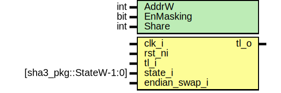

# Entity: kmac_staterd

- **File**: kmac_staterd.sv
## Diagram

## Description

 Copyright lowRISC contributors.
 Licensed under the Apache License, Version 2.0, see LICENSE for details.
 SPDX-License-Identifier: Apache-2.0

 Keccak state read

## Generics

| Generic name | Type | Value     | Description                                                                                                                         |
| ------------ | ---- | --------- | ----------------------------------------------------------------------------------------------------------------------------------- |
| AddrW        | int  | 9         |  TL-UL Address Width. Should be bigger than  $clog2(kmac_pkg::StateW) * Share                                                       |
| EnMasking    | bit  | 1'b0      |  EnMasking: Enable masking security hardening inside keccak_round  If it is enabled, the result digest will be two set of 1600bit.  |
| Share        | int  | undefined |  derived parameter                                                                                                                  |
## Ports

| Port name     | Direction | Type                   | Description |
| ------------- | --------- | ---------------------- | ----------- |
| clk_i         | input     |                        |             |
| rst_ni        | input     |                        |             |
| tl_i          | input     |                        |             |
| tl_o          | output    |                        |             |
| state_i       | input     | [sha3_pkg::StateW-1:0] |  State in   |
| endian_swap_i | input     |                        |  Config     |
## Signals

| Name               | Type                 | Description                                                 |
| ------------------ | -------------------- | ----------------------------------------------------------- |
| tlram_req          | logic                | ///////////  Signals // ///////////  TL-UL Adapter signals  |
| tlram_gnt          | logic                |                                                             |
| tlram_we           | logic                |                                                             |
| tlram_addr         | logic [AddrW-3:0]    | Word base                                                   |
| unused_tlram_wdata | logic [31:0]         |                                                             |
| unused_tlram_wmask | logic [31:0]         |                                                             |
| tlram_rdata        | logic [31:0]         |                                                             |
| tlram_rvalid       | logic                |                                                             |
| tlram_rerror       | logic [1:0]          |                                                             |
| tlram_rdata_endian | logic [31:0]         |                                                             |
| muxed_state        | logic [31:0]         |                                                             |
| addr_sel           | logic [SelAddrW-1:0] |                                                             |
## Constants

| Name       | Type | Value                       | Description        |
| ---------- | ---- | --------------------------- | ------------------ |
| Share      | int  | undefined                   | derived parameter  |
| StateAddrW | int  | $clog2(sha3_pkg::StateW/32) |                    |
| SelAddrW   | int  | AddrW-2-StateAddrW          |                    |
## Processes
- unnamed: ( @(posedge clk_i or negedge rst_ni) )
  - **Type:** always_ff
- unnamed: ( @(posedge clk_i or negedge rst_ni) )
  - **Type:** always_ff
## Instantiations

- u_tlul_adapter: tlul_adapter_sram
 **Description**
 TL Adapter

