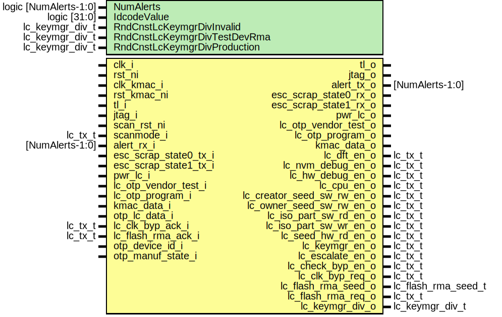

# Entity: lc_ctrl

## Diagram

## Description

Copyright lowRISC contributors.
 Licensed under the Apache License, Version 2.0, see LICENSE for details.
 SPDX-License-Identifier: Apache-2.0
 Life cycle controller top.
 
## Generics

| Generic name                 | Type                  | Value                | Description                                 |
| ---------------------------- | --------------------- | -------------------- | ------------------------------------------- |
| NumAlerts                    | logic [NumAlerts-1:0] | undefined            | Enable asynchronous transitions on alerts.  |
| IdcodeValue                  | logic [31:0]          | 32'h00000001         | Idcode value for the JTAG.                  |
| RndCnstLcKeymgrDivInvalid    | lc_keymgr_div_t       | LcKeymgrDivWidth'(0) | Random netlist constants                    |
| RndCnstLcKeymgrDivTestDevRma | lc_keymgr_div_t       | LcKeymgrDivWidth'(1) |                                             |
| RndCnstLcKeymgrDivProduction | lc_keymgr_div_t       | LcKeymgrDivWidth'(2) |                                             |
## Ports

| Port name                  | Direction | Type                | Description                                                                                                                                    |
| -------------------------- | --------- | ------------------- | ---------------------------------------------------------------------------------------------------------------------------------------------- |
| clk_i                      | input     |                     | Life cycle controller clock                                                                                                                    |
| rst_ni                     | input     |                     |                                                                                                                                                |
| clk_kmac_i                 | input     |                     | Clock for KMAC interface                                                                                                                       |
| rst_kmac_ni                | input     |                     |                                                                                                                                                |
| tl_i                       | input     |                     | Bus Interface (device)                                                                                                                         |
| tl_o                       | output    |                     |                                                                                                                                                |
| jtag_i                     | input     |                     | JTAG TAP.                                                                                                                                      |
| jtag_o                     | output    |                     |                                                                                                                                                |
| scan_rst_ni                | input     |                     | This bypasses the clock inverter inside the JTAG TAP for scanmmode.                                                                            |
| scanmode_i                 | input     | lc_tx_t             |                                                                                                                                                |
| alert_rx_i                 | input     | [NumAlerts-1:0]     | Alert outputs.                                                                                                                                 |
| alert_tx_o                 | output    | [NumAlerts-1:0]     |                                                                                                                                                |
| esc_scrap_state0_tx_i      | input     |                     | Escalation inputs (severity 1 and 2).These need not be synchronized since the alert handler is in the same clock domain as the LC controller.  |
| esc_scrap_state0_rx_o      | output    |                     |                                                                                                                                                |
| esc_scrap_state1_tx_i      | input     |                     |                                                                                                                                                |
| esc_scrap_state1_rx_o      | output    |                     |                                                                                                                                                |
| pwr_lc_i                   | input     |                     | Power manager interface (inputs are synced to lifecycle clock domain).                                                                         |
| pwr_lc_o                   | output    |                     |                                                                                                                                                |
| lc_otp_program_o           | output    |                     | Life cycle transition command interface.No sync required since LC and OTP are in the same clock domain.                                        |
| lc_otp_program_i           | input     |                     |                                                                                                                                                |
| kmac_data_i                | input     |                     | Life cycle hashing interface for raw unlockSynchronized in the life cycle controller.                                                          |
| kmac_data_o                | output    |                     |                                                                                                                                                |
| otp_lc_data_i              | input     |                     | OTP broadcast outputsNo sync required since LC and OTP are in the same clock domain.                                                           |
| lc_dft_en_o                | output    | lc_tx_t             | Life cycle broadcast outputs (all of them are registered).                                                                                     |
| lc_nvm_debug_en_o          | output    | lc_tx_t             |                                                                                                                                                |
| lc_hw_debug_en_o           | output    | lc_tx_t             |                                                                                                                                                |
| lc_cpu_en_o                | output    | lc_tx_t             |                                                                                                                                                |
| lc_creator_seed_sw_rw_en_o | output    | lc_tx_t             |                                                                                                                                                |
| lc_owner_seed_sw_rw_en_o   | output    | lc_tx_t             |                                                                                                                                                |
| lc_iso_part_sw_rd_en_o     | output    | lc_tx_t             |                                                                                                                                                |
| lc_iso_part_sw_wr_en_o     | output    | lc_tx_t             |                                                                                                                                                |
| lc_seed_hw_rd_en_o         | output    | lc_tx_t             |                                                                                                                                                |
| lc_keymgr_en_o             | output    | lc_tx_t             |                                                                                                                                                |
| lc_escalate_en_o           | output    | lc_tx_t             |                                                                                                                                                |
| lc_check_byp_en_o          | output    | lc_tx_t             |                                                                                                                                                |
| lc_clk_byp_req_o           | output    | lc_tx_t             | Request and feedback to/from clock manager and AST.The ack is synced to the lc clock domain using prim_lc_sync.                                |
| lc_clk_byp_ack_i           | input     | lc_tx_t             |                                                                                                                                                |
| lc_flash_rma_seed_o        | output    | lc_flash_rma_seed_t | Request and feedback to/from flash controller.The ack is synced to the lc clock domain using prim_lc_sync.                                     |
| lc_flash_rma_req_o         | output    | lc_tx_t             |                                                                                                                                                |
| lc_flash_rma_ack_i         | input     | lc_tx_t             |                                                                                                                                                |
| lc_keymgr_div_o            | output    | lc_keymgr_div_t     | State group diversification value for keymgr.                                                                                                  |
| otp_device_id_i            | input     |                     | Hardware config input, needed for the DEVICE_ID field.                                                                                         |
## Signals

| Name                      | Type                              | Description                                                                                                                                                                                                                                                                                                                                                                                                                                                                                                                                             |
| ------------------------- | --------------------------------- | ------------------------------------------------------------------------------------------------------------------------------------------------------------------------------------------------------------------------------------------------------------------------------------------------------------------------------------------------------------------------------------------------------------------------------------------------------------------------------------------------------------------------------------------------------- |
| reg2hw                    | lc_ctrl_reg_pkg::lc_ctrl_reg2hw_t |                                                                                                                                                                                                                                                                                                                                                                                                                                                                                                                                                         |
| hw2reg                    | lc_ctrl_reg_pkg::lc_ctrl_hw2reg_t |                                                                                                                                                                                                                                                                                                                                                                                                                                                                                                                                                         |
| fatal_bus_integ_error_q   | logic                             |                                                                                                                                                                                                                                                                                                                                                                                                                                                                                                                                                         |
| fatal_bus_integ_error_d   | logic                             |                                                                                                                                                                                                                                                                                                                                                                                                                                                                                                                                                         |
| tap_tl_h2d                | tlul_pkg::tl_h2d_t                |                                                                                                                                                                                                                                                                                                                                                                                                                                                                                                                                                         |
| tap_tl_d2h                | tlul_pkg::tl_d2h_t                |                                                                                                                                                                                                                                                                                                                                                                                                                                                                                                                                                         |
| tap_reg2hw                | lc_ctrl_reg_pkg::lc_ctrl_reg2hw_t |                                                                                                                                                                                                                                                                                                                                                                                                                                                                                                                                                         |
| tap_hw2reg                | lc_ctrl_reg_pkg::lc_ctrl_hw2reg_t |                                                                                                                                                                                                                                                                                                                                                                                                                                                                                                                                                         |
| dmi_req                   | dm::dmi_req_t                     | This reuses the JTAG DTM and DMI from the RISC-V external debug v0.13 specification to read and write the lc_ctrl CSRs: https://github.com/riscv/riscv-debug-spec/blob/release/riscv-debug-release.pdf The register addresses correspond to the byte offsets of the lc_ctrl CSRs, divided by 4. Note that the DMI reset does not affect the LC controller in any way.                                                                                                                                                                                   |
| dmi_req_valid             | logic                             |                                                                                                                                                                                                                                                                                                                                                                                                                                                                                                                                                         |
| dmi_req_ready             | logic                             |                                                                                                                                                                                                                                                                                                                                                                                                                                                                                                                                                         |
| dmi_resp                  | dm::dmi_resp_t                    |                                                                                                                                                                                                                                                                                                                                                                                                                                                                                                                                                         |
| dmi_resp_ready            | logic                             |                                                                                                                                                                                                                                                                                                                                                                                                                                                                                                                                                         |
| dmi_resp_valid            | logic                             |                                                                                                                                                                                                                                                                                                                                                                                                                                                                                                                                                         |
| scanmode                  | logic                             |                                                                                                                                                                                                                                                                                                                                                                                                                                                                                                                                                         |
| tck_muxed                 | logic                             |                                                                                                                                                                                                                                                                                                                                                                                                                                                                                                                                                         |
| trst_n_muxed              | logic                             |                                                                                                                                                                                                                                                                                                                                                                                                                                                                                                                                                         |
| req_ready                 | logic                             |                                                                                                                                                                                                                                                                                                                                                                                                                                                                                                                                                         |
| unused_tap_tl_d2h         | logic                             | unused inside dmi_jtag These signals are unused                                                                                                                                                                                                                                                                                                                                                                                                                                                                                                         |
| trans_success_d           | logic                             | All registers are HWext                                                                                                                                                                                                                                                                                                                                                                                                                                                                                                                                 |
| trans_success_q           | logic                             | All registers are HWext                                                                                                                                                                                                                                                                                                                                                                                                                                                                                                                                 |
| trans_cnt_oflw_error_d    | logic                             |                                                                                                                                                                                                                                                                                                                                                                                                                                                                                                                                                         |
| trans_cnt_oflw_error_q    | logic                             |                                                                                                                                                                                                                                                                                                                                                                                                                                                                                                                                                         |
| trans_invalid_error_d     | logic                             |                                                                                                                                                                                                                                                                                                                                                                                                                                                                                                                                                         |
| trans_invalid_error_q     | logic                             |                                                                                                                                                                                                                                                                                                                                                                                                                                                                                                                                                         |
| token_invalid_error_d     | logic                             |                                                                                                                                                                                                                                                                                                                                                                                                                                                                                                                                                         |
| token_invalid_error_q     | logic                             |                                                                                                                                                                                                                                                                                                                                                                                                                                                                                                                                                         |
| flash_rma_error_d         | logic                             |                                                                                                                                                                                                                                                                                                                                                                                                                                                                                                                                                         |
| flash_rma_error_q         | logic                             |                                                                                                                                                                                                                                                                                                                                                                                                                                                                                                                                                         |
| otp_prog_error_d          | logic                             |                                                                                                                                                                                                                                                                                                                                                                                                                                                                                                                                                         |
| fatal_prog_error_q        | logic                             |                                                                                                                                                                                                                                                                                                                                                                                                                                                                                                                                                         |
| state_invalid_error_d     | logic                             |                                                                                                                                                                                                                                                                                                                                                                                                                                                                                                                                                         |
| fatal_state_error_q       | logic                             |                                                                                                                                                                                                                                                                                                                                                                                                                                                                                                                                                         |
| otp_part_error_q          | logic                             |                                                                                                                                                                                                                                                                                                                                                                                                                                                                                                                                                         |
| sw_claim_transition_if_d  | logic [7:0]                       |                                                                                                                                                                                                                                                                                                                                                                                                                                                                                                                                                         |
| sw_claim_transition_if_q  | logic [7:0]                       |                                                                                                                                                                                                                                                                                                                                                                                                                                                                                                                                                         |
| tap_claim_transition_if_d | logic [7:0]                       |                                                                                                                                                                                                                                                                                                                                                                                                                                                                                                                                                         |
| tap_claim_transition_if_q | logic [7:0]                       |                                                                                                                                                                                                                                                                                                                                                                                                                                                                                                                                                         |
| transition_cmd            | logic                             |                                                                                                                                                                                                                                                                                                                                                                                                                                                                                                                                                         |
| transition_token_d        | lc_token_t                        |                                                                                                                                                                                                                                                                                                                                                                                                                                                                                                                                                         |
| transition_token_q        | lc_token_t                        |                                                                                                                                                                                                                                                                                                                                                                                                                                                                                                                                                         |
| transition_target_d       | dec_lc_state_e                    |                                                                                                                                                                                                                                                                                                                                                                                                                                                                                                                                                         |
| transition_target_q       | dec_lc_state_e                    |                                                                                                                                                                                                                                                                                                                                                                                                                                                                                                                                                         |
| dec_lc_state              | dec_lc_state_e                    | No need to register these.                                                                                                                                                                                                                                                                                                                                                                                                                                                                                                                              |
| dec_lc_cnt                | dec_lc_cnt_t                      |                                                                                                                                                                                                                                                                                                                                                                                                                                                                                                                                                         |
| dec_lc_id_state           | dec_lc_id_state_e                 |                                                                                                                                                                                                                                                                                                                                                                                                                                                                                                                                                         |
| lc_idle_d                 | logic                             |                                                                                                                                                                                                                                                                                                                                                                                                                                                                                                                                                         |
| use_ext_clock_d           | logic                             | OTP Vendor control bits                                                                                                                                                                                                                                                                                                                                                                                                                                                                                                                                 |
| use_ext_clock_q           | logic                             | OTP Vendor control bits                                                                                                                                                                                                                                                                                                                                                                                                                                                                                                                                 |
| otp_test_ctrl_d           | logic [CsrOtpTestCtrlWidth-1:0]   |                                                                                                                                                                                                                                                                                                                                                                                                                                                                                                                                                         |
| otp_test_ctrl_q           | logic [CsrOtpTestCtrlWidth-1:0]   |                                                                                                                                                                                                                                                                                                                                                                                                                                                                                                                                                         |
| lc_test_or_rma            | lc_tx_t                           | Output the vendor specific test ctrl bits only in TEST* or RMA states.                                                                                                                                                                                                                                                                                                                                                                                                                                                                                  |
| alerts                    | logic [NumAlerts-1:0]             |                                                                                                                                                                                                                                                                                                                                                                                                                                                                                                                                                         |
| alert_test                | logic [NumAlerts-1:0]             |                                                                                                                                                                                                                                                                                                                                                                                                                                                                                                                                                         |
| tap_alert_test            | logic [NumAlerts-1:0]             |                                                                                                                                                                                                                                                                                                                                                                                                                                                                                                                                                         |
| esc_scrap_state0          | logic                             | We still have two escalation receivers here for historical reasons. The two actions "wipe secrets" and "scrap lifecycle state" have been combined in order to simplify both DV and the design, as otherwise this separation of very intertwined actions would have caused too many unnecessary corner cases. The escalation receivers are now redundant and trigger both actions at once. This escalation action moves the life cycle state into a temporary "SCRAP" state named "ESCALATE", and asserts the lc_escalate_en life cycle control signal.  |
| esc_scrap_state1          | logic                             |                                                                                                                                                                                                                                                                                                                                                                                                                                                                                                                                                         |
| esc_scrap_state           | logic                             | This escalation action moves the life cycle state into a temporary "SCRAP" state named "ESCALATE".                                                                                                                                                                                                                                                                                                                                                                                                                                                      |
| lc_init                   | logic                             | Signals going to and coming from power manager.                                                                                                                                                                                                                                                                                                                                                                                                                                                                                                         |
| lc_done_d                 | logic                             |                                                                                                                                                                                                                                                                                                                                                                                                                                                                                                                                                         |
| lc_done_q                 | logic                             |                                                                                                                                                                                                                                                                                                                                                                                                                                                                                                                                                         |
| lc_idle_q                 | logic                             |                                                                                                                                                                                                                                                                                                                                                                                                                                                                                                                                                         |
| token_hash_req            | logic                             |                                                                                                                                                                                                                                                                                                                                                                                                                                                                                                                                                         |
| token_hash_ack            | logic                             |                                                                                                                                                                                                                                                                                                                                                                                                                                                                                                                                                         |
| token_hash_err            | logic                             |                                                                                                                                                                                                                                                                                                                                                                                                                                                                                                                                                         |
| hashed_token              | lc_token_t                        |                                                                                                                                                                                                                                                                                                                                                                                                                                                                                                                                                         |
## Processes
- p_csr_assign_outputs: (  )
- p_csr_assign_inputs: (  )
- p_csrs: ( @(posedge clk_i or negedge rst_ni) )
- p_sync_regs: ( @(posedge clk_i or negedge rst_ni) )
## Instantiations

- u_reg: lc_ctrl_reg_top
- u_reg_tap: lc_ctrl_reg_top
- u_prim_clock_mux2: prim_clock_mux2
- u_prim_rst_n_mux2: prim_clock_mux2
- u_dmi_jtag: dmi_jtag
- u_tap_tlul_host: tlul_adapter_host
**Description**
DMI to TL-UL transducing

- u_prim_esc_receiver0: prim_esc_receiver
- u_prim_esc_receiver1: prim_esc_receiver
- u_prim_flop_2sync_init: prim_flop_2sync
- u_lc_ctrl_kmac_if: lc_ctrl_kmac_if
- u_lc_ctrl_fsm: lc_ctrl_fsm
