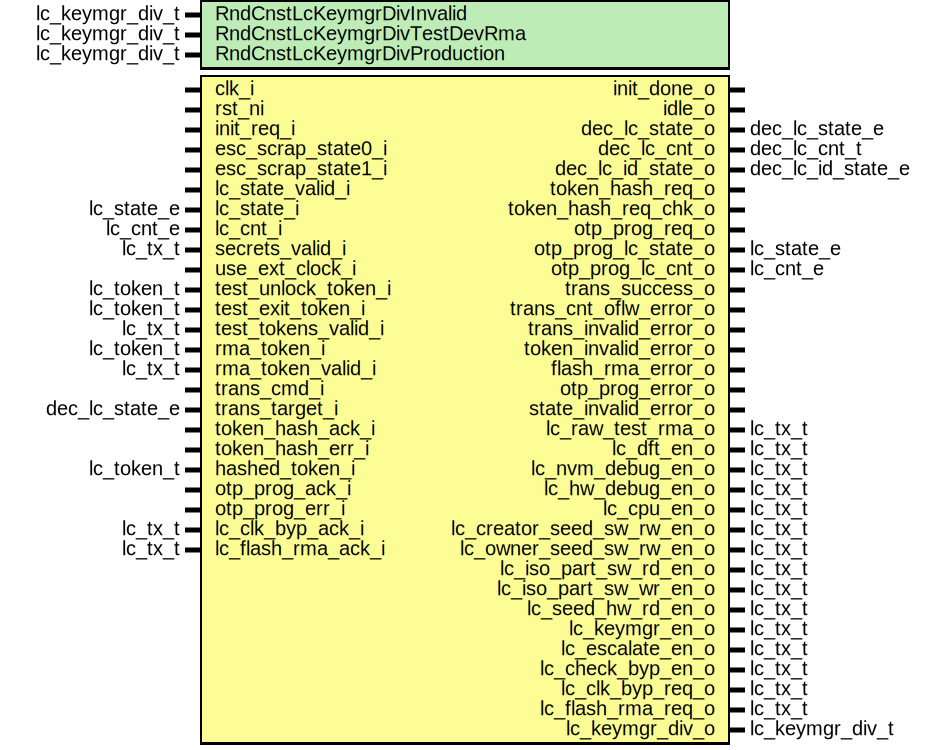

# Entity: lc_ctrl_fsm

- **File**: lc_ctrl_fsm.sv
## Diagram

## Description

 Copyright lowRISC contributors.
 Licensed under the Apache License, Version 2.0, see LICENSE for details.
 SPDX-License-Identifier: Apache-2.0

 Main Life Cycle Controller FSM.

## Generics

| Generic name                 | Type            | Value                | Description                |
| ---------------------------- | --------------- | -------------------- | -------------------------- |
| RndCnstLcKeymgrDivInvalid    | lc_keymgr_div_t | LcKeymgrDivWidth'(0) |  Random netlist constants  |
| RndCnstLcKeymgrDivTestDevRma | lc_keymgr_div_t | LcKeymgrDivWidth'(1) |                            |
| RndCnstLcKeymgrDivProduction | lc_keymgr_div_t | LcKeymgrDivWidth'(2) |                            |
## Ports

| Port name                  | Direction | Type              | Description                                                                         |
| -------------------------- | --------- | ----------------- | ----------------------------------------------------------------------------------- |
| clk_i                      | input     |                   |  This module is combinational, but we need the clock and reset for the assertions.  |
| rst_ni                     | input     |                   |                                                                                     |
| init_req_i                 | input     |                   |  Initialization request from power manager.                                         |
| init_done_o                | output    |                   |                                                                                     |
| idle_o                     | output    |                   |                                                                                     |
| esc_scrap_state0_i         | input     |                   |  Escalatio input                                                                    |
| esc_scrap_state1_i         | input     |                   |                                                                                     |
| lc_state_valid_i           | input     |                   |  Life cycle state vector from OTP.                                                  |
| lc_state_i                 | input     | lc_state_e        |                                                                                     |
| lc_cnt_i                   | input     | lc_cnt_e          |                                                                                     |
| secrets_valid_i            | input     | lc_tx_t           |                                                                                     |
| use_ext_clock_i            | input     |                   |  Defines whether we switch to an external clock when initiating a transition.       |
| test_unlock_token_i        | input     | lc_token_t        |  Token input from OTP (these are all hash post-images).                             |
| test_exit_token_i          | input     | lc_token_t        |                                                                                     |
| test_tokens_valid_i        | input     | lc_tx_t           |                                                                                     |
| rma_token_i                | input     | lc_token_t        |                                                                                     |
| rma_token_valid_i          | input     | lc_tx_t           |                                                                                     |
| trans_cmd_i                | input     |                   |  Transition trigger interface.                                                      |
| trans_target_i             | input     | dec_lc_state_e    |                                                                                     |
| dec_lc_state_o             | output    | dec_lc_state_e    |  Decoded life cycle state for CSRs.                                                 |
| dec_lc_cnt_o               | output    | dec_lc_cnt_t      |                                                                                     |
| dec_lc_id_state_o          | output    | dec_lc_id_state_e |                                                                                     |
| token_hash_req_o           | output    |                   |  Token hashing interface                                                            |
| token_hash_req_chk_o       | output    |                   |                                                                                     |
| token_hash_ack_i           | input     |                   |                                                                                     |
| token_hash_err_i           | input     |                   |                                                                                     |
| hashed_token_i             | input     | lc_token_t        |                                                                                     |
| otp_prog_req_o             | output    |                   |  OTP programming interface                                                          |
| otp_prog_lc_state_o        | output    | lc_state_e        |                                                                                     |
| otp_prog_lc_cnt_o          | output    | lc_cnt_e          |                                                                                     |
| otp_prog_ack_i             | input     |                   |                                                                                     |
| otp_prog_err_i             | input     |                   |                                                                                     |
| trans_success_o            | output    |                   |  Error outputs going to CSRs                                                        |
| trans_cnt_oflw_error_o     | output    |                   |                                                                                     |
| trans_invalid_error_o      | output    |                   |                                                                                     |
| token_invalid_error_o      | output    |                   |                                                                                     |
| flash_rma_error_o          | output    |                   |                                                                                     |
| otp_prog_error_o           | output    |                   |                                                                                     |
| state_invalid_error_o      | output    |                   |                                                                                     |
| lc_raw_test_rma_o          | output    | lc_tx_t           |  Local life cycle signal                                                            |
| lc_dft_en_o                | output    | lc_tx_t           |  Life cycle broadcast outputs.                                                      |
| lc_nvm_debug_en_o          | output    | lc_tx_t           |                                                                                     |
| lc_hw_debug_en_o           | output    | lc_tx_t           |                                                                                     |
| lc_cpu_en_o                | output    | lc_tx_t           |                                                                                     |
| lc_creator_seed_sw_rw_en_o | output    | lc_tx_t           |                                                                                     |
| lc_owner_seed_sw_rw_en_o   | output    | lc_tx_t           |                                                                                     |
| lc_iso_part_sw_rd_en_o     | output    | lc_tx_t           |                                                                                     |
| lc_iso_part_sw_wr_en_o     | output    | lc_tx_t           |                                                                                     |
| lc_seed_hw_rd_en_o         | output    | lc_tx_t           |                                                                                     |
| lc_keymgr_en_o             | output    | lc_tx_t           |                                                                                     |
| lc_escalate_en_o           | output    | lc_tx_t           |                                                                                     |
| lc_check_byp_en_o          | output    | lc_tx_t           |                                                                                     |
| lc_clk_byp_req_o           | output    | lc_tx_t           |  Request and feedback to/from clock manager and AST.                                |
| lc_clk_byp_ack_i           | input     | lc_tx_t           |                                                                                     |
| lc_flash_rma_req_o         | output    | lc_tx_t           |  Request and feedback to/from flash controller                                      |
| lc_flash_rma_ack_i         | input     | lc_tx_t           |                                                                                     |
| lc_keymgr_div_o            | output    | lc_keymgr_div_t   |  State group diversification value for keymgr                                       |
## Signals

| Name                   | Type                              | Description                                                                                                                                                                                                                                                                                                |
| ---------------------- | --------------------------------- | ---------------------------------------------------------------------------------------------------------------------------------------------------------------------------------------------------------------------------------------------------------------------------------------------------------- |
| lc_clk_byp_ack         | lc_tx_t [2:0]                     | ///////////////////////////  Synchronizers / Buffers // ///////////////////////////  We use multiple copies of these signals in the  FSM checks below.                                                                                                                                                     |
| lc_flash_rma_ack       | lc_tx_t [1:0]                     |                                                                                                                                                                                                                                                                                                            |
| fsm_state_d            | fsm_state_e                       |                                                                                                                                                                                                                                                                                                            |
| fsm_state_q            | fsm_state_e                       |                                                                                                                                                                                                                                                                                                            |
| lc_state_valid_d       | logic                             |  Continuously feed in valid signal for LC state.                                                                                                                                                                                                                                                           |
| lc_state_valid_q       | logic                             |  Continuously feed in valid signal for LC state.                                                                                                                                                                                                                                                           |
| lc_state_d             | lc_state_e                        |                                                                                                                                                                                                                                                                                                            |
| lc_state_q             | lc_state_e                        |                                                                                                                                                                                                                                                                                                            |
| next_lc_state          | lc_state_e                        |                                                                                                                                                                                                                                                                                                            |
| lc_cnt_d               | lc_cnt_e                          |                                                                                                                                                                                                                                                                                                            |
| lc_cnt_q               | lc_cnt_e                          |                                                                                                                                                                                                                                                                                                            |
| next_lc_cnt            | lc_cnt_e                          |                                                                                                                                                                                                                                                                                                            |
| lc_clk_byp_req         | lc_tx_t                           |                                                                                                                                                                                                                                                                                                            |
| lc_flash_rma_req       | lc_tx_t                           |                                                                                                                                                                                                                                                                                                            |
| lc_check_byp_en        | lc_tx_t                           |                                                                                                                                                                                                                                                                                                            |
| hashed_token_valid_mux | logic                             |  Hashed token to compare against.                                                                                                                                                                                                                                                                          |
| hashed_token_mux       | lc_token_t                        |                                                                                                                                                                                                                                                                                                            |
| state_invalid_error    | logic [5:0]                       |  Multibit state error from state decoder                                                                                                                                                                                                                                                                   |
| fsm_state_raw_q        | logic [FsmStateWidth-1:0]         | ///////////////  State Flops // ///////////////  This primitive is used to place a size-only constraint on the  flops in order to prevent FSM state encoding optimizations.                                                                                                                                |
| lc_state_raw_q         | logic [LcStateWidth-1:0]          |                                                                                                                                                                                                                                                                                                            |
| lc_cnt_raw_q           | logic [LcCountWidth-1:0]          |                                                                                                                                                                                                                                                                                                            |
| hashed_tokens          | lc_token_t [2**TokenIdxWidth-1:0] | /////////////  Token mux // /////////////  This indexes the correct token, based on the transition arc.  Note that we always perform a token comparison, even in case of  unconditional transitions. In the case of unconditional tokens  we just pass an all-zero constant through the hashing function.  |
| hashed_tokens_valid    | logic [2**TokenIdxWidth-1:0]      |                                                                                                                                                                                                                                                                                                            |
| token_idx              | logic [TokenIdxWidth-1:0]         |                                                                                                                                                                                                                                                                                                            |
## Processes
- p_fsm: (  )
  - **Type:** always_comb
- p_regs: ( @(posedge clk_i or negedge rst_ni) )
  - **Type:** always_ff
- p_token_assign: (  )
  - **Type:** always_comb
## Instantiations

- u_prim_lc_sync_clk_byp_ack: prim_lc_sync
- u_prim_lc_sync_flash_rma_ack: prim_lc_sync
- u_fsm_state_regs: prim_flop
- u_state_regs: prim_flop
- u_cnt_regs: prim_flop
- u_lc_ctrl_state_decode: lc_ctrl_state_decode
**Description**
//////////////////////////////////////////////////////////////////
 Decoding and transition logic for redundantly encoded LC state //
//////////////////////////////////////////////////////////////////
 This decodes the state into a format that can be exposed in the CSRs,
 and flags any errors in the state encoding. Errors will move the
 main FSM into INVALID right away.

- u_lc_ctrl_state_transition: lc_ctrl_state_transition
**Description**
 LC transition checker logic and next state generation.

- u_lc_ctrl_signal_decode: lc_ctrl_signal_decode
**Description**
 LC signal decoder and broadcasting logic.

- u_prim_lc_sender_clk_byp_req: prim_lc_sender
**Description**
 Conditional signals set by main FSM.

- u_prim_lc_sender_flash_rma_req: prim_lc_sender
- u_prim_lc_sender_check_byp_en: prim_lc_sender
