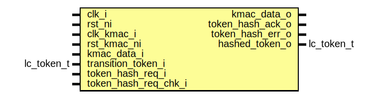

# Entity: lc_ctrl_kmac_if

- **File**: lc_ctrl_kmac_if.sv
## Diagram

## Description

 Copyright lowRISC contributors.
 Licensed under the Apache License, Version 2.0, see LICENSE for details.
 SPDX-License-Identifier: Apache-2.0

 Synchronization interface between LC FSM and KMAC.

## Ports

| Port name            | Direction | Type       | Description                                                                              |
| -------------------- | --------- | ---------- | ---------------------------------------------------------------------------------------- |
| clk_i                | input     |            |  Life cycle controller clock                                                             |
| rst_ni               | input     |            |                                                                                          |
| clk_kmac_i           | input     |            |  Clock for KMAC interface                                                                |
| rst_kmac_ni          | input     |            |                                                                                          |
| kmac_data_i          | input     |            |  Life cycle hashing interface for raw unlock Synchronized in the life cycle controller.  |
| kmac_data_o          | output    |            |                                                                                          |
| transition_token_i   | input     | lc_token_t |  Token hashing interface to LC FSM'                                                      |
| token_hash_req_i     | input     |            |                                                                                          |
| token_hash_req_chk_i | input     |            |  Used for gating assertions inside CDC primitives.                                       |
| token_hash_ack_o     | output    |            |                                                                                          |
| token_hash_err_o     | output    |            |                                                                                          |
| hashed_token_o       | output    | lc_token_t |                                                                                          |
## Signals

| Name                  | Type                   | Description                                                                                                                  |
| --------------------- | ---------------------- | ---------------------------------------------------------------------------------------------------------------------------- |
| kmac_req              | logic                  | ////////////////////////////////////  Data and Handshake Synchronizers // ////////////////////////////////////               |
| kmac_ack              | logic                  | ////////////////////////////////////  Data and Handshake Synchronizers // ////////////////////////////////////               |
| kmac_transition_token | lc_token_t             |                                                                                                                              |
| token_hash_req        | logic                  |                                                                                                                              |
| token_hash_ack_d      | logic                  |  Second synchronizer instance for handshake and return data synchronization.                                                 |
| token_hash_ack_q      | logic                  |  Second synchronizer instance for handshake and return data synchronization.                                                 |
| token_hash_err_q      | logic                  |                                                                                                                              |
| token_hash_err_d      | logic                  |                                                                                                                              |
| hashed_token_q        | lc_token_t             |                                                                                                                              |
| hashed_token_d        | lc_token_t             |                                                                                                                              |
| unused_sigs           | logic                  |                                                                                                                              |
| state_d               | state_e                |                                                                                                                              |
| state_q               | state_e                |                                                                                                                              |
| state_raw_q           | logic [StateWidth-1:0] |  This primitive is used to place a size-only constraint on the  flops in order to prevent FSM state encoding optimizations.  |
## Constants

| Name       | Type | Value | Description                                                                                                                                                                                                                                                                                                                                                                                                                                                                                                                              |
| ---------- | ---- | ----- | ---------------------------------------------------------------------------------------------------------------------------------------------------------------------------------------------------------------------------------------------------------------------------------------------------------------------------------------------------------------------------------------------------------------------------------------------------------------------------------------------------------------------------------------- |
| StateWidth | int  | 8     | ///////////////////////////////////////////  Serialization FSM Running on KMAC Clock // ///////////////////////////////////////////  Encoding generated with:  $ ./util/design/sparse-fsm-encode.py -d 5 -m 4 -n 8 \       -s 3343913945 --language=sv   Hamming distance histogram:    0: --   1: --   2: --   3: --   4: --   5: |||||||||||||||||||| (66.67%)   6: |||||||||| (33.33%)   7: --   8: --   Minimum Hamming distance: 5  Maximum Hamming distance: 6  Minimum Hamming weight: 1  Maximum Hamming weight: 6   |
## Types

| Name    | Type                                                                                                                                                                                                                                                                                             | Description |
| ------- | ------------------------------------------------------------------------------------------------------------------------------------------------------------------------------------------------------------------------------------------------------------------------------------------------ | ----------- |
| state_e | enum logic [StateWidth-1:0] {      FirstSt  = 8'b00000001,      SecondSt = 8'b11110011,      WaitSt   = 8'b10111100,      DoneSt   = 8'b01001110   } |             |
## Processes
- p_kmac: (  )
  - **Type:** always_comb
 **Description**
 Serialize the 128bit token into two 64bit beats. 
## Instantiations

- u_prim_sync_reqack_data_out: prim_sync_reqack_data
 **Description**
 The transition_token_i register is guaranteed to remain stable once a life cycle
 transition has been initiated.
 Hence no further synchronization registers are required on the outgoing data.
 We just instantiate this synchronizer instance to facilitate CDC tooling (i.e., we
 make sure the CDC paths go through a prim_sync_reqack_data instance).

- u_state_regs: prim_flop
