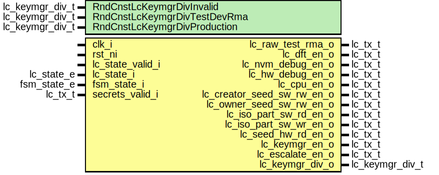

# Entity: lc_ctrl_signal_decode

- **File**: lc_ctrl_signal_decode.sv
## Diagram

## Description

Copyright lowRISC contributors.
 Licensed under the Apache License, Version 2.0, see LICENSE for details.
 SPDX-License-Identifier: Apache-2.0
 Life cycle signal decoder and sender module.
 
## Generics

| Generic name                 | Type            | Value                | Description                                                 |
| ---------------------------- | --------------- | -------------------- | ----------------------------------------------------------- |
| RndCnstLcKeymgrDivInvalid    | lc_keymgr_div_t | LcKeymgrDivWidth'(0) | Random netlist constants SCRAP, RAW, TEST_LOCKED*, INVALID  |
| RndCnstLcKeymgrDivTestDevRma | lc_keymgr_div_t | LcKeymgrDivWidth'(1) | TEST_UNLOCKED*, DEV, RMA                                    |
| RndCnstLcKeymgrDivProduction | lc_keymgr_div_t | LcKeymgrDivWidth'(2) | PROD, PROD_END                                              |
## Ports

| Port name                  | Direction | Type            | Description                                  |
| -------------------------- | --------- | --------------- | -------------------------------------------- |
| clk_i                      | input     |                 |                                              |
| rst_ni                     | input     |                 |                                              |
| lc_state_valid_i           | input     |                 | Life cycle state vector.                     |
| lc_state_i                 | input     | lc_state_e      |                                              |
| fsm_state_i                | input     | fsm_state_e     |                                              |
| secrets_valid_i            | input     | lc_tx_t         |                                              |
| lc_test_or_rma_o           | output    | lc_tx_t         | Local life cycle signal                      |
| lc_dft_en_o                | output    | lc_tx_t         | Life cycle broadcast outputs.                |
| lc_nvm_debug_en_o          | output    | lc_tx_t         |                                              |
| lc_hw_debug_en_o           | output    | lc_tx_t         |                                              |
| lc_cpu_en_o                | output    | lc_tx_t         |                                              |
| lc_creator_seed_sw_rw_en_o | output    | lc_tx_t         |                                              |
| lc_owner_seed_sw_rw_en_o   | output    | lc_tx_t         |                                              |
| lc_iso_part_sw_rd_en_o     | output    | lc_tx_t         |                                              |
| lc_iso_part_sw_wr_en_o     | output    | lc_tx_t         |                                              |
| lc_seed_hw_rd_en_o         | output    | lc_tx_t         |                                              |
| lc_keymgr_en_o             | output    | lc_tx_t         |                                              |
| lc_escalate_en_o           | output    | lc_tx_t         |                                              |
| lc_keymgr_div_o            | output    | lc_keymgr_div_t | State group diversification value for keymgr |
## Signals

| Name                     | Type            | Description |
| ------------------------ | --------------- | ----------- |
| lc_test_or_rma           | lc_tx_t         |             |
| lc_dft_en                | lc_tx_t         |             |
| lc_nvm_debug_en          | lc_tx_t         |             |
| lc_hw_debug_en           | lc_tx_t         |             |
| lc_cpu_en                | lc_tx_t         |             |
| lc_keymgr_en             | lc_tx_t         |             |
| lc_escalate_en           | lc_tx_t         |             |
| lc_creator_seed_sw_rw_en | lc_tx_t         |             |
| lc_owner_seed_sw_rw_en   | lc_tx_t         |             |
| lc_iso_part_sw_rd_en     | lc_tx_t         |             |
| lc_iso_part_sw_wr_en     | lc_tx_t         |             |
| lc_seed_hw_rd_en         | lc_tx_t         |             |
| lc_keymgr_div_d          | lc_keymgr_div_t |             |
| lc_keymgr_div_q          | lc_keymgr_div_t |             |
## Processes
- p_lc_signal_decode: (  )
## Instantiations

- u_prim_lc_sender_test_or_rma: prim_lc_sender
- u_prim_lc_sender_dft_en: prim_lc_sender
- u_prim_lc_sender_nvm_debug_en: prim_lc_sender
- u_prim_lc_sender_hw_debug_en: prim_lc_sender
- u_prim_lc_sender_cpu_en: prim_lc_sender
- u_prim_lc_sender_creator_seed_sw_rw_en: prim_lc_sender
- u_prim_lc_sender_owner_seed_sw_rw_en: prim_lc_sender
- u_prim_lc_sender_iso_part_sw_rd_en: prim_lc_sender
- u_prim_lc_sender_iso_part_sw_wr_en: prim_lc_sender
- u_prim_lc_sender_seed_hw_rd_en: prim_lc_sender
- u_prim_lc_sender_keymgr_en: prim_lc_sender
- u_prim_lc_sender_escalate_en: prim_lc_sender
- u_prim_flo_keymgr_div: prim_flop
