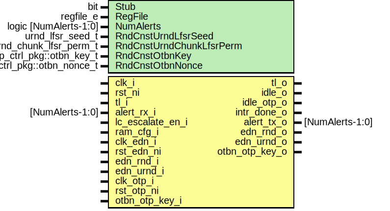

# Entity: otbn

## Diagram

## Description

Copyright lowRISC contributors.
 Licensed under the Apache License, Version 2.0, see LICENSE for details.
 SPDX-License-Identifier: Apache-2.0
 
## Generics

| Generic name             | Type                       | Value                           | Description                                 |
| ------------------------ | -------------------------- | ------------------------------- | ------------------------------------------- |
| Stub                     | bit                        | 1'b0                            |                                             |
| RegFile                  | regfile_e                  | RegFileFF                       |                                             |
| NumAlerts                | logic [NumAlerts-1:0]      | undefined                       |                                             |
| RndCnstUrndLfsrSeed      | urnd_lfsr_seed_t           | RndCnstUrndLfsrSeedDefault      | Default seed and permutation for URND LFSR  |
| RndCnstUrndChunkLfsrPerm | urnd_chunk_lfsr_perm_t     | RndCnstUrndChunkLfsrPermDefault |                                             |
| RndCnstOtbnKey           | otp_ctrl_pkg::otbn_key_t   | RndCnstOtbnKeyDefault           | Default seed and nonce for scrambling       |
| RndCnstOtbnNonce         | otp_ctrl_pkg::otbn_nonce_t | RndCnstOtbnNonceDefault         |                                             |
## Ports

| Port name        | Direction | Type            | Description                               |
| ---------------- | --------- | --------------- | ----------------------------------------- |
| clk_i            | input     |                 |                                           |
| rst_ni           | input     |                 |                                           |
| tl_i             | input     |                 |                                           |
| tl_o             | output    |                 |                                           |
| idle_o           | output    |                 | Inter-module signals                      |
| intr_done_o      | output    |                 | Interrupts                                |
| alert_rx_i       | input     | [NumAlerts-1:0] | Alerts                                    |
| alert_tx_o       | output    | [NumAlerts-1:0] |                                           |
| lc_escalate_en_i | input     |                 | Lifecycle interface                       |
| ram_cfg_i        | input     |                 | Memory configuration                      |
| clk_edn_i        | input     |                 | EDN clock and interface                   |
| rst_edn_ni       | input     |                 |                                           |
| edn_rnd_o        | output    |                 |                                           |
| edn_rnd_i        | input     |                 |                                           |
| edn_urnd_o       | output    |                 |                                           |
| edn_urnd_i       | input     |                 |                                           |
| clk_otp_i        | input     |                 | Key request to OTP (running on clk_fixed) |
| rst_otp_ni       | input     |                 |                                           |
| otbn_otp_key_o   | output    |                 |                                           |
| otbn_otp_key_i   | input     |                 |                                           |
## Signals

| Name                                     | Type                                     | Description                                                                                                                                                                                    |
| ---------------------------------------- | ---------------------------------------- | ---------------------------------------------------------------------------------------------------------------------------------------------------------------------------------------------- |
| rst_n                                    | logic                                    |                                                                                                                                                                                                |
| start_d                                  | logic                                    |                                                                                                                                                                                                |
| start_q                                  | logic                                    |                                                                                                                                                                                                |
| busy_d                                   | logic                                    |                                                                                                                                                                                                |
| busy_q                                   | logic                                    |                                                                                                                                                                                                |
| done                                     | logic                                    |                                                                                                                                                                                                |
| err_bits                                 | err_bits_t                               |                                                                                                                                                                                                |
| start_addr                               | logic [ImemAddrWidth-1:0]                |                                                                                                                                                                                                |
| reg2hw                                   | otbn_reg2hw_t                            |                                                                                                                                                                                                |
| hw2reg                                   | otbn_hw2reg_t                            |                                                                                                                                                                                                |
| tl_win_h2d                               | tlul_pkg::tl_h2d_t                       |                                                                                                                                                                                                |
| tl_win_d2h                               | tlul_pkg::tl_d2h_t                       |                                                                                                                                                                                                |
| lc_escalate_en                           | lc_ctrl_pkg::lc_tx_t                     | Lifecycle ==================================================================                                                                                                                   |
| unused_lc_escalate_en                    | lc_ctrl_pkg::lc_tx_t                     | TODO: Connect lifecycle signal.                                                                                                                                                                |
| imem_access_core                         | logic                                    | Access select to IMEM: core (1), or bus (0)                                                                                                                                                    |
| imem_req                                 | logic                                    |                                                                                                                                                                                                |
| imem_write                               | logic                                    |                                                                                                                                                                                                |
| imem_index                               | logic [ImemIndexWidth-1:0]               |                                                                                                                                                                                                |
| imem_wdata                               | logic [38:0]                             |                                                                                                                                                                                                |
| imem_wmask                               | logic [38:0]                             |                                                                                                                                                                                                |
| imem_rdata                               | logic [38:0]                             |                                                                                                                                                                                                |
| imem_rvalid                              | logic                                    |                                                                                                                                                                                                |
| imem_rerror_vec                          | logic [1:0]                              |                                                                                                                                                                                                |
| imem_rerror                              | logic                                    |                                                                                                                                                                                                |
| imem_req_core                            | logic                                    |                                                                                                                                                                                                |
| imem_write_core                          | logic                                    |                                                                                                                                                                                                |
| imem_index_core                          | logic [ImemIndexWidth-1:0]               |                                                                                                                                                                                                |
| imem_wdata_core                          | logic [31:0]                             |                                                                                                                                                                                                |
| imem_rdata_core                          | logic [31:0]                             |                                                                                                                                                                                                |
| imem_rvalid_core                         | logic                                    |                                                                                                                                                                                                |
| imem_rerror_core                         | logic                                    |                                                                                                                                                                                                |
| imem_req_bus                             | logic                                    |                                                                                                                                                                                                |
| imem_write_bus                           | logic                                    |                                                                                                                                                                                                |
| imem_index_bus                           | logic [ImemIndexWidth-1:0]               |                                                                                                                                                                                                |
| imem_wdata_bus                           | logic [38:0]                             |                                                                                                                                                                                                |
| imem_wmask_bus                           | logic [38:0]                             |                                                                                                                                                                                                |
| imem_rdata_bus                           | logic [38:0]                             |                                                                                                                                                                                                |
| imem_rvalid_bus                          | logic                                    |                                                                                                                                                                                                |
| imem_rerror_bus                          | logic [1:0]                              |                                                                                                                                                                                                |
| imem_bus_integrity_error                 | logic                                    |                                                                                                                                                                                                |
| imem_addr_core                           | logic [ImemAddrWidth-1:0]                |                                                                                                                                                                                                |
| unused_imem_addr_core_wordbits           | logic [1:0]                              |                                                                                                                                                                                                |
| otbn_imem_scramble_key                   | otp_ctrl_pkg::otbn_key_t                 |                                                                                                                                                                                                |
| otbn_imem_scramble_nonce                 | otbn_imem_nonce_t                        |                                                                                                                                                                                                |
| otbn_imem_scramble_valid                 | logic                                    |                                                                                                                                                                                                |
| unused_otbn_imem_scramble_key_seed_valid | logic                                    |                                                                                                                                                                                                |
| otbn_dmem_scramble_key                   | otp_ctrl_pkg::otbn_key_t                 |                                                                                                                                                                                                |
| otbn_dmem_scramble_nonce                 | otbn_dmem_nonce_t                        |                                                                                                                                                                                                |
| otbn_dmem_scramble_valid                 | logic                                    |                                                                                                                                                                                                |
| unused_otbn_dmem_scramble_key_seed_valid | logic                                    |                                                                                                                                                                                                |
| imem_gnt_bus                             | logic                                    | IMEM access from main TL-UL bus                                                                                                                                                                |
| dmem_access_core                         | logic                                    | Access select to DMEM: core (1), or bus (0)                                                                                                                                                    |
| dmem_req                                 | logic                                    |                                                                                                                                                                                                |
| dmem_write                               | logic                                    |                                                                                                                                                                                                |
| dmem_index                               | logic [DmemIndexWidth-1:0]               |                                                                                                                                                                                                |
| dmem_wdata                               | logic [ExtWLEN-1:0]                      |                                                                                                                                                                                                |
| dmem_wmask                               | logic [ExtWLEN-1:0]                      |                                                                                                                                                                                                |
| dmem_rdata                               | logic [ExtWLEN-1:0]                      |                                                                                                                                                                                                |
| dmem_rvalid                              | logic                                    |                                                                                                                                                                                                |
| dmem_rerror_vec                          | logic [BaseWordsPerWLEN*2-1:0]           |                                                                                                                                                                                                |
| dmem_rerror                              | logic                                    |                                                                                                                                                                                                |
| dmem_req_core                            | logic                                    |                                                                                                                                                                                                |
| dmem_write_core                          | logic                                    |                                                                                                                                                                                                |
| dmem_index_core                          | logic [DmemIndexWidth-1:0]               |                                                                                                                                                                                                |
| dmem_wdata_core                          | logic [ExtWLEN-1:0]                      |                                                                                                                                                                                                |
| dmem_wmask_core                          | logic [ExtWLEN-1:0]                      |                                                                                                                                                                                                |
| dmem_rmask_core_q                        | logic [BaseWordsPerWLEN-1:0]             |                                                                                                                                                                                                |
| dmem_rmask_core_d                        | logic [BaseWordsPerWLEN-1:0]             |                                                                                                                                                                                                |
| dmem_rdata_core                          | logic [ExtWLEN-1:0]                      |                                                                                                                                                                                                |
| dmem_rvalid_core                         | logic                                    |                                                                                                                                                                                                |
| dmem_rerror_core                         | logic                                    |                                                                                                                                                                                                |
| dmem_req_bus                             | logic                                    |                                                                                                                                                                                                |
| dmem_write_bus                           | logic                                    |                                                                                                                                                                                                |
| dmem_index_bus                           | logic [DmemIndexWidth-1:0]               |                                                                                                                                                                                                |
| dmem_wdata_bus                           | logic [ExtWLEN-1:0]                      |                                                                                                                                                                                                |
| dmem_wmask_bus                           | logic [ExtWLEN-1:0]                      |                                                                                                                                                                                                |
| dmem_rdata_bus                           | logic [ExtWLEN-1:0]                      |                                                                                                                                                                                                |
| dmem_rvalid_bus                          | logic                                    |                                                                                                                                                                                                |
| dmem_rerror_bus                          | logic [1:0]                              |                                                                                                                                                                                                |
| dmem_bus_integrity_error                 | logic                                    |                                                                                                                                                                                                |
| dmem_addr_core                           | logic [DmemAddrWidth-1:0]                |                                                                                                                                                                                                |
| unused_dmem_addr_core_wordbits           | logic                                    |                                                                                                                                                                                                |
| dmem_gnt_bus                             | logic                                    | DMEM access from main TL-UL bus                                                                                                                                                                |
| unused_dmem_top_rdata                    | logic                                    | The top bits of DMEM rdata aren't currently used (they will eventually be used for integrity checks within the core)                                                                           |
| reg_bus_integrity_error                  | logic                                    | Registers =================================================================                                                                                                                    |
| bus_integrity_error                      | logic                                    |                                                                                                                                                                                                |
|                                          | [ImemAddrWidth-1:0]                      |                                                                                                                                                                                                |
| unused_start_addr_bits                   | logic [top_pkg::TL_DW-ImemAddrWidth-1:0] |                                                                                                                                                                                                |
|                                          | [top_pkg::TL_DW-1:ImemAddrWidth]         |                                                                                                                                                                                                |
| insn_cnt                                 | logic [31:0]                             | INSN_CNT register                                                                                                                                                                              |
| alert_test                               | logic [NumAlerts-1:0]                    | Alerts ====================================================================                                                                                                                    |
| alerts                                   | logic [NumAlerts-1:0]                    |                                                                                                                                                                                                |
| edn_rnd_req                              | logic                                    | EDN Connections ============================================================                                                                                                                   |
| edn_rnd_ack                              | logic                                    | EDN Connections ============================================================                                                                                                                   |
| edn_rnd_data                             | logic [EdnDataWidth-1:0]                 |                                                                                                                                                                                                |
| edn_urnd_req                             | logic                                    |                                                                                                                                                                                                |
| edn_urnd_ack                             | logic                                    |                                                                                                                                                                                                |
| edn_urnd_data                            | logic [EdnDataWidth-1:0]                 |                                                                                                                                                                                                |
| otbn_use_model                           | bit                                      | Build both model and RTL implementation into the design, and switch at runtime through a plusarg. Set the plusarg +OTBN_USE_MODEL=1 to use the model (ISS) instead of the RTL implementation.  |
| done_model                               | logic                                    | Mux between model and RTL implementation at runtime.                                                                                                                                           |
| done_rtl                                 | logic                                    | Mux between model and RTL implementation at runtime.                                                                                                                                           |
| start_model                              | logic                                    |                                                                                                                                                                                                |
| start_rtl                                | logic                                    |                                                                                                                                                                                                |
| err_bits_model                           | err_bits_t                               |                                                                                                                                                                                                |
| err_bits_rtl                             | err_bits_t                               |                                                                                                                                                                                                |
| insn_cnt_model                           | logic [31:0]                             |                                                                                                                                                                                                |
| insn_cnt_rtl                             | logic [31:0]                             |                                                                                                                                                                                                |
| edn_rnd_data_valid                       | logic                                    |                                                                                                                                                                                                |
| edn_urnd_data_valid                      | logic                                    |                                                                                                                                                                                                |
| edn_rnd_data_model                       | logic [255:0]                            |                                                                                                                                                                                                |
## Constants

| Name            | Type             | Value                | Description                                                                                                                                                                                                                                         |
| --------------- | ---------------- | -------------------- | --------------------------------------------------------------------------------------------------------------------------------------------------------------------------------------------------------------------------------------------------- |
| ImemSizeByte    | int              | undefined            | The OTBN_*_SIZE parameters are auto-generated by regtool and come from the bus window sizes; they are given in bytes and must be powers of two.                                                                                                     |
| DmemSizeByte    | int              | undefined            |                                                                                                                                                                                                                                                     |
| ImemAddrWidth   | int              | vbits(ImemSizeByte)  |                                                                                                                                                                                                                                                     |
| DmemAddrWidth   | int              | vbits(DmemSizeByte)  |                                                                                                                                                                                                                                                     |
| ImemSizeWords   | int              | ImemSizeByte / 4     | Instruction Memory (IMEM) =================================================                                                                                                                                                                         |
| ImemIndexWidth  | int              | vbits(ImemSizeWords) |                                                                                                                                                                                                                                                     |
| DmemSizeWords   | int              | DmemSizeByte         | Data Memory (DMEM) ========================================================                                                                                                                                                                         |
| DmemIndexWidth  | int              | vbits(DmemSizeWords) |                                                                                                                                                                                                                                                     |
| ModelOnlyEdnVal | logic [WLEN-1:0] | undefined            | Model (Instruction Set Simulator) In model only runs, leave valid signals high and supply constant RND data for EDN which will allow the model to continue without RND/URND related stalls. TODO: Implement proper EDN requests in model only runs  |
## Types

| Name     | Type                                                                                                                                | Description                                     |
| -------- | ----------------------------------------------------------------------------------------------------------------------------------- | ----------------------------------------------- |
| tl_win_e | enum logic {      TlWinImem = 1'b0,      TlWinDmem = 1'b1   } | Bus device windows, as specified in otbn.hjson  |
## Processes
- unnamed: ( @(posedge clk_i or negedge rst_ni) )
- unnamed: ( @(posedge clk_i or negedge rst_ni) )
- unnamed: ( @(posedge clk_i or negedge rst_n) )
**Description**
OTBN Core =================================================================

## Instantiations

- u_lc_escalate_en_sync: prim_lc_sync
- u_intr_hw_done: prim_intr_hw
**Description**
Interrupts ================================================================

- u_otbn_scramble_ctrl: otbn_scramble_ctrl
- u_imem: prim_ram_1p_scr
- u_imem_intg_check: prim_secded_39_32_dec
**Description**
Separate check for imem read data integrity outside of `u_imem` as `prim_ram_1p_adv` doesn't
have functionality for only integrity checking, just fully integrated ECC.

- u_tlul_adapter_sram_imem: tlul_adapter_sram
- u_dmem: prim_ram_1p_scr
- u_tlul_adapter_sram_dmem: tlul_adapter_sram
- u_reg: otbn_reg_top
- u_prim_edn_rnd_req: prim_edn_req
**Description**
These synchronize the data coming from EDN and stack the 32 bit EDN words to achieve an
internal entropy width of 256 bit.

- u_prim_edn_urnd_req: prim_edn_req
- u_otbn_core_model: otbn_core_model
- u_otbn_core: otbn_core
**Description**
RTL implementation

- u_otbn_core: otbn_core
