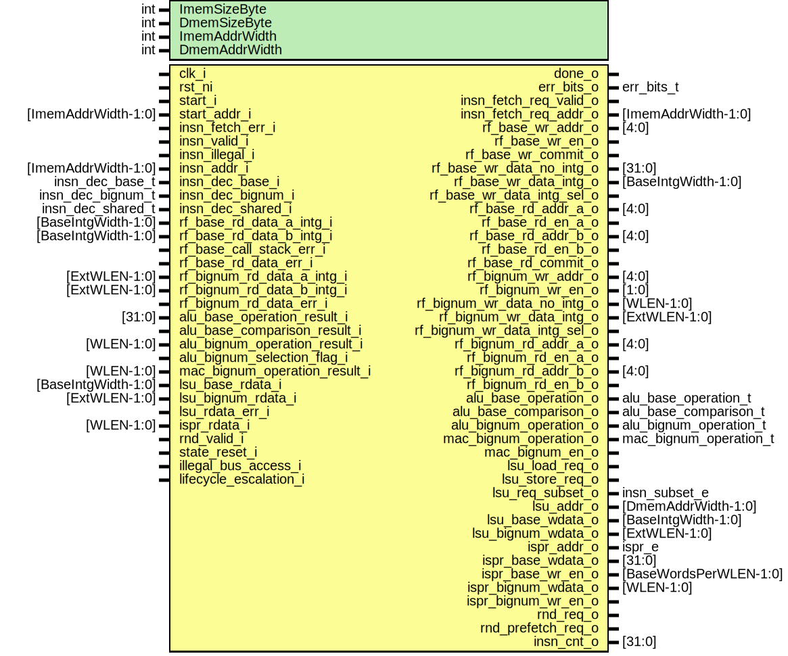

# Entity: otbn_controller

## Diagram

## Description

Copyright lowRISC contributors.
 Licensed under the Apache License, Version 2.0, see LICENSE for details.
 SPDX-License-Identifier: Apache-2.0
 
## Generics

| Generic name  | Type | Value                              | Description                               |
| ------------- | ---- | ---------------------------------- | ----------------------------------------- |
| ImemSizeByte  | int  | 4096                               | Size of the instruction memory, in bytes  |
| DmemSizeByte  | int  | 4096                               | Size of the data memory, in bytes         |
| ImemAddrWidth | int  | prim_util_pkg::vbits(ImemSizeByte) |                                           |
| DmemAddrWidth | int  | prim_util_pkg::vbits(DmemSizeByte) |                                           |
## Ports

| Port name                     | Direction | Type                   | Description                                           |
| ----------------------------- | --------- | ---------------------- | ----------------------------------------------------- |
| clk_i                         | input     |                        |                                                       |
| rst_ni                        | input     |                        |                                                       |
| start_i                       | input     |                        | start the processing at start_addr_i                  |
| done_o                        | output    |                        | processing done, signaled by ECALL or error occurring |
| err_bits_o                    | output    | err_bits_t             | valid when done_o is asserted                         |
| start_addr_i                  | input     | [ImemAddrWidth-1:0]    |                                                       |
| insn_fetch_req_valid_o        | output    |                        | Next instruction selection (to instruction fetch)     |
| insn_fetch_req_addr_o         | output    | [ImemAddrWidth-1:0]    |                                                       |
| insn_fetch_err_i              | input     |                        | Error from fetch requested last cycle                 |
| insn_valid_i                  | input     |                        | Fetched/decoded instruction                           |
| insn_illegal_i                | input     |                        |                                                       |
| insn_addr_i                   | input     | [ImemAddrWidth-1:0]    |                                                       |
| insn_dec_base_i               | input     | insn_dec_base_t        | Decoded instruction data                              |
| insn_dec_bignum_i             | input     | insn_dec_bignum_t      |                                                       |
| insn_dec_shared_i             | input     | insn_dec_shared_t      |                                                       |
| rf_base_wr_addr_o             | output    | [4:0]                  | Base register file                                    |
| rf_base_wr_en_o               | output    |                        |                                                       |
| rf_base_wr_commit_o           | output    |                        |                                                       |
| rf_base_wr_data_no_intg_o     | output    | [31:0]                 |                                                       |
| rf_base_wr_data_intg_o        | output    | [BaseIntgWidth-1:0]    |                                                       |
| rf_base_wr_data_intg_sel_o    | output    |                        |                                                       |
| rf_base_rd_addr_a_o           | output    | [4:0]                  |                                                       |
| rf_base_rd_en_a_o             | output    |                        |                                                       |
| rf_base_rd_data_a_intg_i      | input     | [BaseIntgWidth-1:0]    |                                                       |
| rf_base_rd_addr_b_o           | output    | [4:0]                  |                                                       |
| rf_base_rd_en_b_o             | output    |                        |                                                       |
| rf_base_rd_data_b_intg_i      | input     | [BaseIntgWidth-1:0]    |                                                       |
| rf_base_rd_commit_o           | output    |                        |                                                       |
| rf_base_call_stack_err_i      | input     |                        |                                                       |
| rf_base_rd_data_err_i         | input     |                        |                                                       |
| rf_bignum_wr_addr_o           | output    | [4:0]                  | Bignum register file (WDRs)                           |
| rf_bignum_wr_en_o             | output    | [1:0]                  |                                                       |
| rf_bignum_wr_data_no_intg_o   | output    | [WLEN-1:0]             |                                                       |
| rf_bignum_wr_data_intg_o      | output    | [ExtWLEN-1:0]          |                                                       |
| rf_bignum_wr_data_intg_sel_o  | output    |                        |                                                       |
| rf_bignum_rd_addr_a_o         | output    | [4:0]                  |                                                       |
| rf_bignum_rd_en_a_o           | output    |                        |                                                       |
| rf_bignum_rd_data_a_intg_i    | input     | [ExtWLEN-1:0]          |                                                       |
| rf_bignum_rd_addr_b_o         | output    | [4:0]                  |                                                       |
| rf_bignum_rd_en_b_o           | output    |                        |                                                       |
| rf_bignum_rd_data_b_intg_i    | input     | [ExtWLEN-1:0]          |                                                       |
| rf_bignum_rd_data_err_i       | input     |                        |                                                       |
| alu_base_operation_o          | output    | alu_base_operation_t   | Execution unitsBase ALU                               |
| alu_base_comparison_o         | output    | alu_base_comparison_t  |                                                       |
| alu_base_operation_result_i   | input     | [31:0]                 |                                                       |
| alu_base_comparison_result_i  | input     |                        |                                                       |
| alu_bignum_operation_o        | output    | alu_bignum_operation_t | Bignum ALU                                            |
| alu_bignum_operation_result_i | input     | [WLEN-1:0]             |                                                       |
| alu_bignum_selection_flag_i   | input     |                        |                                                       |
| mac_bignum_operation_o        | output    | mac_bignum_operation_t | Bignum MAC                                            |
| mac_bignum_operation_result_i | input     | [WLEN-1:0]             |                                                       |
| mac_bignum_en_o               | output    |                        |                                                       |
| lsu_load_req_o                | output    |                        | LSU                                                   |
| lsu_store_req_o               | output    |                        |                                                       |
| lsu_req_subset_o              | output    | insn_subset_e          |                                                       |
| lsu_addr_o                    | output    | [DmemAddrWidth-1:0]    |                                                       |
| lsu_base_wdata_o              | output    | [BaseIntgWidth-1:0]    |                                                       |
| lsu_bignum_wdata_o            | output    | [ExtWLEN-1:0]          |                                                       |
| lsu_base_rdata_i              | input     | [BaseIntgWidth-1:0]    |                                                       |
| lsu_bignum_rdata_i            | input     | [ExtWLEN-1:0]          |                                                       |
| lsu_rdata_err_i               | input     |                        |                                                       |
| ispr_addr_o                   | output    | ispr_e                 | Internal Special-Purpose Registers (ISPRs)            |
| ispr_base_wdata_o             | output    | [31:0]                 |                                                       |
| ispr_base_wr_en_o             | output    | [BaseWordsPerWLEN-1:0] |                                                       |
| ispr_bignum_wdata_o           | output    | [WLEN-1:0]             |                                                       |
| ispr_bignum_wr_en_o           | output    |                        |                                                       |
| ispr_rdata_i                  | input     | [WLEN-1:0]             |                                                       |
| rnd_req_o                     | output    |                        |                                                       |
| rnd_prefetch_req_o            | output    |                        |                                                       |
| rnd_valid_i                   | input     |                        |                                                       |
| insn_cnt_reset_i              | input     |                        |                                                       |
| insn_cnt_o                    | output    | [31:0]                 |                                                       |
## Signals

| Name                            | Type                                 | Description                                                                                                                                                                    |
| ------------------------------- | ------------------------------------ | ------------------------------------------------------------------------------------------------------------------------------------------------------------------------------ |
| state_q                         | otbn_state_e                         |                                                                                                                                                                                |
| state_d                         | otbn_state_e                         |                                                                                                                                                                                |
| state_raw                       | otbn_state_e                         |                                                                                                                                                                                |
| err                             | logic                                |                                                                                                                                                                                |
| done_complete                   | logic                                |                                                                                                                                                                                |
| insn_fetch_req_valid_raw        | logic                                |                                                                                                                                                                                |
| stall                           | logic                                |                                                                                                                                                                                |
| ispr_stall                      | logic                                |                                                                                                                                                                                |
| mem_stall                       | logic                                |                                                                                                                                                                                |
| branch_taken                    | logic                                |                                                                                                                                                                                |
| insn_executing                  | logic                                |                                                                                                                                                                                |
| branch_target                   | logic [ImemAddrWidth-1:0]            |                                                                                                                                                                                |
| branch_target_overflow          | logic                                |                                                                                                                                                                                |
| next_insn_addr_wide             | logic [ImemAddrWidth:0]              |                                                                                                                                                                                |
| next_insn_addr                  | logic [ImemAddrWidth-1:0]            |                                                                                                                                                                                |
| csr_addr                        | csr_e                                |                                                                                                                                                                                |
| csr_sub_addr                    | logic [$clog2(BaseWordsPerWLEN)-1:0] |                                                                                                                                                                                |
| csr_rdata_raw                   | logic [31:0]                         |                                                                                                                                                                                |
| csr_rdata                       | logic [31:0]                         |                                                                                                                                                                                |
| csr_rdata_mux                   | logic [BaseWordsPerWLEN-1:0]         |                                                                                                                                                                                |
| csr_wdata_raw                   | logic [31:0]                         |                                                                                                                                                                                |
| csr_wdata                       | logic [31:0]                         |                                                                                                                                                                                |
| wsr_addr                        | wsr_e                                |                                                                                                                                                                                |
| wsr_wdata                       | logic [WLEN-1:0]                     |                                                                                                                                                                                |
| ispr_addr_base                  | ispr_e                               |                                                                                                                                                                                |
| ispr_word_addr_base             | logic [$clog2(BaseWordsPerWLEN)-1:0] |                                                                                                                                                                                |
| ispr_word_sel_base              | logic [BaseWordsPerWLEN-1:0]         |                                                                                                                                                                                |
| ispr_addr_bignum                | ispr_e                               |                                                                                                                                                                                |
| ispr_wr_insn                    | logic                                |                                                                                                                                                                                |
| ispr_rd_insn                    | logic                                |                                                                                                                                                                                |
| ispr_wr_base_insn               | logic                                |                                                                                                                                                                                |
| ispr_wr_bignum_insn             | logic                                |                                                                                                                                                                                |
| lsu_load_req_raw                | logic                                |                                                                                                                                                                                |
| lsu_store_req_raw               | logic                                |                                                                                                                                                                                |
| rf_base_rd_data_a_no_intg       | logic [31:0]                         | Register read data with integrity stripped off                                                                                                                                 |
| rf_base_rd_data_b_no_intg       | logic [31:0]                         |                                                                                                                                                                                |
| rf_bignum_rd_data_a_no_intg     | logic [WLEN-1:0]                     |                                                                                                                                                                                |
| rf_bignum_rd_data_b_no_intg     | logic [WLEN-1:0]                     |                                                                                                                                                                                |
| selection_result                | logic [ExtWLEN-1:0]                  |                                                                                                                                                                                |
| rf_base_rd_data_a_inc           | logic [5:0]                          | Computed increments for indirect register index and memory address in BN.LID/BN.SID/BN.MOVR instructions.                                                                      |
| rf_base_rd_data_b_inc           | logic [5:0]                          |                                                                                                                                                                                |
| rf_base_rd_data_a_wlen_word_inc | logic [26:0]                         |                                                                                                                                                                                |
| increment_out                   | logic [31:0]                         | Output of mux taking the above increments as inputs and choosing one to write back to base register file with appropriate zero extension and padding to give a 32-bit result.  |
| loop_start_req                  | logic                                | Loop control, used to start a new loop                                                                                                                                         |
| loop_start_commit               | logic                                |                                                                                                                                                                                |
| loop_bodysize                   | logic [11:0]                         |                                                                                                                                                                                |
| loop_iterations                 | logic [31:0]                         |                                                                                                                                                                                |
| loop_jump                       | logic                                | Loop generated jumps. The loop controller asks to jump when execution reaches the end of a loop body that hasn't completed all of its iterations.                              |
| loop_jump_addr                  | logic [ImemAddrWidth-1:0]            |                                                                                                                                                                                |
| mac_bignum_rf_wr_data           | logic [WLEN-1:0]                     |                                                                                                                                                                                |
| csr_illegal_addr                | logic                                |                                                                                                                                                                                |
| wsr_illegal_addr                | logic                                |                                                                                                                                                                                |
| ispr_illegal_addr               | logic                                |                                                                                                                                                                                |
| imem_addr_err                   | logic                                |                                                                                                                                                                                |
| loop_err                        | logic                                |                                                                                                                                                                                |
| ispr_err                        | logic                                |                                                                                                                                                                                |
| dmem_addr_err                   | logic                                |                                                                                                                                                                                |
| dmem_addr_unaligned_base        | logic                                |                                                                                                                                                                                |
| dmem_addr_unaligned_bignum      | logic                                |                                                                                                                                                                                |
| dmem_addr_overflow              | logic                                |                                                                                                                                                                                |
| rf_a_indirect_err               | logic                                |                                                                                                                                                                                |
| rf_b_indirect_err               | logic                                |                                                                                                                                                                                |
| rf_d_indirect_err               | logic                                |                                                                                                                                                                                |
| rf_indirect_err                 | logic                                |                                                                                                                                                                                |
| insn_cnt_en                     | logic                                |                                                                                                                                                                                |
| insn_cnt_d                      | logic [31:0]                         |                                                                                                                                                                                |
| insn_cnt_q                      | logic [31:0]                         |                                                                                                                                                                                |
| unused_rf_base_rd_a_intg_bits   | logic                                | TODO: For now integrity bits from RF base are ignored in the controller, remove this when end to end integrity features that use them are implemented                          |
| unused_rf_base_rd_b_intg_bits   | logic                                |                                                                                                                                                                                |
|                                 | [$clog2(BaseWordsPerWLEN)-1:0]       |                                                                                                                                                                                |
## Constants

| Name          | Type | Value                              | Description |
| ------------- | ---- | ---------------------------------- | ----------- |
| ImemAddrWidth | int  | prim_util_pkg::vbits(ImemSizeByte) |             |
| DmemAddrWidth | int  | prim_util_pkg::vbits(DmemSizeByte) |             |
## Processes
- unnamed: (  )
- unnamed: (  )
**Description**
Determine if there are any errors related to the Imem fetch address.

- unnamed: ( @(posedge clk_i or negedge rst_ni) )
- unnamed: ( @(posedge clk_i or negedge rst_ni) )
- unnamed: (  )
**Description**
Choose increment to write back to base register file, only one increment can be written as
there is only one write port. Note that where an instruction is incrementing the indirect
reference to its destination register (insn_dec_bignum_i.d_inc) that reference is read on the
B read port so the B increment is written back.

- unnamed: (  )
- unnamed: (  )
**Description**
Base ALU Operand A MUX

- unnamed: (  )
**Description**
Base ALU Operand B MUX

- unnamed: (  )
- unnamed: (  )
**Description**
Base ALU Operand B MUX

- unnamed: (  )
**Description**
Bignum Register file write control

- unnamed: (  )
- unnamed: (  )
- unnamed: (  )
**Description**
Specialised read data handling for CSR reads where raw read data needs modification.

- unnamed: (  )
**Description**
Specialised write data handling for CSR writes where raw write data needs modification.

- unnamed: (  )
## Instantiations

- u_otbn_loop_controller: otbn_loop_controller
