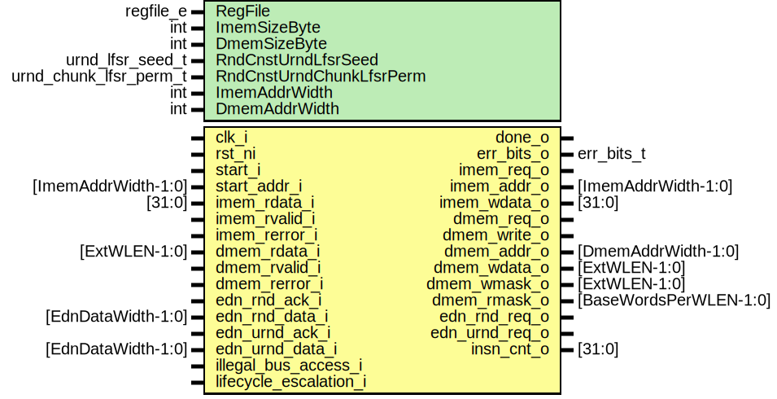

# Entity: otbn_core

- **File**: otbn_core.sv
## Diagram

## Description

 Copyright lowRISC contributors.
 Licensed under the Apache License, Version 2.0, see LICENSE for details.
 SPDX-License-Identifier: Apache-2.0
*

## Generics

| Generic name             | Type                   | Value                              | Description                                                |
| ------------------------ | ---------------------- | ---------------------------------- | ---------------------------------------------------------- |
| RegFile                  | regfile_e              | RegFileFF                          |  Register file implementation selection, see otbn_pkg.sv.  |
| ImemSizeByte             | int                    | 4096                               |  Size of the instruction memory, in bytes                  |
| DmemSizeByte             | int                    | 4096                               |  Size of the data memory, in bytes                         |
| RndCnstUrndLfsrSeed      | urnd_lfsr_seed_t       | RndCnstUrndLfsrSeedDefault         |  Default seed and permutation for URND LFSR                |
| RndCnstUrndChunkLfsrPerm | urnd_chunk_lfsr_perm_t | RndCnstUrndChunkLfsrPermDefault    |                                                            |
| ImemAddrWidth            | int                    | prim_util_pkg::vbits(ImemSizeByte) |                                                            |
| DmemAddrWidth            | int                    | prim_util_pkg::vbits(DmemSizeByte) |                                                            |
## Ports

| Port name              | Direction | Type                   | Description                                                                                                  |
| ---------------------- | --------- | ---------------------- | ------------------------------------------------------------------------------------------------------------ |
| clk_i                  | input     |                        |                                                                                                              |
| rst_ni                 | input     |                        |                                                                                                              |
| start_i                | input     |                        | start the operation                                                                                          |
| done_o                 | output    |                        | operation done                                                                                               |
| err_bits_o             | output    | err_bits_t             | valid when done_o is asserted                                                                                |
| start_addr_i           | input     | [ImemAddrWidth-1:0]    | start byte address in IMEM                                                                                   |
| imem_req_o             | output    |                        |  Instruction memory (IMEM)                                                                                   |
| imem_addr_o            | output    | [ImemAddrWidth-1:0]    |                                                                                                              |
| imem_wdata_o           | output    | [31:0]                 |                                                                                                              |
| imem_rdata_i           | input     | [31:0]                 |                                                                                                              |
| imem_rvalid_i          | input     |                        |                                                                                                              |
| imem_rerror_i          | input     |                        |                                                                                                              |
| dmem_req_o             | output    |                        |  Data memory (DMEM)                                                                                          |
| dmem_write_o           | output    |                        |                                                                                                              |
| dmem_addr_o            | output    | [DmemAddrWidth-1:0]    |                                                                                                              |
| dmem_wdata_o           | output    | [ExtWLEN-1:0]          |                                                                                                              |
| dmem_wmask_o           | output    | [ExtWLEN-1:0]          |                                                                                                              |
| dmem_rmask_o           | output    | [BaseWordsPerWLEN-1:0] |                                                                                                              |
| dmem_rdata_i           | input     | [ExtWLEN-1:0]          |                                                                                                              |
| dmem_rvalid_i          | input     |                        |                                                                                                              |
| dmem_rerror_i          | input     |                        |                                                                                                              |
| edn_rnd_req_o          | output    |                        |  Entropy distribution network (EDN) connections One for RND, the other for URND                              |
| edn_rnd_ack_i          | input     |                        |                                                                                                              |
| edn_rnd_data_i         | input     | [EdnDataWidth-1:0]     |                                                                                                              |
| edn_urnd_req_o         | output    |                        |                                                                                                              |
| edn_urnd_ack_i         | input     |                        |                                                                                                              |
| edn_urnd_data_i        | input     | [EdnDataWidth-1:0]     |                                                                                                              |
| insn_cnt_o             | output    | [31:0]                 |                                                                                                              |
| illegal_bus_access_i   | input     |                        |  Asserted by system when bus tries to access OTBN memories whilst OTBN is active. Results in a fatal error.  |
| lifecycle_escalation_i | input     |                        |  Indicates an incoming escalation from the life cycle manager. Results in a fatal error.                     |
## Signals

| Name                          | Type                         | Description                                                     |
| ----------------------------- | ---------------------------- | --------------------------------------------------------------- |
| insn_fetch_req_addr           | logic [ImemAddrWidth-1:0]    |  Fetch request (the next instruction)                           |
| insn_fetch_req_valid          | logic                        |                                                                 |
| insn_fetch_resp_valid         | logic                        |  Fetch response (the current instruction before it is decoded)  |
| insn_fetch_resp_addr          | logic [ImemAddrWidth-1:0]    |                                                                 |
| insn_fetch_resp_data          | logic [31:0]                 |                                                                 |
| insn_fetch_err                | logic                        |                                                                 |
| insn_valid                    | logic                        |  The currently executed instruction.                            |
| insn_illegal                  | logic                        |                                                                 |
| insn_addr                     | logic [ImemAddrWidth-1:0]    |                                                                 |
| insn_dec_base                 | insn_dec_base_t              |                                                                 |
| insn_dec_bignum               | insn_dec_bignum_t            |                                                                 |
| insn_dec_shared               | insn_dec_shared_t            |                                                                 |
| rf_base_wr_addr               | logic [4:0]                  |                                                                 |
| rf_base_wr_en                 | logic                        |                                                                 |
| rf_base_wr_commit             | logic                        |                                                                 |
| rf_base_wr_data_no_intg       | logic [31:0]                 |                                                                 |
| rf_base_wr_data_intg          | logic [BaseIntgWidth-1:0]    |                                                                 |
| rf_base_wr_data_intg_sel      | logic                        |                                                                 |
| rf_base_rd_addr_a             | logic [4:0]                  |                                                                 |
| rf_base_rd_en_a               | logic                        |                                                                 |
| rf_base_rd_data_a_intg        | logic [BaseIntgWidth-1:0]    |                                                                 |
| rf_base_rd_addr_b             | logic [4:0]                  |                                                                 |
| rf_base_rd_en_b               | logic                        |                                                                 |
| rf_base_rd_data_b_intg        | logic [BaseIntgWidth-1:0]    |                                                                 |
| rf_base_rd_commit             | logic                        |                                                                 |
| rf_base_call_stack_err        | logic                        |                                                                 |
| rf_base_rd_data_err           | logic                        |                                                                 |
| alu_base_operation            | alu_base_operation_t         |                                                                 |
| alu_base_comparison           | alu_base_comparison_t        |                                                                 |
| alu_base_operation_result     | logic [31:0]                 |                                                                 |
| alu_base_comparison_result    | logic                        |                                                                 |
| lsu_load_req                  | logic                        |                                                                 |
| lsu_store_req                 | logic                        |                                                                 |
| lsu_req_subset                | insn_subset_e                |                                                                 |
| lsu_addr                      | logic [DmemAddrWidth-1:0]    |                                                                 |
| lsu_base_wdata                | logic [BaseIntgWidth-1:0]    |                                                                 |
| lsu_bignum_wdata              | logic [ExtWLEN-1:0]          |                                                                 |
| lsu_base_rdata                | logic [BaseIntgWidth-1:0]    |                                                                 |
| lsu_bignum_rdata              | logic [ExtWLEN-1:0]          |                                                                 |
| lsu_rdata_err                 | logic                        |                                                                 |
| rf_bignum_wr_addr             | logic [WdrAw-1:0]            |                                                                 |
| rf_bignum_wr_en               | logic [1:0]                  |                                                                 |
| rf_bignum_wr_data_no_intg     | logic [WLEN-1:0]             |                                                                 |
| rf_bignum_wr_data_intg        | logic [ExtWLEN-1:0]          |                                                                 |
| rf_bignum_wr_data_intg_sel    | logic                        |                                                                 |
| rf_bignum_rd_addr_a           | logic [WdrAw-1:0]            |                                                                 |
| rf_bignum_rd_en_a             | logic                        |                                                                 |
| rf_bignum_rd_data_a_intg      | logic [ExtWLEN-1:0]          |                                                                 |
| rf_bignum_rd_addr_b           | logic [WdrAw-1:0]            |                                                                 |
| rf_bignum_rd_en_b             | logic                        |                                                                 |
| rf_bignum_rd_data_b_intg      | logic [ExtWLEN-1:0]          |                                                                 |
| rf_bignum_rd_data_err         | logic                        |                                                                 |
| alu_bignum_operation          | alu_bignum_operation_t       |                                                                 |
| alu_bignum_operation_result   | logic [WLEN-1:0]             |                                                                 |
| alu_bignum_selection_flag     | logic                        |                                                                 |
| mac_bignum_operation          | mac_bignum_operation_t       |                                                                 |
| mac_bignum_operation_result   | logic [WLEN-1:0]             |                                                                 |
| mac_bignum_operation_flags    | flags_t                      |                                                                 |
| mac_bignum_operation_flags_en | flags_t                      |                                                                 |
| mac_bignum_en                 | logic                        |                                                                 |
| ispr_addr                     | ispr_e                       |                                                                 |
| ispr_base_wdata               | logic [31:0]                 |                                                                 |
| ispr_base_wr_en               | logic [BaseWordsPerWLEN-1:0] |                                                                 |
| ispr_bignum_wdata             | logic [WLEN-1:0]             |                                                                 |
| ispr_bignum_wr_en             | logic                        |                                                                 |
| ispr_rdata                    | logic [WLEN-1:0]             |                                                                 |
| ispr_acc                      | logic [WLEN-1:0]             |                                                                 |
| ispr_acc_wr_data              | logic [WLEN-1:0]             |                                                                 |
| ispr_acc_wr_en                | logic                        |                                                                 |
| ispr_init                     | logic                        |                                                                 |
| rnd_req                       | logic                        |                                                                 |
| rnd_prefetch_req              | logic                        |                                                                 |
| rnd_valid                     | logic                        |                                                                 |
| rnd_data                      | logic [WLEN-1:0]             |                                                                 |
| urnd_reseed_req               | logic                        |                                                                 |
| urnd_reseed_busy              | logic                        |                                                                 |
| urnd_advance                  | logic                        |                                                                 |
| urnd_data                     | logic [WLEN-1:0]             |                                                                 |
| controller_start              | logic                        |                                                                 |
| controller_start_addr         | logic [ImemAddrWidth-1:0]    |                                                                 |
| state_reset                   | logic                        |                                                                 |
| insn_cnt                      | logic [31:0]                 |                                                                 |
## Constants

| Name          | Type | Value                              | Description |
| ------------- | ---- | ---------------------------------- | ----------- |
| ImemAddrWidth | int  | prim_util_pkg::vbits(ImemSizeByte) |             |
| DmemAddrWidth | int  | prim_util_pkg::vbits(DmemSizeByte) |             |
## Instantiations

- u_otbn_start_stop_control: otbn_start_stop_control
 **Description**
 Start stop control start OTBN execution when requested and deals with any pre start or post
 stop actions.

- u_otbn_instruction_fetch: otbn_instruction_fetch
 **Description**
 Instruction fetch unit

- u_otbn_decoder: otbn_decoder
 **Description**
 Instruction decoder

- u_otbn_controller: otbn_controller
 **Description**
 Controller: coordinate between functional units, prepare their inputs (e.g. by muxing between
 operand sources), and post-process their outputs as needed.

- u_otbn_lsu: otbn_lsu
 **Description**
 Load store unit: read and write data from data memory

- u_otbn_rf_base: otbn_rf_base
 **Description**
 Base Instruction Subset =======================================================================

- u_otbn_alu_base: otbn_alu_base
- u_otbn_rf_bignum: otbn_rf_bignum
- u_otbn_alu_bignum: otbn_alu_bignum
- u_otbn_mac_bignum: otbn_mac_bignum
- u_otbn_rnd: otbn_rnd
