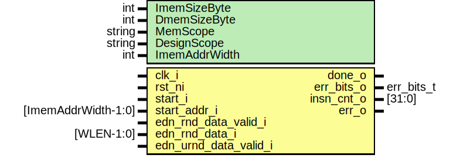

# Entity: otbn_core_model

- **File**: otbn_core_model.sv
## Diagram

## Description

 Copyright lowRISC contributors.
 Licensed under the Apache License, Version 2.0, see LICENSE for details.
 SPDX-License-Identifier: Apache-2.0
*

## Generics

| Generic name  | Type   | Value                              | Description                                                                                                                                                                                                                                                                      |
| ------------- | ------ | ---------------------------------- | -------------------------------------------------------------------------------------------------------------------------------------------------------------------------------------------------------------------------------------------------------------------------------- |
| ImemSizeByte  | int    | 4096                               |  Size of the instruction memory, in bytes                                                                                                                                                                                                                                        |
| DmemSizeByte  | int    | 4096                               |  Size of the data memory, in bytes                                                                                                                                                                                                                                               |
| MemScope      | string | ""                                 |  The scope that contains the instruction and data memory (for DPI)                                                                                                                                                                                                               |
| DesignScope   | string | ""                                 |  Scope of an RTL OTBN implementation (for DPI). If empty, this is a "standalone" model, which  should update DMEM on completion. If not empty, we assume it's the scope for the top-level of a  real implementation running alongside and we check DMEM contents on completion.  |
| ImemAddrWidth | int    | prim_util_pkg::vbits(ImemSizeByte) |                                                                                                                                                                                                                                                                                  |
## Ports

| Port name             | Direction | Type                | Description                   |
| --------------------- | --------- | ------------------- | ----------------------------- |
| clk_i                 | input     |                     |                               |
| rst_ni                | input     |                     |                               |
| start_i               | input     |                     | start the operation           |
| done_o                | output    |                     | operation done                |
| err_bits_o            | output    | err_bits_t          | valid when done_o is asserted |
| start_addr_i          | input     | [ImemAddrWidth-1:0] | start byte address in IMEM    |
| edn_rnd_data_valid_i  | input     |                     | provide RND data from EDN     |
| edn_rnd_data_i        | input     | [WLEN-1:0]          |                               |
| edn_urnd_data_valid_i | input     |                     | URND reseed from EDN is valid |
| insn_cnt_o            | output    | [31:0]              | INSN_CNT register             |
| err_o                 | output    |                     | something went wrong          |
## Signals

| Name                | Type         | Description                                                                                                                                                                                                                                                                                                                                           |
| ------------------- | ------------ | ----------------------------------------------------------------------------------------------------------------------------------------------------------------------------------------------------------------------------------------------------------------------------------------------------------------------------------------------------- |
| start_addr_32       | logic [31:0] |                                                                                                                                                                                                                                                                                                                                                       |
| chandle_null        | chandle      |                                                                                                                                                                                                                                                                                                                                                       |
| chandle_null        | chandle      |                                                                                                                                                                                                                                                                                                                                                       |
| model_handle        | chandle      |  Create and destroy an object through which we can talk to the ISS.                                                                                                                                                                                                                                                                                   |
| status              | int unsigned |  A packed "status" value. This gets assigned by DPI function calls that need to update both  whether we're running and also error flags at the same time. The contents are magic simulation  values, so get initialized before reset (to avoid stopping the simulation before it even  starts).                                                       |
| failed_cmp          | bit          |  Extract particular bits of the status value.     [0]     running:      The ISS is currently running    [1]     check_due:    The ISS just finished but still needs to check results    [2]     failed_step:  Something went wrong when trying to start or step the ISS.    [3]     failed_cmp:   The consistency check at the end of run failed.  |
| failed_step         | bit          |  Extract particular bits of the status value.     [0]     running:      The ISS is currently running    [1]     check_due:    The ISS just finished but still needs to check results    [2]     failed_step:  Something went wrong when trying to start or step the ISS.    [3]     failed_cmp:   The consistency check at the end of run failed.  |
| check_due           | bit          |  Extract particular bits of the status value.     [0]     running:      The ISS is currently running    [1]     check_due:    The ISS just finished but still needs to check results    [2]     failed_step:  Something went wrong when trying to start or step the ISS.    [3]     failed_cmp:   The consistency check at the end of run failed.  |
| running             | bit          |  Extract particular bits of the status value.     [0]     running:      The ISS is currently running    [1]     check_due:    The ISS just finished but still needs to check results    [2]     failed_step:  Something went wrong when trying to start or step the ISS.    [3]     failed_cmp:   The consistency check at the end of run failed.  |
| raw_err_bits_d      | bit [31:0]   |                                                                                                                                                                                                                                                                                                                                                       |
| raw_err_bits_q      | bit [31:0]   |                                                                                                                                                                                                                                                                                                                                                       |
| unused_raw_err_bits | bit          |                                                                                                                                                                                                                                                                                                                                                       |
| stop_pc_d           | bit [31:0]   |                                                                                                                                                                                                                                                                                                                                                       |
| stop_pc_q           | bit [31:0]   |                                                                                                                                                                                                                                                                                                                                                       |
| insn_cnt_d          | bit [31:0]   |                                                                                                                                                                                                                                                                                                                                                       |
| insn_cnt_q          | bit [31:0]   |                                                                                                                                                                                                                                                                                                                                                       |
| running_r           | bit          |  Track negedges of running_q and expose that as a "done" output.                                                                                                                                                                                                                                                                                      |
## Constants

| Name          | Type | Value                              | Description |
| ------------- | ---- | ---------------------------------- | ----------- |
| ImemAddrWidth | int  | prim_util_pkg::vbits(ImemSizeByte) |             |
| ImemSizeWords | int  | ImemSizeByte / 4                   |             |
| DmemSizeWords | int  | DmemSizeByte                       |             |
## Functions
- otbn_core_get_stop_pc () return (int)
## Processes
- unnamed: ( @(posedge clk_i or negedge rst_ni) )
  - **Type:** always_ff
- unnamed: ( @(posedge clk_i or negedge rst_ni) )
  - **Type:** always_ff
