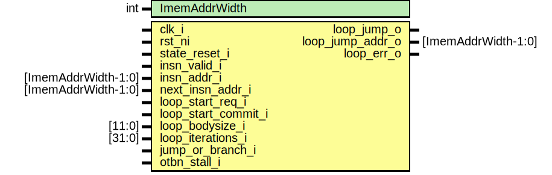

# Entity: otbn_loop_controller

## Diagram

## Description

Copyright lowRISC contributors.
 Licensed under the Apache License, Version 2.0, see LICENSE for details.
 SPDX-License-Identifier: Apache-2.0
 
## Generics

| Generic name  | Type | Value | Description |
| ------------- | ---- | ----- | ----------- |
| ImemAddrWidth | int  | 12    |             |
## Ports

| Port name           | Direction | Type                | Description |
| ------------------- | --------- | ------------------- | ----------- |
| clk_i               | input     |                     |             |
| rst_ni              | input     |                     |             |
| insn_valid_i        | input     |                     |             |
| insn_addr_i         | input     | [ImemAddrWidth-1:0] |             |
| next_insn_addr_i    | input     | [ImemAddrWidth-1:0] |             |
| loop_start_req_i    | input     |                     |             |
| loop_start_commit_i | input     |                     |             |
| loop_bodysize_i     | input     | [11:0]              |             |
| loop_iterations_i   | input     | [31:0]              |             |
| loop_jump_o         | output    |                     |             |
| loop_jump_addr_o    | output    | [ImemAddrWidth-1:0] |             |
| loop_err_o          | output    |                     |             |
| branch_taken_i      | input     |                     |             |
| otbn_stall_i        | input     |                     |             |
## Signals

| Name                     | Type                       | Description |
| ------------------------ | -------------------------- | ----------- |
| loop_active_q            | logic                      |             |
| loop_active_d            | logic                      |             |
| current_loop_q           | loop_info_t                |             |
| current_loop_d           | loop_info_t                |             |
| at_current_loop_end_insn | logic                      |             |
| current_loop_finish      | logic                      |             |
| next_loop                | loop_info_t                |             |
| next_loop_valid          | logic                      |             |
| new_loop                 | loop_info_t                |             |
| new_loop_end_addr_full   | logic [LoopEndAddrWidth:0] |             |
| new_loop_end_addr_imem   | logic [ImemAddrWidth:0]    |             |
| loop_stack_push_req      | logic                      |             |
| loop_stack_push          | logic                      |             |
| loop_stack_full          | logic                      |             |
| loop_stack_pop           | logic                      |             |
| loop_iteration_err       | logic                      |             |
| loop_branch_err          | logic                      |             |
| loop_stack_overflow_err  | logic                      |             |
| loop_at_end_err          | logic                      |             |
## Constants

| Name             | Type         | Value                                   | Description                                                                                                                                                                            |
| ---------------- | ------------ | --------------------------------------- | -------------------------------------------------------------------------------------------------------------------------------------------------------------------------------------- |
| LoopStackDepth   | int unsigned | 7                                       | The loop controller has a current loop and then a stack of outer loops, this sets the size of the stack so maximum loop nesting depth is LoopStackDepth + 1.                           |
| LoopEndAddrWidth | int unsigned | ImemAddrWidth < 14 ? 14 : ImemAddrWidth | ISA has a fixed 12 bits for loop_bodysize. When IMEM size is less than 16 kB (ImemAddrWidth < 14) some of these bits are ignored as a loop body cannot be greater than the IMEM size.  |
## Types

| Name        | Type                                                                                                                                                                                                                                                                                                 | Description |
| ----------- | ---------------------------------------------------------------------------------------------------------------------------------------------------------------------------------------------------------------------------------------------------------------------------------------------------- | ----------- |
| loop_info_t | struct packed {      logic [ImemAddrWidth-1:0] loop_start;      logic [ImemAddrWidth:0]   loop_end;      logic [31:0]              loop_iterations;    } |             |
## Processes
- unnamed: (  )
- unnamed: ( @(posedge clk_i or negedge rst_ni) )
- unnamed: ( @(posedge clk_i) )
