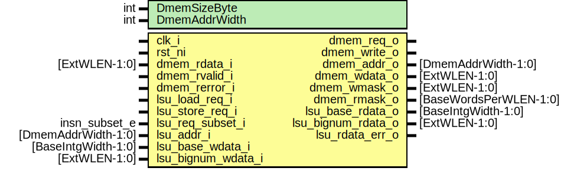

# Entity: otbn_lsu
## Diagram

## Description
Copyright lowRISC contributors.
 Licensed under the Apache License, Version 2.0, see LICENSE for details.
 SPDX-License-Identifier: Apache-2.0
 
## Generics
| Generic name  | Type | Value                              | Description |
| ------------- | ---- | ---------------------------------- | ----------- |
| DmemSizeByte  | int  | 4096                               |             |
| DmemAddrWidth | int  | prim_util_pkg::vbits(DmemSizeByte) |             |
## Ports
| Port name          | Direction | Type                   | Description                  |
| ------------------ | --------- | ---------------------- | ---------------------------- |
| clk_i              | input     |                        |                              |
| rst_ni             | input     |                        |                              |
| dmem_req_o         | output    |                        | Data memory (DMEM) interface |
| dmem_write_o       | output    |                        |                              |
| dmem_addr_o        | output    | [DmemAddrWidth-1:0]    |                              |
| dmem_wdata_o       | output    | [ExtWLEN-1:0]          |                              |
| dmem_wmask_o       | output    | [ExtWLEN-1:0]          |                              |
| dmem_rmask_o       | output    | [BaseWordsPerWLEN-1:0] |                              |
| dmem_rdata_i       | input     | [ExtWLEN-1:0]          |                              |
| dmem_rvalid_i      | input     |                        |                              |
| dmem_rerror_i      | input     |                        |                              |
| lsu_load_req_i     | input     |                        |                              |
| lsu_store_req_i    | input     |                        |                              |
| lsu_req_subset_i   | input     | insn_subset_e          |                              |
| lsu_addr_i         | input     | [DmemAddrWidth-1:0]    |                              |
| lsu_base_wdata_i   | input     | [BaseIntgWidth-1:0]    |                              |
| lsu_bignum_wdata_i | input     | [ExtWLEN-1:0]          |                              |
| lsu_base_rdata_o   | output    | [BaseIntgWidth-1:0]    |                              |
| lsu_bignum_rdata_o | output    | [ExtWLEN-1:0]          |                              |
| lsu_rdata_err_o    | output    |                        |                              |
## Signals
| Name               | Type                      | Description                                |
| ------------------ | ------------------------- | ------------------------------------------ |
| lsu_word_select    | logic [BaseWordAddrW-1:2] |                                            |
| lsu_word_select_en | logic                     |                                            |
| unused_clk         | logic                     | clk_i, rst_ni are only used by assertions  |
| unused_rst_n       | logic                     |                                            |
## Constants
| Name             | Type | Value                              | Description |
| ---------------- | ---- | ---------------------------------- | ----------- |
| DmemAddrWidth    | int  | prim_util_pkg::vbits(DmemSizeByte) |             |
| BaseWordsPerWLen | int  | WLEN / 32                          |             |
| BaseWordAddrW    | int  | prim_util_pkg::vbits(WLEN/8        |             |
## Processes
- unnamed: _( @(posedge clk_i) )_

