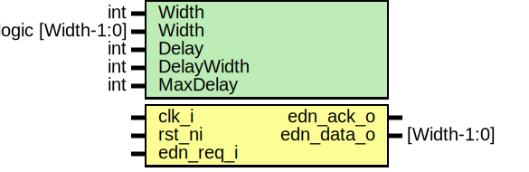

# Entity: otbn_mock_edn
## Diagram

## Description
Copyright lowRISC contributors.
 Licensed under the Apache License, Version 2.0, see LICENSE for details.
 SPDX-License-Identifier: Apache-2.0
 
## Generics
| Generic name | Type              | Value         | Description |
| ------------ | ----------------- | ------------- | ----------- |
| Width        | int               | 256           |             |
| Width        | logic [Width-1:0] | '0            |             |
| Delay        | int               | 16            |             |
| DelayWidth   | int               | $clog2(Delay) |             |
| MaxDelay     | int               | Delay - 1     |             |
## Ports
| Port name  | Direction | Type        | Description |
| ---------- | --------- | ----------- | ----------- |
| clk_i      | input     |             |             |
| rst_ni     | input     |             |             |
| edn_req_i  | input     |             |             |
| edn_ack_o  | output    |             |             |
| edn_data_o | output    | [Width-1:0] |             |
## Signals
| Name             | Type                   | Description |
| ---------------- | ---------------------- | ----------- |
| edn_req_counter  | logic [DelayWidth-1:0] |             |
| edn_req_active   | logic                  |             |
| edn_req_complete | logic                  |             |
## Constants
| Name       | Type | Value         | Description |
| ---------- | ---- | ------------- | ----------- |
| DelayWidth | int  | $clog2(Delay) |             |
## Processes
- unnamed: _( @(posedge clk_i or negedge rst_ni) )_

