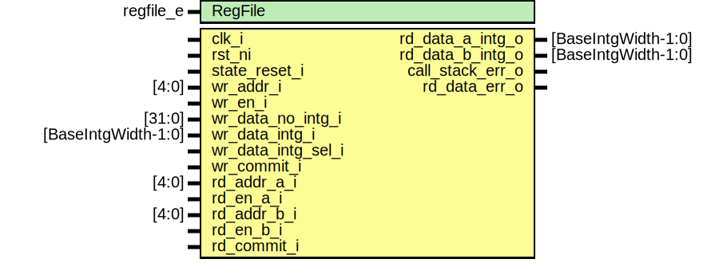

# Entity: otbn_rf_base

## Diagram

## Description

Copyright lowRISC contributors.
 Licensed under the Apache License, Version 2.0, see LICENSE for details.
 SPDX-License-Identifier: Apache-2.0
 
## Generics

| Generic name | Type      | Value     | Description                                               |
| ------------ | --------- | --------- | --------------------------------------------------------- |
| RegFile      | regfile_e | RegFileFF | Register file implementation selection, see otbn_pkg.sv.  |
## Ports

| Port name          | Direction | Type                | Description |
| ------------------ | --------- | ------------------- | ----------- |
| clk_i              | input     |                     |             |
| rst_ni             | input     |                     |             |
| wr_addr_i          | input     | [4:0]               |             |
| wr_en_i            | input     |                     |             |
| wr_data_no_intg_i  | input     | [31:0]              |             |
| wr_data_intg_i     | input     | [BaseIntgWidth-1:0] |             |
| wr_data_intg_sel_i | input     |                     |             |
| wr_commit_i        | input     |                     |             |
| rd_addr_a_i        | input     | [4:0]               |             |
| rd_en_a_i          | input     |                     |             |
| rd_data_a_intg_o   | output    | [BaseIntgWidth-1:0] |             |
| rd_addr_b_i        | input     | [4:0]               |             |
| rd_en_b_i          | input     |                     |             |
| rd_data_b_intg_o   | output    | [BaseIntgWidth-1:0] |             |
| rd_commit_i        | input     |                     |             |
| call_stack_err_o   | output    |                     |             |
| rd_data_err_o      | output    |                     |             |
## Signals

| Name                 | Type                      | Description                                                                                                                                                                                                                                                               |
| -------------------- | ------------------------- | ------------------------------------------------------------------------------------------------------------------------------------------------------------------------------------------------------------------------------------------------------------------------- |
| wr_data_intg_mux_out | logic [BaseIntgWidth-1:0] |                                                                                                                                                                                                                                                                           |
| wr_data_intg_calc    | logic [BaseIntgWidth-1:0] |                                                                                                                                                                                                                                                                           |
| rd_data_a_raw_intg   | logic [BaseIntgWidth-1:0] |                                                                                                                                                                                                                                                                           |
| rd_data_b_raw_intg   | logic [BaseIntgWidth-1:0] |                                                                                                                                                                                                                                                                           |
| rd_data_a_err        | logic [1:0]               |                                                                                                                                                                                                                                                                           |
| rd_data_b_err        | logic [1:0]               |                                                                                                                                                                                                                                                                           |
| wr_en_masked         | logic                     | The stack implementation is shared between FF and FPGA implementations, actual register register file differs between FF and FPGA implementations. Pass through signals to chosen register file, diverting any reads/writes to register CallStatckRegIndex to the stack.  |
| pop_stack_a          | logic                     |                                                                                                                                                                                                                                                                           |
| pop_stack_b          | logic                     |                                                                                                                                                                                                                                                                           |
| pop_stack_reqd       | logic                     |                                                                                                                                                                                                                                                                           |
| pop_stack            | logic                     |                                                                                                                                                                                                                                                                           |
| push_stack_reqd      | logic                     |                                                                                                                                                                                                                                                                           |
| push_stack           | logic                     |                                                                                                                                                                                                                                                                           |
| stack_full           | logic                     |                                                                                                                                                                                                                                                                           |
| stack_data_intg      | logic [BaseIntgWidth-1:0] |                                                                                                                                                                                                                                                                           |
| stack_data_valid     | logic                     |                                                                                                                                                                                                                                                                           |
## Constants

| Name              | Type         | Value | Description |
| ----------------- | ------------ | ----- | ----------- |
| CallStackRegIndex | int unsigned | 1     |             |
| CallStackDepth    | int unsigned | 8     |             |
## Instantiations

- u_wr_data_intg_enc: prim_secded_39_32_enc
- u_call_stack: otbn_stack
- u_rd_data_a_intg_dec: prim_secded_39_32_dec
**Description**
Integrity decoders used to detect errors only, corrections (`syndrome_o`/`d_o`) are ignored

- u_rd_data_b_intg_dec: prim_secded_39_32_dec
