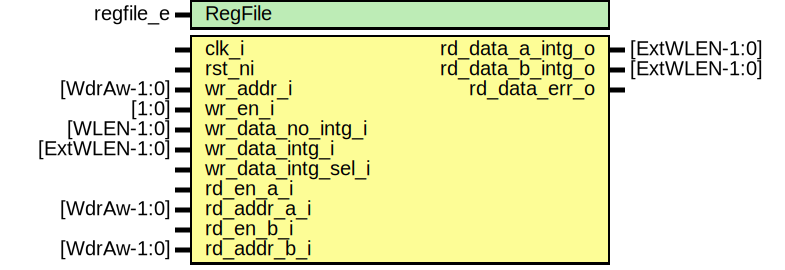

# Entity: otbn_rf_bignum

- **File**: otbn_rf_bignum.sv
## Diagram

## Description

 Copyright lowRISC contributors.
 Licensed under the Apache License, Version 2.0, see LICENSE for details.
 SPDX-License-Identifier: Apache-2.0
*

## Generics

| Generic name | Type      | Value     | Description                                                |
| ------------ | --------- | --------- | ---------------------------------------------------------- |
| RegFile      | regfile_e | RegFileFF |  Register file implementation selection, see otbn_pkg.sv.  |
## Ports

| Port name          | Direction | Type          | Description |
| ------------------ | --------- | ------------- | ----------- |
| clk_i              | input     |               |             |
| rst_ni             | input     |               |             |
| wr_addr_i          | input     | [WdrAw-1:0]   |             |
| wr_en_i            | input     | [1:0]         |             |
| wr_data_no_intg_i  | input     | [WLEN-1:0]    |             |
| wr_data_intg_i     | input     | [ExtWLEN-1:0] |             |
| wr_data_intg_sel_i | input     |               |             |
| rd_en_a_i          | input     |               |             |
| rd_addr_a_i        | input     | [WdrAw-1:0]   |             |
| rd_data_a_intg_o   | output    | [ExtWLEN-1:0] |             |
| rd_en_b_i          | input     |               |             |
| rd_addr_b_i        | input     | [WdrAw-1:0]   |             |
| rd_data_b_intg_o   | output    | [ExtWLEN-1:0] |             |
| rd_data_err_o      | output    |               |             |
## Signals

| Name                 | Type                           | Description |
| -------------------- | ------------------------------ | ----------- |
| wr_data_intg_mux_out | logic [ExtWLEN-1:0]            |             |
| wr_data_intg_calc    | logic [ExtWLEN-1:0]            |             |
| rd_data_a_err        | logic [BaseWordsPerWLEN*2-1:0] |             |
| rd_data_b_err        | logic [BaseWordsPerWLEN*2-1:0] |             |
