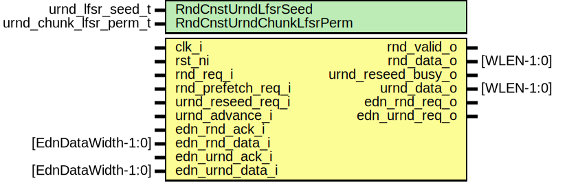

# Entity: otbn_rnd

## Diagram

## Description

Copyright lowRISC contributors.
 Licensed under the Apache License, Version 2.0, see LICENSE for details.
 SPDX-License-Identifier: Apache-2.0
 IMPORTANT NOTE:                                                                                //
                                   DO NOT USE THIS BLINDLY!                                     //
                                                                                                //
 This is an initial prototype of the random number functionality in OTBN. Details are still     //
 under discussion and subject to change. It has not yet been verified this provides the         //
 necessary guarantees required for the various uses of random numbers in OTBN software.         //
 
## Generics

| Generic name             | Type                   | Value                           | Description |
| ------------------------ | ---------------------- | ------------------------------- | ----------- |
| RndCnstUrndLfsrSeed      | urnd_lfsr_seed_t       | RndCnstUrndLfsrSeedDefault      |             |
| RndCnstUrndChunkLfsrPerm | urnd_chunk_lfsr_perm_t | RndCnstUrndChunkLfsrPermDefault |             |
## Ports

| Port name          | Direction | Type               | Description                                                                                      |
| ------------------ | --------- | ------------------ | ------------------------------------------------------------------------------------------------ |
| clk_i              | input     |                    |                                                                                                  |
| rst_ni             | input     |                    |                                                                                                  |
| rnd_req_i          | input     |                    |                                                                                                  |
| rnd_prefetch_req_i | input     |                    |                                                                                                  |
| rnd_valid_o        | output    |                    |                                                                                                  |
| rnd_data_o         | output    | [WLEN-1:0]         |                                                                                                  |
| urnd_reseed_req_i  | input     |                    | Request URND LFSR reseed from the EDN                                                            |
| urnd_reseed_busy_o | output    |                    | Remains asserted whilst reseed is in progress                                                    |
| urnd_advance_i     | input     |                    | When asserted URND LFSR state advances. It is permissible to advance the state whilstreseeding.  |
| urnd_data_o        | output    | [WLEN-1:0]         | URND data from LFSR                                                                              |
| edn_rnd_req_o      | output    |                    | Entropy distribution network (EDN)                                                               |
| edn_rnd_ack_i      | input     |                    |                                                                                                  |
| edn_rnd_data_i     | input     | [EdnDataWidth-1:0] |                                                                                                  |
| edn_urnd_req_o     | output    |                    |                                                                                                  |
| edn_urnd_ack_i     | input     |                    |                                                                                                  |
| edn_urnd_data_i    | input     | [EdnDataWidth-1:0] |                                                                                                  |
## Signals

| Name                  | Type                           | Description |
| --------------------- | ------------------------------ | ----------- |
| rnd_valid_q           | logic                          |             |
| rnd_valid_d           | logic                          |             |
| rnd_data_q            | logic [WLEN-1:0]               |             |
| rnd_data_d            | logic [WLEN-1:0]               |             |
| rnd_data_en           | logic                          |             |
| rnd_req_complete      | logic                          |             |
| edn_rnd_req_complete  | logic                          |             |
| edn_rnd_req_start     | logic                          |             |
| edn_rnd_req_q         | logic                          |             |
| edn_rnd_req_d         | logic                          |             |
| edn_urnd_req_complete | logic                          |             |
| edn_urnd_req_q        | logic                          |             |
| edn_urnd_req_d        | logic                          |             |
| lfsr_seed_en          | logic                          |             |
| lfsr_seed             | logic [UrndChunkLfsrWidth-1:0] |             |
| lfsr_state            | logic [UrndChunkLfsrWidth-1:0] |             |
## Constants

| Name              | Type | Value                     | Description                                                               |
| ----------------- | ---- | ------------------------- | ------------------------------------------------------------------------- |
| LfsrChunksPerWLEN | int  | WLEN / UrndChunkLfsrWidth | Determine how many LFSR chunks are required to fill a full WLEN register  |
| BytesPerLfsrChunk | int  | UrndChunkLfsrWidth / 8    |                                                                           |
## Processes
- unnamed: ( @(posedge clk_i) )
- unnamed: ( @(posedge clk_i or negedge rst_ni) )
- unnamed: ( @(posedge clk_i or negedge rst_ni) )
