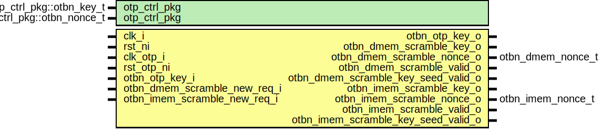

# Entity: otbn_scramble_ctrl
## Diagram

## Description
Copyright lowRISC contributors.
 Licensed under the Apache License, Version 2.0, see LICENSE for details.
 SPDX-License-Identifier: Apache-2.0
 
## Generics
| Generic name | Type                       | Value                             | Description                            |
| ------------ | -------------------------- | --------------------------------- | -------------------------------------- |
| otp_ctrl_pkg | otp_ctrl_pkg::otbn_key_t   | otbn_pkg::RndCnstOtbnKeyDefault   | Default seed and nonce for scrambling  |
| otp_ctrl_pkg | otp_ctrl_pkg::otbn_nonce_t | otbn_pkg::RndCnstOtbnNonceDefault |                                        |
## Ports
| Port name                           | Direction | Type              | Description                   |
| ----------------------------------- | --------- | ----------------- | ----------------------------- |
| clk_i                               | input     |                   | OTBN clock                    |
| rst_ni                              | input     |                   |                               |
| clk_otp_i                           | input     |                   | OTP Clock (for key interface) |
| rst_otp_ni                          | input     |                   |                               |
| otbn_otp_key_o                      | output    |                   | OTP key interface             |
| otbn_otp_key_i                      | input     |                   |                               |
| otbn_dmem_scramble_key_o            | output    |                   |                               |
| otbn_dmem_scramble_nonce_o          | output    | otbn_dmem_nonce_t |                               |
| otbn_dmem_scramble_valid_o          | output    |                   |                               |
| otbn_dmem_scramble_key_seed_valid_o | output    |                   |                               |
| otbn_imem_scramble_key_o            | output    |                   |                               |
| otbn_imem_scramble_nonce_o          | output    | otbn_imem_nonce_t |                               |
| otbn_imem_scramble_valid_o          | output    |                   |                               |
| otbn_imem_scramble_key_seed_valid_o | output    |                   |                               |
| otbn_dmem_scramble_new_req_i        | input     |                   |                               |
| otbn_imem_scramble_new_req_i        | input     |                   |                               |
## Signals
| Name                        | Type                       | Description |
| --------------------------- | -------------------------- | ----------- |
| state_q                     | scramble_ctrl_state_t      |             |
| state_d                     | scramble_ctrl_state_t      |             |
| dmem_key_valid_q            | logic                      |             |
| dmem_key_valid_d            | logic                      |             |
| imem_key_valid_q            | logic                      |             |
| imem_key_valid_d            | logic                      |             |
| dmem_key_seed_valid_q       | logic                      |             |
| dmem_key_seed_valid_d       | logic                      |             |
| imem_key_seed_valid_q       | logic                      |             |
| imem_key_seed_valid_d       | logic                      |             |
| dmem_scramble_req_pending_q | logic                      |             |
| dmem_scramble_req_pending_d | logic                      |             |
| imem_scramble_req_pending_q | logic                      |             |
| imem_scramble_req_pending_d | logic                      |             |
| dmem_key_nonce_en           | logic                      |             |
| imem_key_nonce_en           | logic                      |             |
| dmem_key_q                  | otp_ctrl_pkg::otbn_key_t   |             |
| imem_key_q                  | otp_ctrl_pkg::otbn_key_t   |             |
| dmem_nonce_q                | otbn_dmem_nonce_t          |             |
| imem_nonce_q                | otbn_imem_nonce_t          |             |
| otp_key_req                 | logic                      |             |
| otp_key_ack                 | logic                      |             |
| otp_key                     | otp_ctrl_pkg::otbn_key_t   |             |
| otp_nonce                   | otp_ctrl_pkg::otbn_nonce_t |             |
| otp_key_seed_valid          | logic                      |             |
| clk_i                       | prim_sync_reqack_data      |             |
| rst_ni                      | prim_sync_reqack_data      |             |
| clk_otp_i                   | prim_sync_reqack_data      |             |
| rst_otp_ni                  | prim_sync_reqack_data      |             |
| otp_key_req                 | prim_sync_reqack_data      |             |
| otp_key_ack                 | prim_sync_reqack_data      |             |
| req                         | prim_sync_reqack_data      |             |
| ack                         | prim_sync_reqack_data      |             |
| key                         | prim_sync_reqack_data      |             |
| otbn_otp_key_i              | prim_sync_reqack_data      |             |
| otbn_otp_key_i              | prim_sync_reqack_data      |             |
| otp_key                     | prim_sync_reqack_data      |             |
| otp_nonce                   | prim_sync_reqack_data      |             |
| otp_key_seed_valid          | prim_sync_reqack_data      |             |
## Types
| Name                  | Type                                                                                          | Description |
| --------------------- | --------------------------------------------------------------------------------------------- | ----------- |
| scramble_ctrl_state_t | enum logic [1:0] {     ScrambleCtrlIdle,     ScrambleCtrlDmemReq,     ScrambleCtrlImemReq   } |             |
## Processes
- unnamed: _( @(posedge clk_i or negedge rst_ni) )_
TODO: Sort out nonce widths. OTP provides us with 256-bit nonce, we need 320-bit for dmem. We
could reuse nonce bits or use a replicated PRINCE keystream so only 64 bits of nonce would be
required. https://github.com/lowRISC/opentitan/issues/7054

**Description**
TODO: Sort out nonce widths. OTP provides us with 256-bit nonce, we need 320-bit for dmem. We
could reuse nonce bits or use a replicated PRINCE keystream so only 64 bits of nonce would be
required. https://github.com/lowRISC/opentitan/issues/7054

- unnamed: _( @(posedge clk_i or negedge rst_ni) )_

- unnamed: _( @(posedge clk_i or negedge rst_ni) )_

- unnamed: _(  )_

