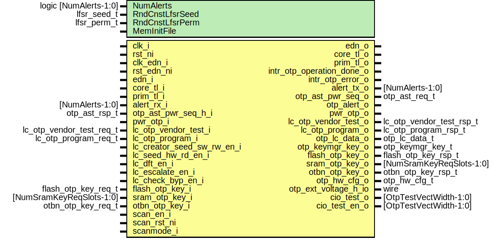

# Entity: otp_ctrl

- **File**: otp_ctrl.sv
## Diagram

## Description

 Copyright lowRISC contributors.
 Licensed under the Apache License, Version 2.0, see LICENSE for details.
 SPDX-License-Identifier: Apache-2.0

 OTP Controller top.

## Generics

| Generic name    | Type                  | Value                  | Description                                                                                  |
| --------------- | --------------------- | ---------------------- | -------------------------------------------------------------------------------------------- |
| NumAlerts       | logic [NumAlerts-1:0] | undefined              |  Enable asynchronous transitions on alerts.                                                  |
| RndCnstLfsrSeed | lfsr_seed_t           | RndCnstLfsrSeedDefault |  Compile time random constants, to be overriden by topgen.                                   |
| RndCnstLfsrPerm | lfsr_perm_t           | RndCnstLfsrPermDefault |                                                                                              |
| MemInitFile     |                       | ""                     |  Hexfile file to initialize the OTP macro.  Note that the hexdump needs to account for ECC.  |
## Ports

| Port name                  | Direction | Type                     | Description                                                      |
| -------------------------- | --------- | ------------------------ | ---------------------------------------------------------------- |
| clk_i                      | input     |                          |  OTP clock                                                       |
| rst_ni                     | input     |                          |                                                                  |
| clk_edn_i                  | input     |                          |  EDN clock and interface                                         |
| rst_edn_ni                 | input     |                          |                                                                  |
| edn_o                      | output    |                          |                                                                  |
| edn_i                      | input     |                          |                                                                  |
| core_tl_i                  | input     |                          |  Bus Interface                                                   |
| core_tl_o                  | output    |                          |                                                                  |
| prim_tl_i                  | input     |                          |                                                                  |
| prim_tl_o                  | output    |                          |                                                                  |
| intr_otp_operation_done_o  | output    |                          |  Interrupt Requests                                              |
| intr_otp_error_o           | output    |                          |                                                                  |
| alert_rx_i                 | input     | [NumAlerts-1:0]          |  Alerts                                                          |
| alert_tx_o                 | output    | [NumAlerts-1:0]          |                                                                  |
| otp_ast_pwr_seq_o          | output    | otp_ast_req_t            |  Macro-specific power sequencing signals to/from AST.            |
| otp_ast_pwr_seq_h_i        | input     | otp_ast_rsp_t            |                                                                  |
| otp_alert_o                | output    |                          |  AST alerts                                                      |
| pwr_otp_i                  | input     |                          |  Power manager interface (inputs are synced to OTP clock domain) |
| pwr_otp_o                  | output    |                          |                                                                  |
| lc_otp_vendor_test_i       | input     | lc_otp_vendor_test_req_t |  Macro-specific test registers going to lifecycle TAP            |
| lc_otp_vendor_test_o       | output    | lc_otp_vendor_test_rsp_t |                                                                  |
| lc_otp_program_i           | input     | lc_otp_program_req_t     |  Lifecycle transition command interface                          |
| lc_otp_program_o           | output    | lc_otp_program_rsp_t     |                                                                  |
| lc_creator_seed_sw_rw_en_i | input     |                          |  Lifecycle broadcast inputs                                      |
| lc_seed_hw_rd_en_i         | input     |                          |                                                                  |
| lc_dft_en_i                | input     |                          |                                                                  |
| lc_escalate_en_i           | input     |                          |                                                                  |
| lc_check_byp_en_i          | input     |                          |                                                                  |
| otp_lc_data_o              | output    | otp_lc_data_t            |  OTP broadcast outputs                                           |
| otp_keymgr_key_o           | output    | otp_keymgr_key_t         |                                                                  |
| flash_otp_key_i            | input     | flash_otp_key_req_t      |  Scrambling key requests                                         |
| flash_otp_key_o            | output    | flash_otp_key_rsp_t      |                                                                  |
| sram_otp_key_i             | input     | [NumSramKeyReqSlots-1:0] |                                                                  |
| sram_otp_key_o             | output    | [NumSramKeyReqSlots-1:0] |                                                                  |
| otbn_otp_key_i             | input     | otbn_otp_key_req_t       |                                                                  |
| otbn_otp_key_o             | output    | otbn_otp_key_rsp_t       |                                                                  |
| otp_hw_cfg_o               | output    | otp_hw_cfg_t             |  Hardware config bits                                            |
| otp_ext_voltage_h_io       | inout     | wire                     |  External voltage for OTP                                        |
| scan_en_i                  | input     |                          |  Scan                                                            |
| scan_rst_ni                | input     |                          |                                                                  |
| scanmode_i                 | input     |                          |                                                                  |
| cio_test_o                 | output    | [OtpTestVectWidth-1:0]   |  Test-related GPIO output                                        |
| cio_test_en_o              | output    | [OtpTestVectWidth-1:0]   |                                                                  |
## Signals

| Name                     | Type                                         | Description                                                                                                                                                                                                                                                                                    |
| ------------------------ | -------------------------------------------- | ---------------------------------------------------------------------------------------------------------------------------------------------------------------------------------------------------------------------------------------------------------------------------------------------- |
| intg_error               | logic [1:0]                                  | ///////////  Regfile // ///////////  We have one CSR node and one functional TL-UL window.                                                                                                                                                                                                     |
| tl_win_h2d               | tlul_pkg::tl_h2d_t                           |                                                                                                                                                                                                                                                                                                |
| tl_win_d2h               | tlul_pkg::tl_d2h_t                           |                                                                                                                                                                                                                                                                                                |
| reg2hw                   | otp_ctrl_reg_pkg::otp_ctrl_core_reg2hw_t     |                                                                                                                                                                                                                                                                                                |
| hw2reg                   | otp_ctrl_reg_pkg::otp_ctrl_core_hw2reg_t     |                                                                                                                                                                                                                                                                                                |
| lc_creator_seed_sw_rw_en | lc_ctrl_pkg::lc_tx_t                         | /////////////////////////////////////  Life Cycle Signal Synchronization // /////////////////////////////////////                                                                                                                                                                              |
| lc_seed_hw_rd_en         | lc_ctrl_pkg::lc_tx_t                         | /////////////////////////////////////  Life Cycle Signal Synchronization // /////////////////////////////////////                                                                                                                                                                              |
| lc_check_byp_en          | lc_ctrl_pkg::lc_tx_t                         | /////////////////////////////////////  Life Cycle Signal Synchronization // /////////////////////////////////////                                                                                                                                                                              |
| lc_dft_en                | lc_ctrl_pkg::lc_tx_t [2:0]                   |                                                                                                                                                                                                                                                                                                |
| lc_escalate_en           | lc_ctrl_pkg::lc_tx_t [NumAgentsIdx+1:0]      |  NumAgents + lfsr timer and scrambling datapath.                                                                                                                                                                                                                                               |
| lc_escalate_en_synced    | lc_ctrl_pkg::lc_tx_t [NumAgentsIdx+1:0]      |  NumAgents + lfsr timer and scrambling datapath.                                                                                                                                                                                                                                               |
| lc_escalate_en_any       | logic                                        |  Single wire for gating assertions in arbitration and CDC primitives.                                                                                                                                                                                                                          |
| tlul_req                 | logic                                        | ///////////////////////////////////  TL-UL SW partition select logic // ///////////////////////////////////  The SW partitions share the same TL-UL adapter.                                                                                                                                   |
| tlul_gnt                 | logic                                        | ///////////////////////////////////  TL-UL SW partition select logic // ///////////////////////////////////  The SW partitions share the same TL-UL adapter.                                                                                                                                   |
| tlul_rvalid              | logic                                        | ///////////////////////////////////  TL-UL SW partition select logic // ///////////////////////////////////  The SW partitions share the same TL-UL adapter.                                                                                                                                   |
| tlul_addr                | logic [SwWindowAddrWidth-1:0]                |                                                                                                                                                                                                                                                                                                |
| tlul_rerror              | logic [1:0]                                  |                                                                                                                                                                                                                                                                                                |
| tlul_rdata               | logic [31:0]                                 |                                                                                                                                                                                                                                                                                                |
| tlul_part_sel_oh         | logic [NumPart-1:0]                          |                                                                                                                                                                                                                                                                                                |
| tlul_part_idx            | logic [NumPartWidth-1:0]                     |                                                                                                                                                                                                                                                                                                |
| tlul_oob_err_d           | logic                                        |                                                                                                                                                                                                                                                                                                |
| tlul_oob_err_q           | logic                                        |                                                                                                                                                                                                                                                                                                |
| part_tlul_req            | logic [NumPart-1:0]                          |                                                                                                                                                                                                                                                                                                |
| part_tlul_gnt            | logic [NumPart-1:0]                          |                                                                                                                                                                                                                                                                                                |
| part_tlul_rvalid         | logic [NumPart-1:0]                          |                                                                                                                                                                                                                                                                                                |
| part_tlul_addr           | logic [SwWindowAddrWidth-1:0]                |                                                                                                                                                                                                                                                                                                |
| part_tlul_rerror         | logic [NumPart-1:0][1:0]                     |                                                                                                                                                                                                                                                                                                |
| part_tlul_rdata          | logic [NumPart-1:0][31:0]                    |                                                                                                                                                                                                                                                                                                |
| unused_digest            | logic [ScrmblBlockWidth-1:0]                 | /////////////////////////////  Digests and LC State CSRs // /////////////////////////////                                                                                                                                                                                                      |
| part_digest              | logic [NumPart-1:0][ScrmblBlockWidth-1:0]    |                                                                                                                                                                                                                                                                                                |
| part_access_csrs         | part_access_t [NumPart-1:0]                  | ////////////////////////////  Access Defaults and CSRs // ////////////////////////////                                                                                                                                                                                                         |
| dai_idle                 | logic                                        | ////////////////////  DAI-related CSRs // ////////////////////                                                                                                                                                                                                                                 |
| dai_req                  | logic                                        |                                                                                                                                                                                                                                                                                                |
| dai_cmd                  | dai_cmd_e                                    |                                                                                                                                                                                                                                                                                                |
| dai_addr                 | logic [OtpByteAddrWidth-1:0]                 |                                                                                                                                                                                                                                                                                                |
| dai_wdata                | logic [NumDaiWords-1:0][31:0]                |                                                                                                                                                                                                                                                                                                |
| dai_rdata                | logic [NumDaiWords-1:0][31:0]                |                                                                                                                                                                                                                                                                                                |
| dai_prog_idle            | logic                                        |  The DAI and the LCI can initiate write transactions, which  are critical and we must not power down if such transactions  are pending. Hence, we signal the LCI/DAI idle state to the  power manager. This signal is flopped here as it has to  cross a clock boundary to the power manager.  |
| lci_prog_idle            | logic                                        |  The DAI and the LCI can initiate write transactions, which  are critical and we must not power down if such transactions  are pending. Hence, we signal the LCI/DAI idle state to the  power manager. This signal is flopped here as it has to  cross a clock boundary to the power manager.  |
| otp_idle_d               | logic                                        |  The DAI and the LCI can initiate write transactions, which  are critical and we must not power down if such transactions  are pending. Hence, we signal the LCI/DAI idle state to the  power manager. This signal is flopped here as it has to  cross a clock boundary to the power manager.  |
| otp_idle_q               | logic                                        |  The DAI and the LCI can initiate write transactions, which  are critical and we must not power down if such transactions  are pending. Hence, we signal the LCI/DAI idle state to the  power manager. This signal is flopped here as it has to  cross a clock boundary to the power manager.  |
| part_error               | otp_err_e [NumPart+1:0]                      | ////////////////////////////////////  Ctrl/Status CSRs, Errors, Alerts // ////////////////////////////////////  Status and error reporting CSRs, error interrupt generation and alerts.                                                                                                        |
| part_errors_reduced      | logic [NumPart+1:0]                          |                                                                                                                                                                                                                                                                                                |
| otp_operation_done       | logic                                        |                                                                                                                                                                                                                                                                                                |
| otp_error                | logic                                        |                                                                                                                                                                                                                                                                                                |
| fatal_macro_error_d      | logic                                        |                                                                                                                                                                                                                                                                                                |
| fatal_macro_error_q      | logic                                        |                                                                                                                                                                                                                                                                                                |
| fatal_check_error_d      | logic                                        |                                                                                                                                                                                                                                                                                                |
| fatal_check_error_q      | logic                                        |                                                                                                                                                                                                                                                                                                |
| fatal_bus_integ_error_d  | logic                                        |                                                                                                                                                                                                                                                                                                |
| fatal_bus_integ_error_q  | logic                                        |                                                                                                                                                                                                                                                                                                |
| chk_pending              | logic                                        |                                                                                                                                                                                                                                                                                                |
| chk_timeout              | logic                                        |                                                                                                                                                                                                                                                                                                |
| lfsr_fsm_err             | logic                                        |                                                                                                                                                                                                                                                                                                |
| key_deriv_fsm_err        | logic                                        |                                                                                                                                                                                                                                                                                                |
| scrmbl_fsm_err           | logic                                        |                                                                                                                                                                                                                                                                                                |
| interrupt_triggers_d     | logic [$bits(part_errors_reduced)+4-1:0]     |  If we got an error, we trigger an interrupt.                                                                                                                                                                                                                                                  |
| interrupt_triggers_q     | logic [$bits(part_errors_reduced)+4-1:0]     |  If we got an error, we trigger an interrupt.                                                                                                                                                                                                                                                  |
| alerts                   | logic [NumAlerts-1:0]                        |                                                                                                                                                                                                                                                                                                |
| alert_test               | logic [NumAlerts-1:0]                        |                                                                                                                                                                                                                                                                                                |
| integ_chk_trig           | logic                                        | //////////////////////////////  LFSR Timer and CSR mapping // //////////////////////////////                                                                                                                                                                                                   |
| cnsty_chk_trig           | logic                                        | //////////////////////////////  LFSR Timer and CSR mapping // //////////////////////////////                                                                                                                                                                                                   |
| integ_chk_req            | logic [NumPart-1:0]                          |                                                                                                                                                                                                                                                                                                |
| integ_chk_ack            | logic [NumPart-1:0]                          |                                                                                                                                                                                                                                                                                                |
| cnsty_chk_req            | logic [NumPart-1:0]                          |                                                                                                                                                                                                                                                                                                |
| cnsty_chk_ack            | logic [NumPart-1:0]                          |                                                                                                                                                                                                                                                                                                |
| lfsr_edn_req             | logic                                        |                                                                                                                                                                                                                                                                                                |
| lfsr_edn_ack             | logic                                        |                                                                                                                                                                                                                                                                                                |
| edn_data                 | logic [EdnDataWidth-1:0]                     |                                                                                                                                                                                                                                                                                                |
| edn_req                  | logic                                        | /////////////////////////////////////  EDN Arbitration, Request and Sync // /////////////////////////////////////  Both the key derivation and LFSR reseeding are low bandwidth,  hence they can share the same EDN interface.                                                                 |
| edn_ack                  | logic                                        | /////////////////////////////////////  EDN Arbitration, Request and Sync // /////////////////////////////////////  Both the key derivation and LFSR reseeding are low bandwidth,  hence they can share the same EDN interface.                                                                 |
| key_edn_req              | logic                                        |                                                                                                                                                                                                                                                                                                |
| key_edn_ack              | logic                                        |                                                                                                                                                                                                                                                                                                |
| part_otp_arb_req         | logic [NumAgents-1:0]                        |                                                                                                                                                                                                                                                                                                |
| part_otp_arb_gnt         | logic [NumAgents-1:0]                        |                                                                                                                                                                                                                                                                                                |
| part_otp_arb_bundle      | otp_bundle_t                                 |                                                                                                                                                                                                                                                                                                |
| otp_arb_valid            | logic                                        |                                                                                                                                                                                                                                                                                                |
| otp_arb_ready            | logic                                        |                                                                                                                                                                                                                                                                                                |
| otp_arb_idx              | logic [vbits(NumAgents)-1:0]                 |                                                                                                                                                                                                                                                                                                |
| otp_arb_bundle           | otp_bundle_t                                 |                                                                                                                                                                                                                                                                                                |
| part_otp_err             | prim_otp_pkg::err_e                          |                                                                                                                                                                                                                                                                                                |
| part_otp_rdata           | logic [OtpIfWidth-1:0]                       |                                                                                                                                                                                                                                                                                                |
| otp_rvalid               | logic                                        |                                                                                                                                                                                                                                                                                                |
| prim_tl_h2d_gated        | tlul_pkg::tl_h2d_t                           |                                                                                                                                                                                                                                                                                                |
| prim_tl_d2h_gated        | tlul_pkg::tl_d2h_t                           |                                                                                                                                                                                                                                                                                                |
| otp_test_vect            | logic [OtpTestVectWidth-1:0]                 |  Test-related GPIOs.                                                                                                                                                                                                                                                                           |
| otp_fifo_valid           | logic                                        |                                                                                                                                                                                                                                                                                                |
| otp_part_idx             | logic [vbits(NumAgents)-1:0]                 |                                                                                                                                                                                                                                                                                                |
| part_otp_rvalid          | logic [NumAgents-1:0]                        |                                                                                                                                                                                                                                                                                                |
| part_scrmbl_mtx_req      | logic [NumAgents-1:0]                        |                                                                                                                                                                                                                                                                                                |
| part_scrmbl_mtx_gnt      | logic [NumAgents-1:0]                        |                                                                                                                                                                                                                                                                                                |
| part_scrmbl_req_bundle   | scrmbl_bundle_t                              |                                                                                                                                                                                                                                                                                                |
| scrmbl_req_bundle        | scrmbl_bundle_t                              |                                                                                                                                                                                                                                                                                                |
| scrmbl_mtx_idx           | logic [vbits(NumAgents)-1:0]                 |                                                                                                                                                                                                                                                                                                |
| scrmbl_mtx_valid         | logic                                        |                                                                                                                                                                                                                                                                                                |
| part_scrmbl_rsp_data     | logic [ScrmblBlockWidth-1:0]                 |                                                                                                                                                                                                                                                                                                |
| scrmbl_arb_req_ready     | logic                                        |                                                                                                                                                                                                                                                                                                |
| scrmbl_arb_rsp_valid     | logic                                        |                                                                                                                                                                                                                                                                                                |
| part_scrmbl_req_ready    | logic [NumAgents-1:0]                        |                                                                                                                                                                                                                                                                                                |
| part_scrmbl_rsp_valid    | logic [NumAgents-1:0]                        |                                                                                                                                                                                                                                                                                                |
| part_init_req            | logic                                        | ///////////////////////////  Direct Access Interface // ///////////////////////////                                                                                                                                                                                                            |
| part_init_done           | logic [NumPart-1:0]                          |                                                                                                                                                                                                                                                                                                |
| part_access_dai          | part_access_t [NumPart-1:0]                  |                                                                                                                                                                                                                                                                                                |
| pwr_otp_req_synced       | logic                                        |  The init request comes from the power manager, which lives in the AON clock domain.                                                                                                                                                                                                           |
| pwr_otp_rsp_d            | logic                                        |  Register this signal as it has to cross a clock boundary.                                                                                                                                                                                                                                     |
| pwr_otp_rsp_q            | logic                                        |  Register this signal as it has to cross a clock boundary.                                                                                                                                                                                                                                     |
| lc_otp_program_data      | logic [PartInfo[LifeCycleIdx].size-1:0][7:0] | //////////////////////////////////  Lifecycle Transition Interface // //////////////////////////////////                                                                                                                                                                                       |
| unused_lci_scrmbl_sigs   | logic                                        |  This stops lint from complaining about unused signals.                                                                                                                                                                                                                                        |
| scrmbl_key_seed_valid    | logic                                        | //////////////////////////////////  Key Derivation Interface (KDI) // //////////////////////////////////                                                                                                                                                                                       |
| sram_data_key_seed       | logic [SramKeySeedWidth-1:0]                 |                                                                                                                                                                                                                                                                                                |
| flash_data_key_seed      | logic [FlashKeySeedWidth-1:0]                |                                                                                                                                                                                                                                                                                                |
| flash_addr_key_seed      | logic [FlashKeySeedWidth-1:0]                |                                                                                                                                                                                                                                                                                                |
| unused_kdi_otp_sigs      | logic                                        |  This stops lint from complaining about unused signals.                                                                                                                                                                                                                                        |
| part_buf_data            | logic [$bits(PartInvDefault)/8-1:0][7:0]     | ///////////////////////  Partition Instances // ///////////////////////                                                                                                                                                                                                                        |
| test_tokens_valid        | logic [lc_ctrl_pkg::TxWidth-1:0]             |                                                                                                                                                                                                                                                                                                |
| rma_token_valid          | logic [lc_ctrl_pkg::TxWidth-1:0]             |                                                                                                                                                                                                                                                                                                |
| secrets_valid            | logic [lc_ctrl_pkg::TxWidth-1:0]             |                                                                                                                                                                                                                                                                                                |
| test_tokens_valid_buf    | logic [lc_ctrl_pkg::TxWidth-1:0]             |  Buffer these constants in order to ensure that synthesis does not try to optimize the encoding.                                                                                                                                                                                               |
| rma_token_valid_buf      | logic [lc_ctrl_pkg::TxWidth-1:0]             |  Buffer these constants in order to ensure that synthesis does not try to optimize the encoding.                                                                                                                                                                                               |
| secrets_valid_buf        | logic [lc_ctrl_pkg::TxWidth-1:0]             |  Buffer these constants in order to ensure that synthesis does not try to optimize the encoding.                                                                                                                                                                                               |
| unused_buf_data          | logic                                        |  Not all bits of part_buf_data are used here.                                                                                                                                                                                                                                                  |
## Types

| Name            | Type                                                                                                                                                                                                                                                                                                                                                                                                                                          | Description                                                                                                                                                                                                                                                                                                                                                                                                                                                                                                                                                                                                                                                                                                                                                                                                                                               |
| --------------- | --------------------------------------------------------------------------------------------------------------------------------------------------------------------------------------------------------------------------------------------------------------------------------------------------------------------------------------------------------------------------------------------------------------------------------------------- | --------------------------------------------------------------------------------------------------------------------------------------------------------------------------------------------------------------------------------------------------------------------------------------------------------------------------------------------------------------------------------------------------------------------------------------------------------------------------------------------------------------------------------------------------------------------------------------------------------------------------------------------------------------------------------------------------------------------------------------------------------------------------------------------------------------------------------------------------------- |
| otp_bundle_t    | struct packed {      prim_otp_pkg::cmd_e          cmd;      logic [OtpSizeWidth-1:0]     size;       logic [OtpIfWidth-1:0]       wdata;      logic [OtpAddrWidth-1:0]     addr;     }                                                                         | /////////////////////////////  OTP Macro and Arbitration // /////////////////////////////                                                                                                                                                                                                                                                                                                                                                                                                                                                                                                                                                                                                                                                                                                                                                                 |
| scrmbl_bundle_t | struct packed {      otp_scrmbl_cmd_e             cmd;      digest_mode_e                mode;      logic [ConstSelWidth-1:0]    sel;      logic [ScrmblBlockWidth-1:0] data;      logic                        valid;    } | ///////////////////////////////////////  Scrambling Datapath and Arbitration // ///////////////////////////////////////  Note: as opposed to the OTP arbitration above, we do not perform cycle-wise arbitration, but  transaction-wise arbitration. This is implemented using a RR arbiter that acts as a mutex.  I.e., each agent (e.g. the DAI or a partition) can request a lock on the mutex. Once granted,  the partition can keep the the lock as long as needed for the transaction to complete. The  partition must yield its lock by deasserting the request signal for the arbiter to proceed.  Since this scheme does not have built-in preemtion, it must be ensured that the agents  eventually release their locks for this to be fair.   See also https://docs.opentitan.org/hw/ip/otp_ctrl/doc/index.html#block-diagram for details.  |
## Processes
- p_tlul_assign: (  )
  - **Type:** always_comb
- p_tlul_reg: ( @(posedge clk_i or negedge rst_ni) )
  - **Type:** always_ff
- p_access_control: (  )
  - **Type:** always_comb
- p_idle_reg: ( @(posedge clk_i or negedge rst_ni) )
  - **Type:** always_ff
- p_errors_alerts: (  )
  - **Type:** always_comb
- p_alert_regs: ( @(posedge clk_i or negedge rst_ni) )
  - **Type:** always_ff
- p_rvalid: (  )
  - **Type:** always_comb
**Description**
 Steer response back to the partition where this request originated. 
- p_mutex: (  )
  - **Type:** always_comb
**Description**
 Since the ready_i signal of the arbiter is statically set to 1'b0 above, we are always in a  "backpressure" situation, where the RR arbiter will automatically advance the internal RR state  to give the current winner max priority in subsequent cycles in order to keep the decision  stable. Rearbitration occurs once the winning agent deasserts its request. 
- p_scmrbl_resp: (  )
  - **Type:** always_comb
**Description**
 steer back responses 
- p_init_reg: ( @(posedge clk_i or negedge rst_ni) )
  - **Type:** always_ff
## Instantiations

- u_reg_core: otp_ctrl_core_reg_top
- u_prim_lc_sync_escalate_en: prim_lc_sync
- u_prim_lc_sync_creator_seed_sw_rw_en: prim_lc_sync
- u_prim_lc_sync_seed_hw_rd_en: prim_lc_sync
- u_prim_lc_sync_dft_en: prim_lc_sync
- u_prim_lc_sync_check_byp_en: prim_lc_sync
- u_tlul_adapter_sram: tlul_adapter_sram
- u_part_sel_idx: prim_arbiter_fixed
- u_intr_operation_done: prim_intr_hw
**Description**
////////////////////////////////
 Interrupts and Alert Senders //
////////////////////////////////

- u_intr_error: prim_intr_hw
- u_otp_ctrl_lfsr_timer: otp_ctrl_lfsr_timer
- u_edn_arb: prim_arbiter_tree
- u_prim_edn_req: prim_edn_req
**Description**
 This synchronizes the data coming from EDN and stacks the
 32bit EDN words to achieve an internal entropy width of 64bit.

- u_otp: prim_otp
- u_scrmbl: otp_ctrl_scrmbl
- u_otp_init_sync: prim_flop_2sync
- u_otp_ctrl_dai: otp_ctrl_dai
- u_otp_ctrl_lci: otp_ctrl_lci
- u_otp_ctrl_kdi: otp_ctrl_kdi
- u_prim_buf_test_tokens_valid: prim_buf
- u_prim_buf_rma_token_valid: prim_buf
- u_prim_buf_secrets_valid: prim_buf
