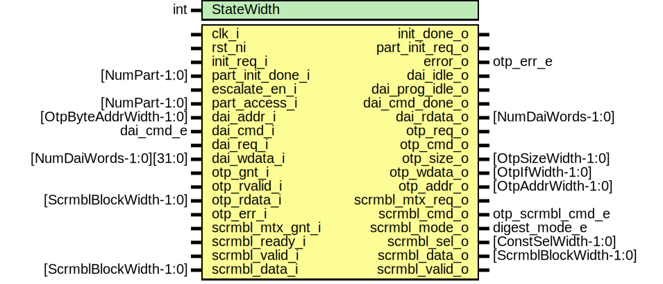

# Entity: otp_ctrl_dai

- **File**: otp_ctrl_dai.sv
## Diagram

## Description

 Copyright lowRISC contributors.
 Licensed under the Apache License, Version 2.0, see LICENSE for details.
 SPDX-License-Identifier: Apache-2.0

 Direct access interface for OTP controller.

## Generics

| Generic name | Type | Value | Description                                                                                                                                                                                                                                                                                                                                                                                                                                                 |
| ------------ | ---- | ----- | ----------------------------------------------------------------------------------------------------------------------------------------------------------------------------------------------------------------------------------------------------------------------------------------------------------------------------------------------------------------------------------------------------------------------------------------------------------- |
| StateWidth   | int  | 12    | ///////////////////  DAI Control FSM // ///////////////////  Encoding generated with ./sparse-fsm-encode.py -d 5 -m 20 -n 12 -s 3011551511  Hamming distance histogram:   0:  --  1:  --  2:  --  3:  --  4:  --  5:  |||||||||||||||||| (32.11%)  6:  |||||||||||||||||||| (35.26%)  7:  |||||||| (15.79%)  8:  |||||| (11.58%)  9:  | (2.11%)  10:  (1.05%)  11: | (2.11%)  12: --   Minimum Hamming distance: 5  Maximum Hamming distance: 11   |
## Ports

| Port name        | Direction | Type                    | Description                                                                                                                                                        |
| ---------------- | --------- | ----------------------- | ------------------------------------------------------------------------------------------------------------------------------------------------------------------ |
| clk_i            | input     |                         |                                                                                                                                                                    |
| rst_ni           | input     |                         |                                                                                                                                                                    |
| init_req_i       | input     |                         |  Init reqest from power manager                                                                                                                                    |
| init_done_o      | output    |                         |                                                                                                                                                                    |
| part_init_req_o  | output    |                         |  Init request going to partitions                                                                                                                                  |
| part_init_done_i | input     | [NumPart-1:0]           |                                                                                                                                                                    |
| escalate_en_i    | input     |                         |  Escalation input. This moves the FSM into a terminal state and locks down the DAI.                                                                                |
| error_o          | output    | otp_err_e               |  Output error state of DAI, to be consumed by OTP error/alert logic. Note that most errors are not recoverable and move the DAI FSM into  a terminal error state.  |
| part_access_i    | input     | [NumPart-1:0]           |  Access/lock status from partitions                                                                                                                                |
| dai_addr_i       | input     | [OtpByteAddrWidth-1:0]  |  CSR interface                                                                                                                                                     |
| dai_cmd_i        | input     | dai_cmd_e               |                                                                                                                                                                    |
| dai_req_i        | input     |                         |                                                                                                                                                                    |
| dai_wdata_i      | input     | [NumDaiWords-1:0][31:0] |                                                                                                                                                                    |
| dai_idle_o       | output    |                         | wired to the status CSRs                                                                                                                                           |
| dai_prog_idle_o  | output    |                         | wired to lfsr timer and pwrmgr                                                                                                                                     |
| dai_cmd_done_o   | output    |                         | this is used to raise an IRQ                                                                                                                                       |
| dai_rdata_o      | output    | [NumDaiWords-1:0]       |                                                                                                                                                                    |
| otp_req_o        | output    |                         |  OTP interface                                                                                                                                                     |
| otp_cmd_o        | output    |                         |                                                                                                                                                                    |
| otp_size_o       | output    | [OtpSizeWidth-1:0]      |                                                                                                                                                                    |
| otp_wdata_o      | output    | [OtpIfWidth-1:0]        |                                                                                                                                                                    |
| otp_addr_o       | output    | [OtpAddrWidth-1:0]      |                                                                                                                                                                    |
| otp_gnt_i        | input     |                         |                                                                                                                                                                    |
| otp_rvalid_i     | input     |                         |                                                                                                                                                                    |
| otp_rdata_i      | input     | [ScrmblBlockWidth-1:0]  |                                                                                                                                                                    |
| otp_err_i        | input     |                         |                                                                                                                                                                    |
| scrmbl_mtx_req_o | output    |                         |  Scrambling mutex request                                                                                                                                          |
| scrmbl_mtx_gnt_i | input     |                         |                                                                                                                                                                    |
| scrmbl_cmd_o     | output    | otp_scrmbl_cmd_e        |  Scrambling datapath interface                                                                                                                                     |
| scrmbl_mode_o    | output    | digest_mode_e           |                                                                                                                                                                    |
| scrmbl_sel_o     | output    | [ConstSelWidth-1:0]     |                                                                                                                                                                    |
| scrmbl_data_o    | output    | [ScrmblBlockWidth-1:0]  |                                                                                                                                                                    |
| scrmbl_valid_o   | output    |                         |                                                                                                                                                                    |
| scrmbl_ready_i   | input     |                         |                                                                                                                                                                    |
| scrmbl_valid_i   | input     |                         |                                                                                                                                                                    |
| scrmbl_data_i    | input     | [ScrmblBlockWidth-1:0]  |                                                                                                                                                                    |
## Signals

| Name            | Type                                  | Description                                                                                                                                                                                                                                                                                                                                                |
| --------------- | ------------------------------------- | ---------------------------------------------------------------------------------------------------------------------------------------------------------------------------------------------------------------------------------------------------------------------------------------------------------------------------------------------------------- |
| state_d         | state_e                               |                                                                                                                                                                                                                                                                                                                                                            |
| state_q         | state_e                               |                                                                                                                                                                                                                                                                                                                                                            |
| cnt_d           | logic [CntWidth-1:0]                  |                                                                                                                                                                                                                                                                                                                                                            |
| cnt_q           | logic [CntWidth-1:0]                  |                                                                                                                                                                                                                                                                                                                                                            |
| cnt_en          | logic                                 |                                                                                                                                                                                                                                                                                                                                                            |
| cnt_clr         | logic                                 |                                                                                                                                                                                                                                                                                                                                                            |
| error_d         | otp_err_e                             |                                                                                                                                                                                                                                                                                                                                                            |
| error_q         | otp_err_e                             |                                                                                                                                                                                                                                                                                                                                                            |
| data_en         | logic                                 |                                                                                                                                                                                                                                                                                                                                                            |
| data_clr        | logic                                 |                                                                                                                                                                                                                                                                                                                                                            |
| data_sel        | data_sel_e                            |                                                                                                                                                                                                                                                                                                                                                            |
| base_sel_d      | addr_sel_e                            |                                                                                                                                                                                                                                                                                                                                                            |
| base_sel_q      | addr_sel_e                            |                                                                                                                                                                                                                                                                                                                                                            |
| data_q          | logic [ScrmblBlockWidth-1:0]          |                                                                                                                                                                                                                                                                                                                                                            |
| part_idx        | logic [NumPartWidth-1:0]              |                                                                                                                                                                                                                                                                                                                                                            |
| digest_addr_lut | logic [NumPart-1:0][OtpAddrWidth-1:0] |                                                                                                                                                                                                                                                                                                                                                            |
| part_sel_oh     | logic [NumPart-1:0]                   | //////////////////////////  Partition Select Logic // //////////////////////////  This checks which partition the address belongs to by comparing  the incoming address to the partition address ranges. The onehot  bitvector generated by the parallel comparisons is fed into a  binary tree that determines the partition index with O(log(N)) delay.  |
| addr_base       | logic [OtpByteAddrWidth-1:0]          | ///////////////////////////////////  Address Calculations for Digest // ///////////////////////////////////  Depending on whether this is a 32bit or 64bit partition, we cut off the lower address bits.  Access sizes are either 64bit or 32bit, depending on what region the access goes to.                                                             |
| addr_calc       | logic [OtpByteAddrWidth-1:0]          |  Note that OTP works on halfword (16bit) addresses, hence need to  shift the addresses appropriately.                                                                                                                                                                                                                                                      |
| state_raw_q     | logic [StateWidth-1:0]                | /////////////  Registers // /////////////  This primitive is used to place a size-only constraint on the  flops in order to prevent FSM state encoding optimizations.                                                                                                                                                                                      |
## Constants

| Name     | Type | Value                                         | Description |
| -------- | ---- | --------------------------------------------- | ----------- |
| CntWidth | int  | OtpByteAddrWidth - $clog2(ScrmblBlockWidth/8) |             |
## Types

| Name       | Type                                                                                                                                                                                                                                                                                                                                                                                                                                                                                                                                                                                                                                                                                                                                                                                                                                                                                                                                                                                                                                                                                                                                                                                                                                                                                                                                                                                                                                                                                                                                                                     | Description |
| ---------- | ------------------------------------------------------------------------------------------------------------------------------------------------------------------------------------------------------------------------------------------------------------------------------------------------------------------------------------------------------------------------------------------------------------------------------------------------------------------------------------------------------------------------------------------------------------------------------------------------------------------------------------------------------------------------------------------------------------------------------------------------------------------------------------------------------------------------------------------------------------------------------------------------------------------------------------------------------------------------------------------------------------------------------------------------------------------------------------------------------------------------------------------------------------------------------------------------------------------------------------------------------------------------------------------------------------------------------------------------------------------------------------------------------------------------------------------------------------------------------------------------------------------------------------------------------------------------ | ----------- |
| state_e    | enum logic [StateWidth-1:0] {      ResetSt       = 12'b001000011011,      InitOtpSt     = 12'b101111001001,      InitPartSt    = 12'b101010100111,      IdleSt        = 12'b110100110101,      ErrorSt       = 12'b100011010000,      ReadSt        = 12'b111001010110,      ReadWaitSt    = 12'b000101100111,      DescrSt       = 12'b110001001101,      DescrWaitSt   = 12'b010000110010,      WriteSt       = 12'b101101111100,      WriteWaitSt   = 12'b100100101010,      ScrSt         = 12'b111110010011,      ScrWaitSt     = 12'b010110011000,      DigClrSt      = 12'b011100001110,      DigReadSt     = 12'b011001101000,      DigReadWaitSt = 12'b000011111110,      DigSt         = 12'b000010101001,      DigPadSt      = 12'b000000000100,      DigFinSt      = 12'b010011000011,      DigWaitSt     = 12'b011011110101   } |             |
| data_sel_e | enum logic [1:0] {      OtpData = 2'b00,      DaiData = 2'b01,      ScrmblData = 2'b10   }                                                                                                                                                                                                                                                                                                                                                                                                                                                                                                                                                                                                                                                                                                                                                                                                                                                                                                                                                                                                                                                                                                                                                                                                                                                                                                                                                                      |             |
| addr_sel_e | enum logic {      PartOffset = 1'b0,      DaiOffset = 1'b1   }                                                                                                                                                                                                                                                                                                                                                                                                                                                                                                                                                                                                                                                                                                                                                                                                                                                                                                                                                                                                                                                                                                                                                                                                                                                                                                                                                                                                                                     |             |
## Processes
- p_fsm: (  )
  - **Type:** always_comb
- p_size_sel: (  )
  - **Type:** always_comb
- p_regs: ( @(posedge clk_i or negedge rst_ni) )
  - **Type:** always_ff
## Instantiations

- u_part_sel_idx: prim_arbiter_fixed
- u_state_regs: prim_flop
