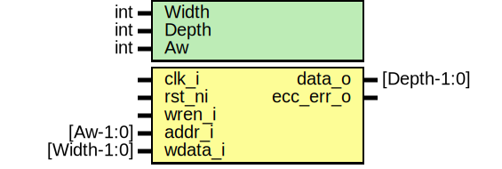

# Entity: otp_ctrl_ecc_reg

- **File**: otp_ctrl_ecc_reg.sv
## Diagram

## Description

 Copyright lowRISC contributors.
 Licensed under the Apache License, Version 2.0, see LICENSE for details.
 SPDX-License-Identifier: Apache-2.0

 Register file for buffered OTP partitions. ECC is used to detect up
 to two simultaneous errors within each 64bit word.

 TODO: discuss whether reset is allowed here. We may also need a secure wiping feature.

## Generics

| Generic name | Type | Value                       | Description         |
| ------------ | ---- | --------------------------- | ------------------- |
| Width        | int  | 64                          |  bit                |
| Depth        | int  | 128                         |                     |
| Aw           | int  | prim_util_pkg::vbits(Depth) |  derived parameter  |
## Ports

| Port name | Direction | Type        | Description                                             |
| --------- | --------- | ----------- | ------------------------------------------------------- |
| clk_i     | input     |             |                                                         |
| rst_ni    | input     |             |                                                         |
| wren_i    | input     |             |                                                         |
| addr_i    | input     | [Aw-1:0]    |                                                         |
| wdata_i   | input     | [Width-1:0] |                                                         |
| data_o    | output    | [Depth-1:0] |  Concurrent output of the register state.               |
| ecc_err_o | output    |             |  Concurrent ECC check error is flagged via this signal. |
## Signals

| Name    | Type                            | Description              |
| ------- | ------------------------------- | ------------------------ |
| data_d  | logic [Depth-1:0][Width-1:0]    |                          |
| data_q  | logic [Depth-1:0][Width-1:0]    |                          |
| ecc_d   | logic [Depth-1:0][EccWidth-1:0] |                          |
| ecc_q   | logic [Depth-1:0][EccWidth-1:0] |                          |
| ecc_enc | logic [Width+EccWidth-1:0]      |                          |
| err     | logic [Depth-1:0][1:0]          |  Concurrent ECC checks.  |
## Constants

| Name     | Type | Value                       | Description        |
| -------- | ---- | --------------------------- | ------------------ |
| Aw       | int  | prim_util_pkg::vbits(Depth) | derived parameter  |
| EccWidth | int  | 8                           |                    |
## Processes
- p_regs: ( @(posedge clk_i or negedge rst_ni) )
  - **Type:** always_ff
## Instantiations

- u_prim_secded_72_64_enc: prim_secded_72_64_enc
 **Description**
 Only one encoder is needed.

