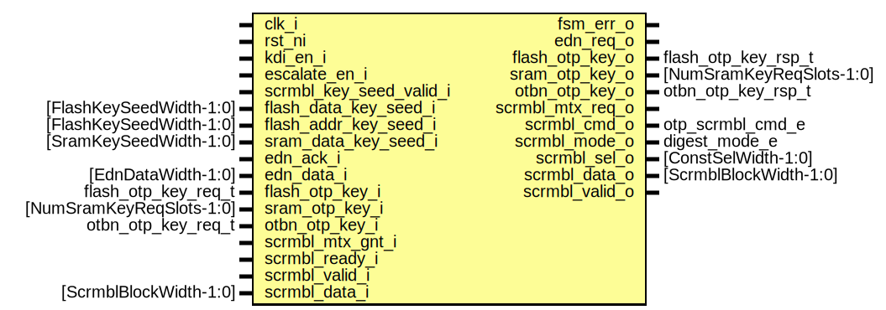

# Entity: otp_ctrl_kdi

- **File**: otp_ctrl_kdi.sv
## Diagram

## Description

 Copyright lowRISC contributors.
 Licensed under the Apache License, Version 2.0, see LICENSE for details.
 SPDX-License-Identifier: Apache-2.0

 Scrambling key derivation module for OTP.

## Ports

| Port name               | Direction | Type                     | Description                                                               |
| ----------------------- | --------- | ------------------------ | ------------------------------------------------------------------------- |
| clk_i                   | input     |                          |                                                                           |
| rst_ni                  | input     |                          |                                                                           |
| kdi_en_i                | input     |                          |  Pulse to enable this module after OTP partitions have been initialized.  |
| escalate_en_i           | input     |                          |  Escalation input. This moves the FSM into a terminal state.              |
| fsm_err_o               | output    |                          |  FSM is in error state                                                    |
| scrmbl_key_seed_valid_i | input     |                          |  Key seed inputs from OTP                                                 |
| flash_data_key_seed_i   | input     | [FlashKeySeedWidth-1:0]  |                                                                           |
| flash_addr_key_seed_i   | input     | [FlashKeySeedWidth-1:0]  |                                                                           |
| sram_data_key_seed_i    | input     | [SramKeySeedWidth-1:0]   |                                                                           |
| edn_req_o               | output    |                          |  EDN interface for requesting entropy                                     |
| edn_ack_i               | input     |                          |                                                                           |
| edn_data_i              | input     | [EdnDataWidth-1:0]       |                                                                           |
| flash_otp_key_i         | input     | flash_otp_key_req_t      |  Scrambling key requests                                                  |
| flash_otp_key_o         | output    | flash_otp_key_rsp_t      |                                                                           |
| sram_otp_key_i          | input     | [NumSramKeyReqSlots-1:0] |                                                                           |
| sram_otp_key_o          | output    | [NumSramKeyReqSlots-1:0] |                                                                           |
| otbn_otp_key_i          | input     | otbn_otp_key_req_t       |                                                                           |
| otbn_otp_key_o          | output    | otbn_otp_key_rsp_t       |                                                                           |
| scrmbl_mtx_req_o        | output    |                          |  Scrambling mutex request                                                 |
| scrmbl_mtx_gnt_i        | input     |                          |                                                                           |
| scrmbl_cmd_o            | output    | otp_scrmbl_cmd_e         |  Scrambling datapath interface                                            |
| scrmbl_mode_o           | output    | digest_mode_e            |                                                                           |
| scrmbl_sel_o            | output    | [ConstSelWidth-1:0]      |                                                                           |
| scrmbl_data_o           | output    | [ScrmblBlockWidth-1:0]   |                                                                           |
| scrmbl_valid_o          | output    |                          |                                                                           |
| scrmbl_ready_i          | input     |                          |                                                                           |
| scrmbl_valid_i          | input     |                          |                                                                           |
| scrmbl_data_i           | input     | [ScrmblBlockWidth-1:0]   |                                                                           |
## Signals

| Name              | Type                                                              | Description                                                                                                                                                            |
| ----------------- | ----------------------------------------------------------------- | ---------------------------------------------------------------------------------------------------------------------------------------------------------------------- |
| req               | logic [NumReq-1:0]                                                |                                                                                                                                                                        |
| gnt               | logic [NumReq-1:0]                                                |                                                                                                                                                                        |
| req_bundles       | req_bundle_t                                                      |                                                                                                                                                                        |
| req_valid         | logic                                                             |  This arbitrates among incoming key derivation requests on a  round robin basis to prevent deadlock.                                                                   |
| req_ready         | logic                                                             |  This arbitrates among incoming key derivation requests on a  round robin basis to prevent deadlock.                                                                   |
| req_bundle        | req_bundle_t                                                      |                                                                                                                                                                        |
| seed_cnt_clr      | logic                                                             | ////////////////////////////  Temporary Regs and Muxes // ////////////////////////////                                                                                 |
| seed_cnt_en       | logic                                                             | ////////////////////////////  Temporary Regs and Muxes // ////////////////////////////                                                                                 |
| entropy_cnt_clr   | logic                                                             | ////////////////////////////  Temporary Regs and Muxes // ////////////////////////////                                                                                 |
| entropy_cnt_en    | logic                                                             | ////////////////////////////  Temporary Regs and Muxes // ////////////////////////////                                                                                 |
| seed_cnt_d        | logic [1:0]                                                       |                                                                                                                                                                        |
| seed_cnt_q        | logic [1:0]                                                       |                                                                                                                                                                        |
| entropy_cnt_d     | logic [1:0]                                                       |                                                                                                                                                                        |
| entropy_cnt_q     | logic [1:0]                                                       |                                                                                                                                                                        |
| seed_valid_reg_en | logic                                                             |                                                                                                                                                                        |
| key_reg_en        | logic                                                             |                                                                                                                                                                        |
| nonce_reg_en      | logic                                                             |                                                                                                                                                                        |
| seed_valid_d      | logic                                                             |                                                                                                                                                                        |
| seed_valid_q      | logic                                                             |                                                                                                                                                                        |
| key_out_d         | logic [ScrmblKeyWidth/ScrmblBlockWidth-1:0][ScrmblBlockWidth-1:0] |                                                                                                                                                                        |
| key_out_q         | logic [ScrmblKeyWidth/ScrmblBlockWidth-1:0][ScrmblBlockWidth-1:0] |                                                                                                                                                                        |
| nonce_out_d       | logic [NumNonceChunks-1:0][ScrmblBlockWidth-1:0]                  |                                                                                                                                                                        |
| nonce_out_q       | logic [NumNonceChunks-1:0][ScrmblBlockWidth-1:0]                  |                                                                                                                                                                        |
| data_sel          | data_sel_e                                                        |  Select correct 64bit block.                                                                                                                                           |
| state_d           | state_e                                                           |                                                                                                                                                                        |
| state_q           | state_e                                                           |                                                                                                                                                                        |
| edn_req_d         | logic                                                             |                                                                                                                                                                        |
| edn_req_q         | logic                                                             |                                                                                                                                                                        |
| state_raw_q       | logic [StateWidth-1:0]                                            | /////////////  Registers // /////////////  This primitive is used to place a size-only constraint on the  flops in order to prevent FSM state encoding optimizations.  |
## Constants

| Name          | Type | Value                             | Description                                                                                                                                                                                                                                                                                                                                                                                                |
| ------------- | ---- | --------------------------------- | ---------------------------------------------------------------------------------------------------------------------------------------------------------------------------------------------------------------------------------------------------------------------------------------------------------------------------------------------------------------------------------------------------------- |
| NumReq        | int  | 3 + NumSramKeyReqSlots            | //////////////////////  Integration Checks // //////////////////////  2xFlash, OTBN + SRAM slots                                                                                                                                                                                                                                                                                                           |
| OtbnNonceSel  | int  | OtbnNonceWidth / ScrmblBlockWidth |                                                                                                                                                                                                                                                                                                                                                                                                            |
| FlashNonceSel | int  | FlashKeyWidth / ScrmblBlockWidth  |                                                                                                                                                                                                                                                                                                                                                                                                            |
| SramNonceSel  | int  | SramNonceWidth / ScrmblBlockWidth |                                                                                                                                                                                                                                                                                                                                                                                                            |
| StateWidth    | int  | 10                                | ///////////////  Control FSM // ///////////////  Encoding generated with:  $ ./sparse-fsm-encode.py -d 5 -m 11 -n 10 \       -s 2544133835 --language=sv   Hamming distance histogram:    0: --   1: --   2: --   3: --   4: --   5: |||||||||||||||||||| (54.55%)   6: |||||||||||||||| (45.45%)   7: --   8: --   9: --  10: --   Minimum Hamming distance: 5  Maximum Hamming distance: 6   |
## Types

| Name         | Type                                                                                                                                                                                                                                                                                                                                                                                                                                                                                                                                                                                                                                                                                                                                                                                                                                                                | Description                                                                                                                                                                                                                                                                                                                                                                                                                                                                                                                                                                                                                                                                                                                                                                                                                                                                                                                                                                                                                                      |
| ------------ | ------------------------------------------------------------------------------------------------------------------------------------------------------------------------------------------------------------------------------------------------------------------------------------------------------------------------------------------------------------------------------------------------------------------------------------------------------------------------------------------------------------------------------------------------------------------------------------------------------------------------------------------------------------------------------------------------------------------------------------------------------------------------------------------------------------------------------------------------------------------- | ------------------------------------------------------------------------------------------------------------------------------------------------------------------------------------------------------------------------------------------------------------------------------------------------------------------------------------------------------------------------------------------------------------------------------------------------------------------------------------------------------------------------------------------------------------------------------------------------------------------------------------------------------------------------------------------------------------------------------------------------------------------------------------------------------------------------------------------------------------------------------------------------------------------------------------------------------------------------------------------------------------------------------------------------ |
| req_bundle_t | struct packed {      logic                             ingest_entropy;       logic                             chained_digest;       digest_sel_e                      digest_sel;           logic                             fetch_nonce;          logic [1:0]                       nonce_size;           logic                             seed_valid;           logic [3:0][ScrmblBlockWidth-1:0] seed;               }                                                                                                                                                | /////////////////////////////////  Input Mapping and Arbitration // /////////////////////////////////  The key derivation and token hashing functions are aligned such that 2 x 128bit key  seeds / token blocks are processed in two subsequent steps using the digest primitive.  This effectively compresses these blocks down into 2 x 64bit blocks, thereby creating  one 128bit key or token output.   The same FSM is shared among the different flavors of key derivation and token  hashing functions, and the following configuration options are available:   1) ingest an additional 128bit entropy block after ingesting a 128bit key seed.  2) keep digest state after producing the first 64bit block instead of reverting to the IV.  3) netlist constant index.  4) fetch additional entropy for the nonce output.  5) whether or not the key seed is valid. if not, it will be defaulted to '0.  6) 256bit key seed / token input.   The configuration options are set further below, depending on the request type.  |
| data_sel_e   | enum logic {      SeedData,      EntropyData   }                                                                                                                                                                                                                                                                                                                                                                                                                                                                                                                                                                                                                                                                                                                                              |                                                                                                                                                                                                                                                                                                                                                                                                                                                                                                                                                                                                                                                                                                                                                                                                                                                                                                                                                                                                                                                  |
| state_e      | enum logic [StateWidth-1:0] {      ResetSt        = 10'b0111100000,      IdleSt         = 10'b0001111101,      DigClrSt       = 10'b1101101011,      DigLoadSt      = 10'b0100011010,      FetchEntropySt = 10'b0010001001,      DigEntropySt   = 10'b0110110111,      DigFinSt       = 10'b0001000110,      DigWaitSt      = 10'b1100000101,      FetchNonceSt   = 10'b1010101110,      FinishSt       = 10'b1111011100,      ErrorSt        = 10'b1011010011   } |                                                                                                                                                                                                                                                                                                                                                                                                                                                                                                                                                                                                                                                                                                                                                                                                                                                                                                                                                                                                                                                  |
## Processes
- p_outregs: (  )
  - **Type:** always_comb
- p_fsm: (  )
  - **Type:** always_comb
- p_regs: ( @(posedge clk_i or negedge rst_ni) )
  - **Type:** always_ff
## Instantiations

- u_state_regs: prim_flop
