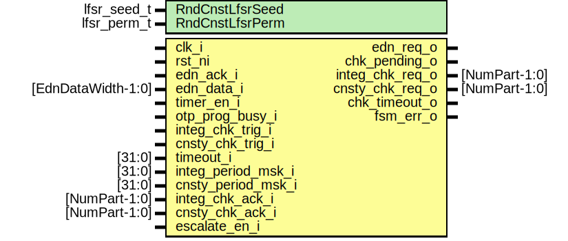

# Entity: otp_ctrl_lfsr_timer

## Diagram

## Description

Copyright lowRISC contributors.
 Licensed under the Apache License, Version 2.0, see LICENSE for details.
 SPDX-License-Identifier: Apache-2.0
 This module implements the LFSR timer for triggering periodic consistency and integrity checks in
 OTP. In particular, this module contains two 40bit counters (one for the consistency and one
 for the integrity checks) and a 40bit LFSR to draw pseudo random wait counts.
 The integ_period_msk_i and cnsty_period_msk_i mask signals are used to mask off the LFSR outputs
 and hence determine the maximum wait count that can be drawn. If these values are set to
 zero, the corresponding timer is disabled.
 Once a particular check timer has expired, the module will send out a check request to all
 partitions and wait for an acknowledgment. If a particular partition encounters an integrity or
 consistency mismatch, this will be directly reported via the error and alert logic.
 In order to guard against wedged partition controllers or arbitration lock ups due to tampering
 attempts, this check timer module also supports a 32bit timeout that can optionally be
 programmed. If a particular check times out, chk_timeout_o will be asserted, which will raise
 an alert via the error logic.
 The EntropyWidth LSBs of the LFSR are reseeded with fresh entropy from EDN once
 LfsrUsageThreshold values have been drawn from the LFSR.
 It is also possible to trigger one-off checks via integ_chk_trig_i and cnsty_chk_trig_i.
 This can be useful if SW chooses to leave the periodic checks disabled.
 
## Generics

| Generic name    | Type        | Value                  | Description                                                |
| --------------- | ----------- | ---------------------- | ---------------------------------------------------------- |
| RndCnstLfsrSeed | lfsr_seed_t | RndCnstLfsrSeedDefault | Compile time random constants, to be overriden by topgen.  |
| RndCnstLfsrPerm | lfsr_perm_t | RndCnstLfsrPermDefault |                                                            |
## Ports

| Port name          | Direction | Type               | Description                                |
| ------------------ | --------- | ------------------ | ------------------------------------------ |
| clk_i              | input     |                    |                                            |
| rst_ni             | input     |                    |                                            |
| edn_req_o          | output    |                    | request to EDN                             |
| edn_ack_i          | input     |                    | ack from EDN                               |
| edn_data_i         | input     | [EdnDataWidth-1:0] | from EDN                                   |
| timer_en_i         | input     |                    | enable timer                               |
| otp_prog_busy_i    | input     |                    | indicates whether prog ops are in progress |
| integ_chk_trig_i   | input     |                    | one-off trigger for integrity check        |
| cnsty_chk_trig_i   | input     |                    | one-off trigger for consistency check      |
| chk_pending_o      | output    |                    | indicates whether there are pending checks |
| timeout_i          | input     | [31:0]             | check timeout                              |
| integ_period_msk_i | input     | [31:0]             | maximum integrity check mask               |
| cnsty_period_msk_i | input     | [31:0]             | maximum consistency check mask             |
| integ_chk_req_o    | output    | [NumPart-1:0]      | request to all partitions                  |
| cnsty_chk_req_o    | output    | [NumPart-1:0]      | request to all partitions                  |
| integ_chk_ack_i    | input     | [NumPart-1:0]      | response from partitions                   |
| cnsty_chk_ack_i    | input     | [NumPart-1:0]      | response from partitions                   |
| escalate_en_i      | input     |                    | escalation input, moves FSM into ErrorSt   |
| chk_timeout_o      | output    |                    | a check has timed out                      |
| fsm_err_o          | output    |                    | the FSM has reached an invalid state       |
## Signals

| Name               | Type                                     | Description                                                                                                                                                                                                                                                                                                                                              |
| ------------------ | ---------------------------------------- | -------------------------------------------------------------------------------------------------------------------------------------------------------------------------------------------------------------------------------------------------------------------------------------------------------------------------------------------------------- |
| reseed_en          | logic                                    | Count how many times the LFSR has been used to generate a value. Once we've reached the limit, we request new entropy from EDN to reseed the LFSR. Note that this is not a blocking operation for the timer below. I.e., the timer is allowed to continue its operation, and may draw more values, even if the EDN reseed request is still in progress.  |
| lfsr_en            | logic                                    | Count how many times the LFSR has been used to generate a value. Once we've reached the limit, we request new entropy from EDN to reseed the LFSR. Note that this is not a blocking operation for the timer below. I.e., the timer is allowed to continue its operation, and may draw more values, even if the EDN reseed request is still in progress.  |
| reseed_cnt_d       | logic [$clog2(LfsrUsageThreshold+1)-1:0] |                                                                                                                                                                                                                                                                                                                                                          |
| reseed_cnt_q       | logic [$clog2(LfsrUsageThreshold+1)-1:0] |                                                                                                                                                                                                                                                                                                                                                          |
| lfsr_en_unbuf      | logic                                    |                                                                                                                                                                                                                                                                                                                                                          |
| entropy_unbuf      | logic [LfsrWidth-1:0]                    |                                                                                                                                                                                                                                                                                                                                                          |
| lfsr_state         | logic [1:0][LfsrWidth-1:0]               |                                                                                                                                                                                                                                                                                                                                                          |
| unused_seed        | logic                                    | Not all entropy bits are used.                                                                                                                                                                                                                                                                                                                           |
| integ_cnt_q        | logic [1:0][LfsrWidth-1:0]               |                                                                                                                                                                                                                                                                                                                                                          |
| cnsty_cnt_q        | logic [1:0][LfsrWidth-1:0]               |                                                                                                                                                                                                                                                                                                                                                          |
| integ_load_period  | logic                                    |                                                                                                                                                                                                                                                                                                                                                          |
| integ_load_timeout | logic                                    |                                                                                                                                                                                                                                                                                                                                                          |
| integ_cnt_zero     | logic                                    |                                                                                                                                                                                                                                                                                                                                                          |
| cnsty_load_period  | logic                                    |                                                                                                                                                                                                                                                                                                                                                          |
| cnsty_load_timeout | logic                                    |                                                                                                                                                                                                                                                                                                                                                          |
| cnsty_cnt_zero     | logic                                    |                                                                                                                                                                                                                                                                                                                                                          |
| integ_mask         | logic [LfsrWidth-1:0]                    |                                                                                                                                                                                                                                                                                                                                                          |
| cnsty_mask         | logic [LfsrWidth-1:0]                    |                                                                                                                                                                                                                                                                                                                                                          |
| timeout_zero       | logic                                    |                                                                                                                                                                                                                                                                                                                                                          |
| integ_msk_zero     | logic                                    |                                                                                                                                                                                                                                                                                                                                                          |
| cnsty_msk_zero     | logic                                    |                                                                                                                                                                                                                                                                                                                                                          |
| cnsty_cnt_pause    | logic                                    |                                                                                                                                                                                                                                                                                                                                                          |
| set_all_integ_reqs | logic                                    |                                                                                                                                                                                                                                                                                                                                                          |
| set_all_cnsty_reqs | logic                                    |                                                                                                                                                                                                                                                                                                                                                          |
| integ_chk_req_d    | logic [NumPart-1:0]                      |                                                                                                                                                                                                                                                                                                                                                          |
| integ_chk_req_q    | logic [NumPart-1:0]                      |                                                                                                                                                                                                                                                                                                                                                          |
| cnsty_chk_req_d    | logic [NumPart-1:0]                      |                                                                                                                                                                                                                                                                                                                                                          |
| cnsty_chk_req_q    | logic [NumPart-1:0]                      |                                                                                                                                                                                                                                                                                                                                                          |
| clr_integ_chk_trig | logic                                    | external triggers                                                                                                                                                                                                                                                                                                                                        |
| clr_cnsty_chk_trig | logic                                    | external triggers                                                                                                                                                                                                                                                                                                                                        |
| integ_chk_trig_d   | logic                                    |                                                                                                                                                                                                                                                                                                                                                          |
| integ_chk_trig_q   | logic                                    |                                                                                                                                                                                                                                                                                                                                                          |
| cnsty_chk_trig_d   | logic                                    |                                                                                                                                                                                                                                                                                                                                                          |
| cnsty_chk_trig_q   | logic                                    |                                                                                                                                                                                                                                                                                                                                                          |
| state_d            | state_e                                  |                                                                                                                                                                                                                                                                                                                                                          |
| state_q            | state_e                                  |                                                                                                                                                                                                                                                                                                                                                          |
| chk_timeout_d      | logic                                    |                                                                                                                                                                                                                                                                                                                                                          |
| chk_timeout_q      | logic                                    |                                                                                                                                                                                                                                                                                                                                                          |
| state_raw_q        | logic [StateWidth-1:0]                   | This primitive is used to place a size-only constraint on the flops in order to prevent FSM state encoding optimizations.                                                                                                                                                                                                                                |
## Constants

| Name       | Type | Value | Description |
| ---------- | ---- | ----- | ----------- |
| StateWidth | int  | 9     |             |
## Types

| Name    | Type                                                                                                                                                                                                                                                                                                                                                                                 | Description |
| ------- | ------------------------------------------------------------------------------------------------------------------------------------------------------------------------------------------------------------------------------------------------------------------------------------------------------------------------------------------------------------------------------------ | ----------- |
| state_e | enum logic [StateWidth-1:0] {      ResetSt     = 9'b011111011,      IdleSt      = 9'b000100000,      IntegWaitSt = 9'b110010101,      CnstyWaitSt = 9'b001010110,      ErrorSt     = 9'b100101111   } |             |
## Processes
- p_fsm: (  )
- p_regs: ( @(posedge clk_i or negedge rst_ni) )
## Instantiations

- u_state_regs: prim_flop
