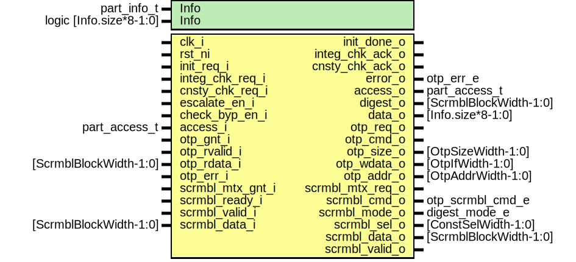

# Entity: otp_ctrl_part_buf
## Diagram

## Description
Copyright lowRISC contributors.
 Licensed under the Apache License, Version 2.0, see LICENSE for details.
 SPDX-License-Identifier: Apache-2.0
 Buffered partition for OTP controller.
 
## Generics
| Generic name | Type                    | Value           | Description             |
| ------------ | ----------------------- | --------------- | ----------------------- |
| Info         | part_info_t             | PartInfoDefault | Partition information.  |
| Info         | logic [Info.size*8-1:0] | '0              |                         |
## Ports
| Port name        | Direction | Type                   | Description                                                                                                                                                                 |
| ---------------- | --------- | ---------------------- | --------------------------------------------------------------------------------------------------------------------------------------------------------------------------- |
| clk_i            | input     |                        |                                                                                                                                                                             |
| rst_ni           | input     |                        |                                                                                                                                                                             |
| init_req_i       | input     |                        | Pulse to start partition initialisation (required once per power cycle).                                                                                                    |
| init_done_o      | output    |                        |                                                                                                                                                                             |
| integ_chk_req_i  | input     |                        | Integrity check requests                                                                                                                                                    |
| integ_chk_ack_o  | output    |                        |                                                                                                                                                                             |
| cnsty_chk_req_i  | input     |                        | Consistency check requests                                                                                                                                                  |
| cnsty_chk_ack_o  | output    |                        |                                                                                                                                                                             |
| escalate_en_i    | input     |                        | Escalation input. This moves the FSM into a terminal state and locks downthe partition.                                                                                     |
| check_byp_en_i   | input     |                        | Check bypass enable. This bypasses integrity and consistency checks andacknowledges all incoming check requests (only used by life cycle).                                  |
| error_o          | output    | otp_err_e              | Output error state of partition, to be consumed by OTP error/alert logic.Note that most errors are not recoverable and move the partition FSM into a terminal error state.  |
| access_i         | input     | part_access_t          | runtime lock from CSRs                                                                                                                                                      |
| access_o         | output    | part_access_t          |                                                                                                                                                                             |
| digest_o         | output    | [ScrmblBlockWidth-1:0] | Buffered 64bit digest output.                                                                                                                                               |
| data_o           | output    | [Info.size*8-1:0]      |                                                                                                                                                                             |
| otp_req_o        | output    |                        | OTP interface                                                                                                                                                               |
| otp_cmd_o        | output    |                        |                                                                                                                                                                             |
| otp_size_o       | output    | [OtpSizeWidth-1:0]     |                                                                                                                                                                             |
| otp_wdata_o      | output    | [OtpIfWidth-1:0]       |                                                                                                                                                                             |
| otp_addr_o       | output    | [OtpAddrWidth-1:0]     |                                                                                                                                                                             |
| otp_gnt_i        | input     |                        |                                                                                                                                                                             |
| otp_rvalid_i     | input     |                        |                                                                                                                                                                             |
| otp_rdata_i      | input     | [ScrmblBlockWidth-1:0] |                                                                                                                                                                             |
| otp_err_i        | input     |                        |                                                                                                                                                                             |
| scrmbl_mtx_req_o | output    |                        | Scrambling mutex request                                                                                                                                                    |
| scrmbl_mtx_gnt_i | input     |                        |                                                                                                                                                                             |
| scrmbl_cmd_o     | output    | otp_scrmbl_cmd_e       | Scrambling datapath interface                                                                                                                                               |
| scrmbl_mode_o    | output    | digest_mode_e          |                                                                                                                                                                             |
| scrmbl_sel_o     | output    | [ConstSelWidth-1:0]    |                                                                                                                                                                             |
| scrmbl_data_o    | output    | [ScrmblBlockWidth-1:0] |                                                                                                                                                                             |
| scrmbl_valid_o   | output    |                        |                                                                                                                                                                             |
| scrmbl_ready_i   | input     |                        |                                                                                                                                                                             |
| scrmbl_valid_i   | input     |                        |                                                                                                                                                                             |
| scrmbl_data_i    | input     | [ScrmblBlockWidth-1:0] |                                                                                                                                                                             |
## Signals
| Name          | Type                             | Description                                                                                                                |
| ------------- | -------------------------------- | -------------------------------------------------------------------------------------------------------------------------- |
| state_d       | state_e                          |                                                                                                                            |
| state_q       | state_e                          |                                                                                                                            |
| error_d       | otp_err_e                        |                                                                                                                            |
| error_q       | otp_err_e                        |                                                                                                                            |
| data_sel      | data_sel_e                       |                                                                                                                            |
| base_sel      | base_sel_e                       |                                                                                                                            |
| dout_gate_d   | access_e                         |                                                                                                                            |
| dout_gate_q   | access_e                         |                                                                                                                            |
| cnt_d         | logic [CntWidth-1:0]             |                                                                                                                            |
| cnt_q         | logic [CntWidth-1:0]             |                                                                                                                            |
| cnt_en        | logic                            |                                                                                                                            |
| cnt_clr       | logic                            |                                                                                                                            |
| ecc_err       | logic                            |                                                                                                                            |
| buffer_reg_en | logic                            |                                                                                                                            |
| data_mux      | logic [ScrmblBlockWidth-1:0]     |                                                                                                                            |
| addr_base     | logic [OtpByteAddrWidth-1:0]     |                                                                                                                            |
| addr_calc     | logic [OtpByteAddrWidth-1:0]     | Note that OTP works on halfword (16bit) addresses, hence need to shift the addresses appropriately.                        |
| data          | logic [Info.size*8-1:0]          |                                                                                                                            |
| access        | part_access_t                    |                                                                                                                            |
| access_in     | logic [$bits(part_access_t)-1:0] | Make sure there is a hand-picked buffer on each bit to prevent the synthesis tool from optimizing the multibit signal.     |
| access_out    | logic [$bits(part_access_t)-1:0] | Make sure there is a hand-picked buffer on each bit to prevent the synthesis tool from optimizing the multibit signal.     |
| state_raw_q   | logic [StateWidth-1:0]           | This primitive is used to place a size-only constraint on the flops in order to prevent FSM state encoding optimizations.  |
## Constants
| Name                      | Type                       | Value                  | Description |
| ------------------------- | -------------------------- | ---------------------- | ----------- |
| DigestOffsetInt           | int unsigned               | (int'(Info.offset) +   |             |
| NumScrmblBlocks           | int                        | int'(Info.size)        |             |
| CntWidth                  | int                        | vbits(NumScrmblBlocks) |             |
| DigestOffset              | bit [OtpByteAddrWidth-1:0] | undefined              |             |
| LastScrmblBlockInt        | int unsigned               | NumScrmblBlocks - 1    |             |
| PenultimateScrmblBlockInt | int unsigned               | NumScrmblBlocks - 2    |             |
| LastScrmblBlock           | bit [CntWidth-1:0]         | undefined              |             |
| PenultimateScrmblBlock    | bit [CntWidth-1:0]         | undefined              |             |
| StateWidth                | int                        | 12                     |             |
## Types
| Name       | Type                                                                                                                                                                                                                                                                                                                                                                                                                                                                                                                                                                                                                                                                                             | Description |
| ---------- | ------------------------------------------------------------------------------------------------------------------------------------------------------------------------------------------------------------------------------------------------------------------------------------------------------------------------------------------------------------------------------------------------------------------------------------------------------------------------------------------------------------------------------------------------------------------------------------------------------------------------------------------------------------------------------------------------ | ----------- |
| state_e    | enum logic [StateWidth-1:0] {     ResetSt         = 12'b001001101010,     InitSt          = 12'b110100100111,     InitWaitSt      = 12'b001110110001,     InitDescrSt     = 12'b110010000100,     InitDescrWaitSt = 12'b101000011100,     IdleSt          = 12'b100110101000,     IntegScrSt      = 12'b010101001101,     IntegScrWaitSt  = 12'b110101011010,     IntegDigClrSt   = 12'b011000011011,     IntegDigSt      = 12'b101001000001,     IntegDigPadSt   = 12'b101111010111,     IntegDigFinSt   = 12'b011011100101,     IntegDigWaitSt  = 12'b100011110010,     CnstyReadSt     = 12'b111111101110,     CnstyReadWaitSt = 12'b001100000110,     ErrorSt         = 12'b000011011001   } |             |
| data_sel_e | enum logic {     ScrmblData,     OtpData   }                                                                                                                                                                                                                                                                                                                                                                                                                                                                                                                                                                                                                                                     |             |
| base_sel_e | enum logic {     PartOffset,     DigOffset   }                                                                                                                                                                                                                                                                                                                                                                                                                                                                                                                                                                                                                                                   |             |
## Processes
- p_fsm: _(  )_

- p_regs: _( @(posedge clk_i or negedge rst_ni) )_

## Instantiations
- u_otp_ctrl_ecc_reg: otp_ctrl_ecc_reg
- u_state_regs: prim_flop
