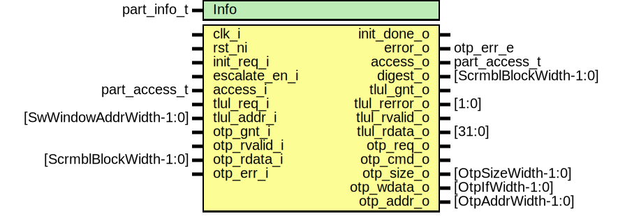

# Entity: otp_ctrl_part_unbuf

- **File**: otp_ctrl_part_unbuf.sv
## Diagram

## Description

 Copyright lowRISC contributors.
 Licensed under the Apache License, Version 2.0, see LICENSE for details.
 SPDX-License-Identifier: Apache-2.0

 Unbuffered partition for OTP controller.

## Generics

| Generic name | Type        | Value           | Description              |
| ------------ | ----------- | --------------- | ------------------------ |
| Info         | part_info_t | PartInfoDefault |  Partition information.  |
## Ports

| Port name     | Direction | Type                    | Description                                                                                                                                                                    |
| ------------- | --------- | ----------------------- | ------------------------------------------------------------------------------------------------------------------------------------------------------------------------------ |
| clk_i         | input     |                         |                                                                                                                                                                                |
| rst_ni        | input     |                         |                                                                                                                                                                                |
| init_req_i    | input     |                         |  Pulse to start partition initialisation (required once per power cycle).                                                                                                      |
| init_done_o   | output    |                         |                                                                                                                                                                                |
| escalate_en_i | input     |                         |  Escalation input. This moves the FSM into a terminal state and locks down the partition.                                                                                      |
| error_o       | output    | otp_err_e               |  Output error state of partition, to be consumed by OTP error/alert logic. Note that most errors are not recoverable and move the partition FSM into  a terminal error state.  |
| access_i      | input     | part_access_t           | runtime lock from CSRs                                                                                                                                                         |
| access_o      | output    | part_access_t           |                                                                                                                                                                                |
| digest_o      | output    | [ScrmblBlockWidth-1:0]  |  Buffered 64bit digest output.                                                                                                                                                 |
| tlul_req_i    | input     |                         |  Interface to TL-UL adapter                                                                                                                                                    |
| tlul_gnt_o    | output    |                         |                                                                                                                                                                                |
| tlul_addr_i   | input     | [SwWindowAddrWidth-1:0] |                                                                                                                                                                                |
| tlul_rerror_o | output    | [1:0]                   |                                                                                                                                                                                |
| tlul_rvalid_o | output    |                         |                                                                                                                                                                                |
| tlul_rdata_o  | output    | [31:0]                  |                                                                                                                                                                                |
| otp_req_o     | output    |                         |  OTP interface                                                                                                                                                                 |
| otp_cmd_o     | output    |                         |                                                                                                                                                                                |
| otp_size_o    | output    | [OtpSizeWidth-1:0]      |                                                                                                                                                                                |
| otp_wdata_o   | output    | [OtpIfWidth-1:0]        |                                                                                                                                                                                |
| otp_addr_o    | output    | [OtpAddrWidth-1:0]      |                                                                                                                                                                                |
| otp_gnt_i     | input     |                         |                                                                                                                                                                                |
| otp_rvalid_i  | input     |                         |                                                                                                                                                                                |
| otp_rdata_i   | input     | [ScrmblBlockWidth-1:0]  |                                                                                                                                                                                |
| otp_err_i     | input     |                         |                                                                                                                                                                                |
## Signals

| Name                 | Type                             | Description                                                                                                                                                            |
| -------------------- | -------------------------------- | ---------------------------------------------------------------------------------------------------------------------------------------------------------------------- |
| state_d              | state_e                          |                                                                                                                                                                        |
| state_q              | state_e                          |                                                                                                                                                                        |
| otp_addr_sel         | addr_sel_e                       |                                                                                                                                                                        |
| error_d              | otp_err_e                        |                                                                                                                                                                        |
| error_q              | otp_err_e                        |                                                                                                                                                                        |
| digest_reg_en        | logic                            |                                                                                                                                                                        |
| ecc_err              | logic                            |                                                                                                                                                                        |
| tlul_addr_d          | logic [SwWindowAddrWidth-1:0]    |                                                                                                                                                                        |
| tlul_addr_q          | logic [SwWindowAddrWidth-1:0]    |                                                                                                                                                                        |
| access               | part_access_t                    |                                                                                                                                                                        |
| pending_tlul_error_d | logic                            |  This is only used to return bus errors when the FSM is in ErrorSt.                                                                                                    |
| pending_tlul_error_q | logic                            |  This is only used to return bus errors when the FSM is in ErrorSt.                                                                                                    |
| addr_calc            | logic [OtpByteAddrWidth-1:0]     |  Note that OTP works on halfword (16bit) addresses, hence need to  shift the addresses appropriately.                                                                  |
| access_in            | logic [$bits(part_access_t)-1:0] |  Make sure there is a hand-picked buffer on each bit to prevent  the synthesis tool from optimizing the multibit signal.                                               |
| access_out           | logic [$bits(part_access_t)-1:0] |  Make sure there is a hand-picked buffer on each bit to prevent  the synthesis tool from optimizing the multibit signal.                                               |
| state_raw_q          | logic [StateWidth-1:0]           | /////////////  Registers // /////////////  This primitive is used to place a size-only constraint on the  flops in order to prevent FSM state encoding optimizations.  |
## Constants

| Name            | Type                       | Value                | Description                                                                                                                                                                                                                                                                                                                                                                                     |
| --------------- | -------------------------- | -------------------- | ----------------------------------------------------------------------------------------------------------------------------------------------------------------------------------------------------------------------------------------------------------------------------------------------------------------------------------------------------------------------------------------------- |
| PartEnd         | logic [OtpByteAddrWidth:0] | (Info.offse          |                                                                                                                                                                                                                                                                                                                                                                                                 |
| DigestOffsetInt | int unsigned               | - ScrmblBlockWidth/8 |                                                                                                                                                                                                                                                                                                                                                                                                 |
| DigestOffset    | bit [OtpByteAddrWidth-1:0] | undefined            |                                                                                                                                                                                                                                                                                                                                                                                                 |
| StateWidth      | int                        | 10                   | /////////////////////  OTP Partition FSM // /////////////////////  Encoding generated with ./sparse-fsm-encode.py -d 5 -m 7 -n 10 -s 4247417884  Hamming distance histogram:   0: --  1: --  2: --  3: --  4: --  5: |||||||||||||||||||| (52.38%)  6: |||||||||||||| (38.10%)  7: | (4.76%)  8: | (4.76%)  9: --  10: --   Minimum Hamming distance: 5  Maximum Hamming distance: 8   |
## Types

| Name       | Type                                                                                                                                                                                                                                                                                                                                                                                                                                                                                                                                | Description |
| ---------- | ----------------------------------------------------------------------------------------------------------------------------------------------------------------------------------------------------------------------------------------------------------------------------------------------------------------------------------------------------------------------------------------------------------------------------------------------------------------------------------------------------------------------------------- | ----------- |
| state_e    | enum logic [StateWidth-1:0] {      ResetSt    = 10'b1000111001,      InitSt     = 10'b1010110110,      InitWaitSt = 10'b0100010011,      IdleSt     = 10'b0101011100,      ReadSt     = 10'b0011000010,      ReadWaitSt = 10'b1101100000,      ErrorSt    = 10'b0110100101   } |             |
| addr_sel_e | enum logic {      DigestAddr = 1'b0,      DataAddr = 1'b1   }                                                                                                                                                                                                                                                                                                                                                                                                 |             |
## Processes
- p_fsm: (  )
  - **Type:** always_comb
- p_regs: ( @(posedge clk_i or negedge rst_ni) )
  - **Type:** always_ff
## Instantiations

- u_otp_ctrl_ecc_reg: otp_ctrl_ecc_reg
**Description**
//////////////
 Digest Reg //
//////////////

- u_state_regs: prim_flop
