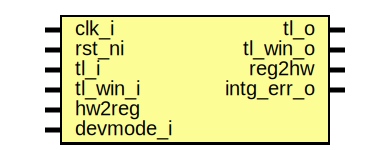

# Entity: otp_ctrl_reg_top

- **File**: otp_ctrl_reg_top.sv
## Diagram

## Description

 Copyright lowRISC contributors.
 Licensed under the Apache License, Version 2.0, see LICENSE for details.
 SPDX-License-Identifier: Apache-2.0

 Register Top module auto-generated by `reggen`

## Ports

| Port name  | Direction | Type | Description                                              |
| ---------- | --------- | ---- | -------------------------------------------------------- |
| clk_i      | input     |      |                                                          |
| rst_ni     | input     |      |                                                          |
| tl_i       | input     |      |                                                          |
| tl_o       | output    |      |                                                          |
| tl_win_o   | output    |      |  Output port for window                                  |
| tl_win_i   | input     |      |                                                          |
| reg2hw     | output    |      | Write                                                    |
| hw2reg     | input     |      | Read                                                     |
| intg_err_o | output    |      |  Integrity check errors                                  |
| devmode_i  | input     |      | If 1, explicit error return for unmapped register access |
## Signals

| Name                                | Type               | Description                                                                                                                  |
| ----------------------------------- | ------------------ | ---------------------------------------------------------------------------------------------------------------------------- |
| reg_we                              | logic              |  register signals                                                                                                            |
| reg_re                              | logic              |                                                                                                                              |
| reg_addr                            | logic [AW-1:0]     |                                                                                                                              |
| reg_wdata                           | logic [DW-1:0]     |                                                                                                                              |
| reg_be                              | logic [DBW-1:0]    |                                                                                                                              |
| reg_rdata                           | logic [DW-1:0]     |                                                                                                                              |
| reg_error                           | logic              |                                                                                                                              |
| addrmiss                            | logic              |                                                                                                                              |
| wr_err                              | logic              |                                                                                                                              |
| reg_rdata_next                      | logic [DW-1:0]     |                                                                                                                              |
| reg_busy                            | logic              |                                                                                                                              |
| tl_reg_h2d                          | tlul_pkg::tl_h2d_t |                                                                                                                              |
| tl_reg_d2h                          | tlul_pkg::tl_d2h_t |                                                                                                                              |
| intg_err                            | logic              |  incoming payload check                                                                                                      |
| intg_err_q                          | logic              |                                                                                                                              |
| tl_o_pre                            | tlul_pkg::tl_d2h_t |  outgoing integrity generation                                                                                               |
| tl_socket_h2d                       | tlul_pkg::tl_h2d_t |                                                                                                                              |
| tl_socket_d2h                       | tlul_pkg::tl_d2h_t |                                                                                                                              |
| reg_steer                           | logic [1:0]        |                                                                                                                              |
| intr_state_we                       | logic              |  Define SW related signals  Format: <reg>_<field>_{wd|we|qs}         or <reg>_{wd|we|qs} if field == 1 or 0                  |
| intr_state_otp_operation_done_qs    | logic              |                                                                                                                              |
| intr_state_otp_operation_done_wd    | logic              |                                                                                                                              |
| intr_state_otp_error_qs             | logic              |                                                                                                                              |
| intr_state_otp_error_wd             | logic              |                                                                                                                              |
| intr_enable_we                      | logic              |                                                                                                                              |
| intr_enable_otp_operation_done_qs   | logic              |                                                                                                                              |
| intr_enable_otp_operation_done_wd   | logic              |                                                                                                                              |
| intr_enable_otp_error_qs            | logic              |                                                                                                                              |
| intr_enable_otp_error_wd            | logic              |                                                                                                                              |
| intr_test_we                        | logic              |                                                                                                                              |
| intr_test_otp_operation_done_wd     | logic              |                                                                                                                              |
| intr_test_otp_error_wd              | logic              |                                                                                                                              |
| alert_test_we                       | logic              |                                                                                                                              |
| alert_test_fatal_macro_error_wd     | logic              |                                                                                                                              |
| alert_test_fatal_check_error_wd     | logic              |                                                                                                                              |
| alert_test_fatal_bus_integ_error_wd | logic              |                                                                                                                              |
| status_re                           | logic              |                                                                                                                              |
| status_creator_sw_cfg_error_qs      | logic              |                                                                                                                              |
| status_owner_sw_cfg_error_qs        | logic              |                                                                                                                              |
| status_hw_cfg_error_qs              | logic              |                                                                                                                              |
| status_secret0_error_qs             | logic              |                                                                                                                              |
| status_secret1_error_qs             | logic              |                                                                                                                              |
| status_secret2_error_qs             | logic              |                                                                                                                              |
| status_life_cycle_error_qs          | logic              |                                                                                                                              |
| status_dai_error_qs                 | logic              |                                                                                                                              |
| status_lci_error_qs                 | logic              |                                                                                                                              |
| status_timeout_error_qs             | logic              |                                                                                                                              |
| status_lfsr_fsm_error_qs            | logic              |                                                                                                                              |
| status_scrambling_fsm_error_qs      | logic              |                                                                                                                              |
| status_key_deriv_fsm_error_qs       | logic              |                                                                                                                              |
| status_bus_integ_error_qs           | logic              |                                                                                                                              |
| status_dai_idle_qs                  | logic              |                                                                                                                              |
| status_check_pending_qs             | logic              |                                                                                                                              |
| err_code_re                         | logic              |                                                                                                                              |
| err_code_err_code_0_qs              | logic [2:0]        |                                                                                                                              |
| err_code_err_code_1_qs              | logic [2:0]        |                                                                                                                              |
| err_code_err_code_2_qs              | logic [2:0]        |                                                                                                                              |
| err_code_err_code_3_qs              | logic [2:0]        |                                                                                                                              |
| err_code_err_code_4_qs              | logic [2:0]        |                                                                                                                              |
| err_code_err_code_5_qs              | logic [2:0]        |                                                                                                                              |
| err_code_err_code_6_qs              | logic [2:0]        |                                                                                                                              |
| err_code_err_code_7_qs              | logic [2:0]        |                                                                                                                              |
| err_code_err_code_8_qs              | logic [2:0]        |                                                                                                                              |
| direct_access_regwen_re             | logic              |                                                                                                                              |
| direct_access_regwen_qs             | logic              |                                                                                                                              |
| direct_access_cmd_we                | logic              |                                                                                                                              |
| direct_access_cmd_rd_wd             | logic              |                                                                                                                              |
| direct_access_cmd_wr_wd             | logic              |                                                                                                                              |
| direct_access_cmd_digest_wd         | logic              |                                                                                                                              |
| direct_access_address_we            | logic              |                                                                                                                              |
| direct_access_address_qs            | logic [10:0]       |                                                                                                                              |
| direct_access_address_wd            | logic [10:0]       |                                                                                                                              |
| direct_access_wdata_0_we            | logic              |                                                                                                                              |
| direct_access_wdata_0_qs            | logic [31:0]       |                                                                                                                              |
| direct_access_wdata_0_wd            | logic [31:0]       |                                                                                                                              |
| direct_access_wdata_1_we            | logic              |                                                                                                                              |
| direct_access_wdata_1_qs            | logic [31:0]       |                                                                                                                              |
| direct_access_wdata_1_wd            | logic [31:0]       |                                                                                                                              |
| direct_access_rdata_0_re            | logic              |                                                                                                                              |
| direct_access_rdata_0_qs            | logic [31:0]       |                                                                                                                              |
| direct_access_rdata_1_re            | logic              |                                                                                                                              |
| direct_access_rdata_1_qs            | logic [31:0]       |                                                                                                                              |
| check_trigger_regwen_we             | logic              |                                                                                                                              |
| check_trigger_regwen_qs             | logic              |                                                                                                                              |
| check_trigger_regwen_wd             | logic              |                                                                                                                              |
| check_trigger_we                    | logic              |                                                                                                                              |
| check_trigger_integrity_wd          | logic              |                                                                                                                              |
| check_trigger_consistency_wd        | logic              |                                                                                                                              |
| check_regwen_we                     | logic              |                                                                                                                              |
| check_regwen_qs                     | logic              |                                                                                                                              |
| check_regwen_wd                     | logic              |                                                                                                                              |
| check_timeout_we                    | logic              |                                                                                                                              |
| check_timeout_qs                    | logic [31:0]       |                                                                                                                              |
| check_timeout_wd                    | logic [31:0]       |                                                                                                                              |
| integrity_check_period_we           | logic              |                                                                                                                              |
| integrity_check_period_qs           | logic [31:0]       |                                                                                                                              |
| integrity_check_period_wd           | logic [31:0]       |                                                                                                                              |
| consistency_check_period_we         | logic              |                                                                                                                              |
| consistency_check_period_qs         | logic [31:0]       |                                                                                                                              |
| consistency_check_period_wd         | logic [31:0]       |                                                                                                                              |
| creator_sw_cfg_read_lock_we         | logic              |                                                                                                                              |
| creator_sw_cfg_read_lock_qs         | logic              |                                                                                                                              |
| creator_sw_cfg_read_lock_wd         | logic              |                                                                                                                              |
| owner_sw_cfg_read_lock_we           | logic              |                                                                                                                              |
| owner_sw_cfg_read_lock_qs           | logic              |                                                                                                                              |
| owner_sw_cfg_read_lock_wd           | logic              |                                                                                                                              |
| creator_sw_cfg_digest_0_re          | logic              |                                                                                                                              |
| creator_sw_cfg_digest_0_qs          | logic [31:0]       |                                                                                                                              |
| creator_sw_cfg_digest_1_re          | logic              |                                                                                                                              |
| creator_sw_cfg_digest_1_qs          | logic [31:0]       |                                                                                                                              |
| owner_sw_cfg_digest_0_re            | logic              |                                                                                                                              |
| owner_sw_cfg_digest_0_qs            | logic [31:0]       |                                                                                                                              |
| owner_sw_cfg_digest_1_re            | logic              |                                                                                                                              |
| owner_sw_cfg_digest_1_qs            | logic [31:0]       |                                                                                                                              |
| hw_cfg_digest_0_re                  | logic              |                                                                                                                              |
| hw_cfg_digest_0_qs                  | logic [31:0]       |                                                                                                                              |
| hw_cfg_digest_1_re                  | logic              |                                                                                                                              |
| hw_cfg_digest_1_qs                  | logic [31:0]       |                                                                                                                              |
| secret0_digest_0_re                 | logic              |                                                                                                                              |
| secret0_digest_0_qs                 | logic [31:0]       |                                                                                                                              |
| secret0_digest_1_re                 | logic              |                                                                                                                              |
| secret0_digest_1_qs                 | logic [31:0]       |                                                                                                                              |
| secret1_digest_0_re                 | logic              |                                                                                                                              |
| secret1_digest_0_qs                 | logic [31:0]       |                                                                                                                              |
| secret1_digest_1_re                 | logic              |                                                                                                                              |
| secret1_digest_1_qs                 | logic [31:0]       |                                                                                                                              |
| secret2_digest_0_re                 | logic              |                                                                                                                              |
| secret2_digest_0_qs                 | logic [31:0]       |                                                                                                                              |
| secret2_digest_1_re                 | logic              |                                                                                                                              |
| secret2_digest_1_qs                 | logic [31:0]       |                                                                                                                              |
| addr_hit                            | logic [32:0]       |                                                                                                                              |
| unused_wdata                        | logic              |  Unused signal tieoff  wdata / byte enable are not always fully used  add a blanket unused statement to handle lint waivers  |
| unused_be                           | logic              |                                                                                                                              |
## Constants

| Name | Type | Value | Description |
| ---- | ---- | ----- | ----------- |
| AW   | int  | 14    |             |
| DW   | int  | 32    |             |
| DBW  | int  | DW/8  | Byte Width  |
## Processes
- unnamed: ( @(posedge clk_i or negedge rst_ni) )
  - **Type:** always_ff
- unnamed: (  )
  - **Type:** always_comb
**Description**
 Create steering logic 
- unnamed: (  )
  - **Type:** always_comb
- unnamed: (  )
  - **Type:** always_comb
**Description**
 Check sub-word write is permitted 
- unnamed: (  )
  - **Type:** always_comb
**Description**
 Read data return 
- unnamed: (  )
  - **Type:** always_comb
**Description**
 register busy 
## Instantiations

- u_chk: tlul_cmd_intg_chk
- u_rsp_intg_gen: tlul_rsp_intg_gen
- u_socket: tlul_socket_1n
**Description**
 Create Socket_1n

- u_reg_if: tlul_adapter_reg
- u_intr_state_otp_operation_done: prim_subreg
**Description**
 Register instances
 R[intr_state]: V(False)
   F[otp_operation_done]: 0:0

- u_intr_state_otp_error: prim_subreg
**Description**
   F[otp_error]: 1:1

- u_intr_enable_otp_operation_done: prim_subreg
**Description**
 R[intr_enable]: V(False)
   F[otp_operation_done]: 0:0

- u_intr_enable_otp_error: prim_subreg
**Description**
   F[otp_error]: 1:1

- u_intr_test_otp_operation_done: prim_subreg_ext
**Description**
 R[intr_test]: V(True)
   F[otp_operation_done]: 0:0

- u_intr_test_otp_error: prim_subreg_ext
**Description**
   F[otp_error]: 1:1

- u_alert_test_fatal_macro_error: prim_subreg_ext
**Description**
 R[alert_test]: V(True)
   F[fatal_macro_error]: 0:0

- u_alert_test_fatal_check_error: prim_subreg_ext
**Description**
   F[fatal_check_error]: 1:1

- u_alert_test_fatal_bus_integ_error: prim_subreg_ext
**Description**
   F[fatal_bus_integ_error]: 2:2

- u_status_creator_sw_cfg_error: prim_subreg_ext
**Description**
 R[status]: V(True)
   F[creator_sw_cfg_error]: 0:0

- u_status_owner_sw_cfg_error: prim_subreg_ext
**Description**
   F[owner_sw_cfg_error]: 1:1

- u_status_hw_cfg_error: prim_subreg_ext
**Description**
   F[hw_cfg_error]: 2:2

- u_status_secret0_error: prim_subreg_ext
**Description**
   F[secret0_error]: 3:3

- u_status_secret1_error: prim_subreg_ext
**Description**
   F[secret1_error]: 4:4

- u_status_secret2_error: prim_subreg_ext
**Description**
   F[secret2_error]: 5:5

- u_status_life_cycle_error: prim_subreg_ext
**Description**
   F[life_cycle_error]: 6:6

- u_status_dai_error: prim_subreg_ext
**Description**
   F[dai_error]: 7:7

- u_status_lci_error: prim_subreg_ext
**Description**
   F[lci_error]: 8:8

- u_status_timeout_error: prim_subreg_ext
**Description**
   F[timeout_error]: 9:9

- u_status_lfsr_fsm_error: prim_subreg_ext
**Description**
   F[lfsr_fsm_error]: 10:10

- u_status_scrambling_fsm_error: prim_subreg_ext
**Description**
   F[scrambling_fsm_error]: 11:11

- u_status_key_deriv_fsm_error: prim_subreg_ext
**Description**
   F[key_deriv_fsm_error]: 12:12

- u_status_bus_integ_error: prim_subreg_ext
**Description**
   F[bus_integ_error]: 13:13

- u_status_dai_idle: prim_subreg_ext
**Description**
   F[dai_idle]: 14:14

- u_status_check_pending: prim_subreg_ext
**Description**
   F[check_pending]: 15:15

- u_direct_access_regwen: prim_subreg_ext
**Description**
 R[direct_access_regwen]: V(True)

- u_direct_access_cmd_rd: prim_subreg_ext
**Description**
 R[direct_access_cmd]: V(True)
   F[rd]: 0:0

- u_direct_access_cmd_wr: prim_subreg_ext
**Description**
   F[wr]: 1:1

- u_direct_access_cmd_digest: prim_subreg_ext
**Description**
   F[digest]: 2:2

- u_direct_access_address: prim_subreg
**Description**
 R[direct_access_address]: V(False)

- u_check_trigger_regwen: prim_subreg
**Description**
 R[check_trigger_regwen]: V(False)

- u_check_trigger_integrity: prim_subreg_ext
**Description**
 R[check_trigger]: V(True)
   F[integrity]: 0:0

- u_check_trigger_consistency: prim_subreg_ext
**Description**
   F[consistency]: 1:1

- u_check_regwen: prim_subreg
**Description**
 R[check_regwen]: V(False)

- u_check_timeout: prim_subreg
**Description**
 R[check_timeout]: V(False)

- u_integrity_check_period: prim_subreg
**Description**
 R[integrity_check_period]: V(False)

- u_consistency_check_period: prim_subreg
**Description**
 R[consistency_check_period]: V(False)

- u_creator_sw_cfg_read_lock: prim_subreg
**Description**
 R[creator_sw_cfg_read_lock]: V(False)

- u_owner_sw_cfg_read_lock: prim_subreg
**Description**
 R[owner_sw_cfg_read_lock]: V(False)

