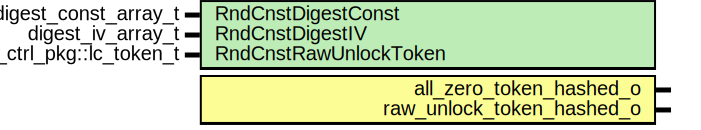

# Entity: otp_ctrl_token_const

- **File**: otp_ctrl_token_const.sv
## Diagram

## Description

Copyright lowRISC contributors.
 Licensed under the Apache License, Version 2.0, see LICENSE for details.
 SPDX-License-Identifier: Apache-2.0
 This module contains the hash post-image constants for the all-zero and raw unlock tokens.
 This implementation relies on constant propagation to precompute these constants from the
 random netlist constants at compile time, and hence does not contain any "real" logic.
 
## Generics

| Generic name          | Type                    | Value                        | Description                                                |
| --------------------- | ----------------------- | ---------------------------- | ---------------------------------------------------------- |
| RndCnstDigestConst    | digest_const_array_t    | RndCnstDigestConstDefault    | Compile time random constants, to be overriden by topgen.  |
| RndCnstDigestIV       | digest_iv_array_t       | RndCnstDigestIVDefault       |                                                            |
| RndCnstRawUnlockToken | lc_ctrl_pkg::lc_token_t | RndCnstRawUnlockTokenDefault |                                                            |
## Ports

| Port name                 | Direction | Type | Description |
| ------------------------- | --------- | ---- | ----------- |
| all_zero_token_hashed_o   | output    |      |             |
| raw_unlock_token_hashed_o | output    |      |             |
## Signals

| Name  | Type                                             | Description |
| ----- | ------------------------------------------------ | ----------- |
| data  | logic [NumHashes-1:0][1:0][ScrmblKeyWidth-1:0]   |             |
| state | logic [NumHashes-1:0][4:0][ScrmblBlockWidth-1:0] |             |
## Constants

| Name         | Type | Value | Description |
| ------------ | ---- | ----- | ----------- |
| NumHashes    | int  | 2     |             |
| AllZeroIdx   | int  | 0     |             |
| RawUnlockIdx | int  | 1     |             |
