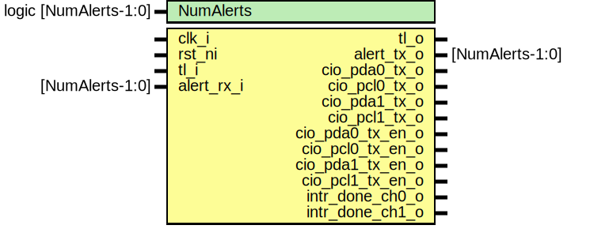

# Entity: pattgen

## Diagram

## Description

Copyright lowRISC contributors.
 Licensed under the Apache License, Version 2.0, see LICENSE for details.
 SPDX-License-Identifier: Apache-2.0
 
## Generics

| Generic name | Type                  | Value     | Description |
| ------------ | --------------------- | --------- | ----------- |
| NumAlerts    | logic [NumAlerts-1:0] | undefined |             |
## Ports

| Port name        | Direction | Type            | Description |
| ---------------- | --------- | --------------- | ----------- |
| clk_i            | input     |                 |             |
| rst_ni           | input     |                 |             |
| tl_i             | input     |                 |             |
| tl_o             | output    |                 |             |
| alert_rx_i       | input     | [NumAlerts-1:0] |             |
| alert_tx_o       | output    | [NumAlerts-1:0] |             |
| cio_pda0_tx_o    | output    |                 |             |
| cio_pcl0_tx_o    | output    |                 |             |
| cio_pda1_tx_o    | output    |                 |             |
| cio_pcl1_tx_o    | output    |                 |             |
| cio_pda0_tx_en_o | output    |                 |             |
| cio_pcl0_tx_en_o | output    |                 |             |
| cio_pda1_tx_en_o | output    |                 |             |
| cio_pcl1_tx_en_o | output    |                 |             |
| intr_done_ch0_o  | output    |                 |             |
| intr_done_ch1_o  | output    |                 |             |
## Signals

| Name       | Type                  | Description |
| ---------- | --------------------- | ----------- |
| alert_test | logic [NumAlerts-1:0] |             |
| alerts     | logic [NumAlerts-1:0] |             |
| reg2hw     | pattgen_reg2hw_t      |             |
| hw2reg     | pattgen_hw2reg_t      |             |
## Instantiations

- u_reg: pattgen_reg_top
- u_pattgen_core: pattgen_core
