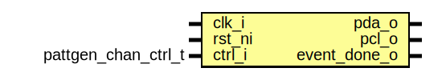

# Entity: pattgen_chan
## Diagram

## Description
Copyright lowRISC contributors.
 Licensed under the Apache License, Version 2.0, see LICENSE for details.
 SPDX-License-Identifier: Apache-2.0
 
## Ports
| Port name    | Direction | Type                | Description |
| ------------ | --------- | ------------------- | ----------- |
| clk_i        | input     |                     |             |
| rst_ni       | input     |                     |             |
| ctrl_i       | input     | pattgen_chan_ctrl_t |             |
| pda_o        | output    |                     |             |
| pcl_o        | output    |                     |             |
| event_done_o | output    |                     |             |
## Signals
| Name        | Type         | Description |
| ----------- | ------------ | ----------- |
| enable      | logic        |             |
| polarity_q  | logic        |             |
| prediv_q    | logic [31:0] |             |
| data_q      | logic [63:0] |             |
| len_q       | logic [5:0]  |             |
| reps_q      | logic [9:0]  |             |
| clk_en      | logic        |             |
| pcl_int_d   | logic        |             |
| pcl_int_q   | logic        |             |
| clk_cnt_d   | logic [31:0] |             |
| clk_cnt_q   | logic [31:0] |             |
| bit_cnt_en  | logic        |             |
| bit_cnt_d   | logic [5:0]  |             |
| bit_cnt_q   | logic [5:0]  |             |
| rep_cnt_en  | logic        |             |
| rep_cnt_d   | logic [9:0]  |             |
| rep_cnt_q   | logic [9:0]  |             |
| complete_en | logic        |             |
| complete_d  | logic        |             |
| complete_q  | logic        |             |
| complete_q2 | logic        |             |
## Processes
- unnamed: _( @(posedge clk_i or negedge rst_ni) )_

- unnamed: _( @(posedge clk_i or negedge rst_ni) )_

- unnamed: _( @(posedge clk_i or negedge rst_ni) )_

- unnamed: _( @(posedge clk_i or negedge rst_ni) )_

- unnamed: _( @(posedge clk_i or negedge rst_ni) )_

