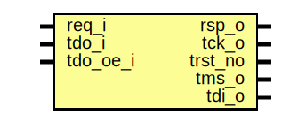

# Entity: pinmux_jtag_breakout

- **File**: pinmux_jtag_breakout.sv
## Diagram

## Description

 Copyright lowRISC contributors.
 Licensed under the Apache License, Version 2.0, see LICENSE for details.
 SPDX-License-Identifier: Apache-2.0

## Ports

| Port name | Direction | Type | Description |
| --------- | --------- | ---- | ----------- |
| req_i     | input     |      |             |
| rsp_o     | output    |      |             |
| tck_o     | output    |      |             |
| trst_no   | output    |      |             |
| tms_o     | output    |      |             |
| tdi_o     | output    |      |             |
| tdo_i     | input     |      |             |
| tdo_oe_i  | input     |      |             |
