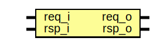

# Entity: pinmux_jtag_buf

## Diagram

## Description

Copyright lowRISC contributors.
 Licensed under the Apache License, Version 2.0, see LICENSE for details.
 SPDX-License-Identifier: Apache-2.0
 
## Ports

| Port name | Direction | Type | Description |
| --------- | --------- | ---- | ----------- |
| req_i     | input     |      |             |
| req_o     | output    |      |             |
| rsp_i     | input     |      |             |
| rsp_o     | output    |      |             |
## Instantiations

- prim_clock_buf_tck: prim_clock_buf
- prim_buf_trst_n: prim_buf
- prim_buf_tms: prim_buf
- prim_buf_tdi: prim_buf
- prim_buf_tdo: prim_buf
- prim_buf_tdo_oe: prim_buf
