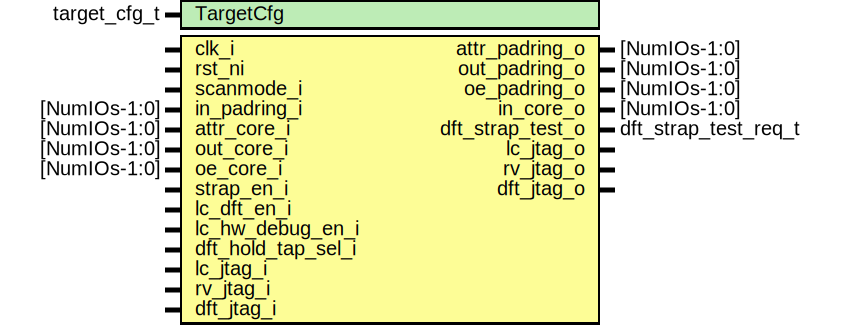

# Entity: pinmux_strap_sampling

## Diagram

## Description

Copyright lowRISC contributors.
 Licensed under the Apache License, Version 2.0, see LICENSE for details.
 SPDX-License-Identifier: Apache-2.0
 
## Generics

| Generic name | Type         | Value            | Description                                                                          |
| ------------ | ------------ | ---------------- | ------------------------------------------------------------------------------------ |
| TargetCfg    | target_cfg_t | DefaultTargetCfg | Taget-specific pinmux configuration passed down from the target-specific top-level.  |
## Ports

| Port name          | Direction | Type                 | Description                     |
| ------------------ | --------- | -------------------- | ------------------------------- |
| clk_i              | input     |                      |                                 |
| rst_ni             | input     |                      |                                 |
| scanmode_i         | input     |                      |                                 |
| attr_padring_o     | output    | [NumIOs-1:0]         | To padring side                 |
| out_padring_o      | output    | [NumIOs-1:0]         |                                 |
| oe_padring_o       | output    | [NumIOs-1:0]         |                                 |
| in_padring_i       | input     | [NumIOs-1:0]         |                                 |
| attr_core_i        | input     | [NumIOs-1:0]         | To core side                    |
| out_core_i         | input     | [NumIOs-1:0]         |                                 |
| oe_core_i          | input     | [NumIOs-1:0]         |                                 |
| in_core_o          | output    | [NumIOs-1:0]         |                                 |
| strap_en_i         | input     |                      | Used for TAP qualification      |
| lc_dft_en_i        | input     |                      |                                 |
| lc_hw_debug_en_i   | input     |                      |                                 |
| dft_strap_test_o   | output    | dft_strap_test_req_t | Sampled values for DFT straps   |
| dft_hold_tap_sel_i | input     |                      | Hold tap strap select           |
| lc_jtag_o          | output    |                      | Qualified JTAG signals for TAPs |
| lc_jtag_i          | input     |                      |                                 |
| rv_jtag_o          | output    |                      |                                 |
| rv_jtag_i          | input     |                      |                                 |
| dft_jtag_o         | output    |                      |                                 |
| dft_jtag_i         | input     |                      |                                 |
## Signals

| Name                | Type                       | Description                                                                                                 |
| ------------------- | -------------------------- | ----------------------------------------------------------------------------------------------------------- |
| lc_hw_debug_en      | lc_ctrl_pkg::lc_tx_t [1:0] |                                                                                                             |
| lc_dft_en           | lc_ctrl_pkg::lc_tx_t [1:0] |                                                                                                             |
| scanmode            | lc_ctrl_pkg::lc_tx_t [0:0] |                                                                                                             |
| dft_strap_valid_d   | logic                      |                                                                                                             |
| dft_strap_valid_q   | logic                      |                                                                                                             |
| lc_strap_sample_en  | logic                      |                                                                                                             |
| rv_strap_sample_en  | logic                      |                                                                                                             |
| dft_strap_sample_en | logic                      |                                                                                                             |
| tap_strap_d         | logic [NTapStraps-1:0]     |                                                                                                             |
| tap_strap_q         | logic [NTapStraps-1:0]     |                                                                                                             |
| dft_strap_d         | logic [NDFTStraps-1:0]     |                                                                                                             |
| dft_strap_q         | logic [NDFTStraps-1:0]     |                                                                                                             |
| tap_sampling_en     | logic                      | During dft enabled states, we continously sample all straps unless told not to do so by external dft logic  |
| dft_hold_tap_sel    | logic                      |                                                                                                             |
| jtag_en             | logic                      |                                                                                                             |
| tap_strap           | tap_strap_t                |                                                                                                             |
| jtag_req            | jtag_pkg::jtag_req_t       |                                                                                                             |
| lc_jtag_req         | jtag_pkg::jtag_req_t       |                                                                                                             |
| rv_jtag_req         | jtag_pkg::jtag_req_t       |                                                                                                             |
| dft_jtag_req        | jtag_pkg::jtag_req_t       |                                                                                                             |
| jtag_rsp            | jtag_pkg::jtag_rsp_t       |                                                                                                             |
| lc_jtag_rsp         | jtag_pkg::jtag_rsp_t       |                                                                                                             |
| rv_jtag_rsp         | jtag_pkg::jtag_rsp_t       |                                                                                                             |
| dft_jtag_rsp        | jtag_pkg::jtag_rsp_t       |                                                                                                             |
## Processes
- p_strap_sampling: (  )
- p_strap_sample: ( @(posedge clk_i or negedge rst_ni) )
- p_tap_mux: (  )
## Instantiations

- u_por_scanmode_sync: prim_lc_sync
- u_prim_lc_sync_rv: prim_lc_sync
- u_prim_lc_sync_dft: prim_lc_sync
- u_buf_hold_tap: prim_buf
- u_pinmux_jtag_buf_lc: pinmux_jtag_buf
**Description**
Insert hand instantiated buffers for
these signals to prevent further optimization.

- u_pinmux_jtag_buf_rv: pinmux_jtag_buf
- u_pinmux_jtag_buf_dft: pinmux_jtag_buf
- u_rst_por_aon_n_mux: prim_clock_mux2
**Description**
Note that this resets the selected TAP controller in
scanmode. If the TAP controller needs to be active during
reset, this reset bypass needs to be adapted accordingly.

