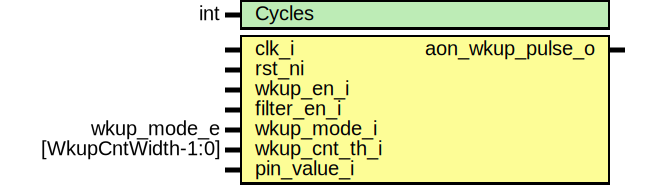

# Entity: pinmux_wkup
## Diagram

## Description
Copyright lowRISC contributors.
 Licensed under the Apache License, Version 2.0, see LICENSE for details.
 SPDX-License-Identifier: Apache-2.0
 
## Generics
| Generic name | Type | Value | Description |
| ------------ | ---- | ----- | ----------- |
| Cycles       | int  | 4     |             |
## Ports
| Port name          | Direction | Type               | Description                                                                                                                  |
| ------------------ | --------- | ------------------ | ---------------------------------------------------------------------------------------------------------------------------- |
| clk_i              | input     |                    |                                                                                                                              |
| rst_ni             | input     |                    |                                                                                                                              |
| clk_aon_i          | input     |                    | Always on clock / reset                                                                                                      |
| rst_aon_ni         | input     |                    |                                                                                                                              |
| wkup_en_i          | input     |                    | These signals get synchronized to theslow AON clock within this module. Note that wkup_en_i is assumed to be level encoded.  |
| filter_en_i        | input     |                    |                                                                                                                              |
| wkup_mode_i        | input     | wkup_mode_e        |                                                                                                                              |
| wkup_cnt_th_i      | input     | [WkupCntWidth-1:0] |                                                                                                                              |
| pin_value_i        | input     |                    |                                                                                                                              |
| wkup_cause_valid_i | input     |                    | Signals to/from cause register.They are synched to/from the AON clock internally                                             |
| wkup_cause_data_i  | input     |                    |                                                                                                                              |
| wkup_cause_data_o  | output    |                    |                                                                                                                              |
| aon_wkup_req_o     | output    |                    | This signal is running on the AON clockand is held high as long as the cause register has not been cleared.                  |
## Signals
| Name                 | Type                     | Description                                                                                                                                                            |
| -------------------- | ------------------------ | ---------------------------------------------------------------------------------------------------------------------------------------------------------------------- |
| aon_wkup_mode_q      | wkup_mode_e              |                                                                                                                                                                        |
| aon_filter_en_q      | logic                    |                                                                                                                                                                        |
| aon_wkup_en_d        | logic                    |                                                                                                                                                                        |
| aon_wkup_en_q        | logic                    |                                                                                                                                                                        |
| aon_wkup_cnt_th_q    | logic [WkupCntWidth-1:0] |                                                                                                                                                                        |
| aon_filter_out       | logic                    | This uses a lower value for filtering than GPIO since the always-on clock is slower. This can be disabled, in which case the signal is just combinationally bypassed.  |
| aon_filter_out_d     | logic                    | This uses a lower value for filtering than GPIO since the always-on clock is slower. This can be disabled, in which case the signal is just combinationally bypassed.  |
| aon_filter_out_q     | logic                    | This uses a lower value for filtering than GPIO since the always-on clock is slower. This can be disabled, in which case the signal is just combinationally bypassed.  |
| aon_rising           | logic                    |                                                                                                                                                                        |
| aon_falling          | logic                    |                                                                                                                                                                        |
| aon_cnt_en           | logic                    |                                                                                                                                                                        |
| aon_cnt_eq_th        | logic                    |                                                                                                                                                                        |
| aon_cnt_d            | logic [WkupCntWidth-1:0] |                                                                                                                                                                        |
| aon_cnt_q            | logic [WkupCntWidth-1:0] |                                                                                                                                                                        |
| aon_wkup_pulse       | logic                    |                                                                                                                                                                        |
| aon_wkup_cause_valid | logic                    | to AON domain                                                                                                                                                          |
| aon_wkup_cause_data  | logic                    | to AON domain                                                                                                                                                          |
| aon_wkup_cause_d     | logic                    |                                                                                                                                                                        |
| aon_wkup_cause_q     | logic                    |                                                                                                                                                                        |
## Processes
- p_sync: _( @(posedge clk_aon_i or negedge rst_aon_ni) )_

- p_mode: _(  )_

- p_aon_pattern: _( @(posedge clk_aon_i or negedge rst_aon_ni) )_

- p_aon_cause: _( @(posedge clk_aon_i or negedge rst_aon_ni) )_

## Instantiations
- i_prim_flop_2sync_config: prim_flop_2sync
- i_prim_filter: prim_filter
- i_prim_flop_2sync_filter: prim_flop_2sync
**Description**
Run this through a 2 stage synchronizer to
prevent metastability.

- i_prim_flop_2sync_cause_in: prim_flop_2sync
- i_prim_pulse_sync_cause: prim_pulse_sync
- i_prim_flop_2sync_cause_out: prim_flop_2sync
**Description**
output to CSR

