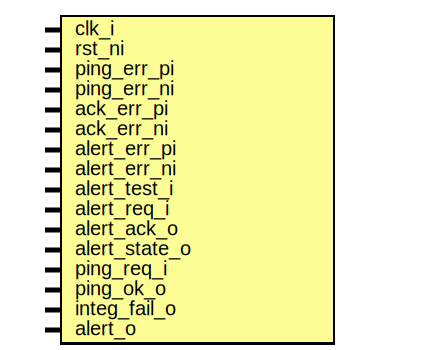

# Entity: prim_alert_rxtx_assert_fpv

- **File**: prim_alert_rxtx_assert_fpv.sv
## Diagram

## Description

 Copyright lowRISC contributors.
 Licensed under the Apache License, Version 2.0, see LICENSE for details.
 SPDX-License-Identifier: Apache-2.0

 Assertions for alert sender/receiver pair. Intended to use with
 a formal tool.

## Ports

| Port name     | Direction | Type | Description                      |
| ------------- | --------- | ---- | -------------------------------- |
| clk_i         | input     |      |                                  |
| rst_ni        | input     |      |                                  |
| ping_err_pi   | input     |      |  for sigint error injection only |
| ping_err_ni   | input     |      |                                  |
| ack_err_pi    | input     |      |                                  |
| ack_err_ni    | input     |      |                                  |
| alert_err_pi  | input     |      |                                  |
| alert_err_ni  | input     |      |                                  |
| alert_test_i  | input     |      |  normal I/Os                     |
| alert_req_i   | input     |      |                                  |
| alert_ack_o   | input     |      |                                  |
| alert_state_o | input     |      |                                  |
| ping_req_i    | input     |      |                                  |
| ping_ok_o     | input     |      |                                  |
| integ_fail_o  | input     |      |                                  |
| alert_o       | input     |      |                                  |
## Signals

| Name                                   | Type                | Description |
| -------------------------------------- | ------------------- | ----------- |
| error_present                          | logic               |             |
|                                        | endsequence         |             |
| alert_o                                | prim_alert_rxtx_fpv |             |
| clk_i                                  | prim_alert_rxtx_fpv |             |
| !rst_ni || error_present || ping_req_i | prim_alert_rxtx_fpv |             |
