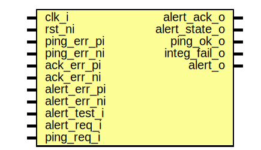

# Entity: prim_alert_rxtx_fatal_fpv

- **File**: prim_alert_rxtx_fatal_fpv.sv
## Diagram

## Description

Copyright lowRISC contributors.
 Licensed under the Apache License, Version 2.0, see LICENSE for details.
 SPDX-License-Identifier: Apache-2.0
 Testbench module for alert sender/receiver pair. Intended to use with
 a formal tool.
 
## Ports

| Port name     | Direction | Type | Description                     |
| ------------- | --------- | ---- | ------------------------------- |
| clk_i         | input     |      |                                 |
| rst_ni        | input     |      |                                 |
| ping_err_pi   | input     |      | for sigint error injection only |
| ping_err_ni   | input     |      |                                 |
| ack_err_pi    | input     |      |                                 |
| ack_err_ni    | input     |      |                                 |
| alert_err_pi  | input     |      |                                 |
| alert_err_ni  | input     |      |                                 |
| alert_test_i  | input     |      | normal I/Os                     |
| alert_req_i   | input     |      |                                 |
| ping_req_i    | input     |      |                                 |
| alert_ack_o   | output    |      |                                 |
| alert_state_o | output    |      |                                 |
| ping_ok_o     | output    |      |                                 |
| integ_fail_o  | output    |      |                                 |
| alert_o       | output    |      |                                 |
## Signals

| Name         | Type       | Description |
| ------------ | ---------- | ----------- |
| alert_rx_out | alert_rx_t |             |
| alert_rx_in  | alert_rx_t |             |
| alert_tx_out | alert_tx_t |             |
| alert_tx_in  | alert_tx_t |             |
## Constants

| Name    | Type | Value | Description       |
| ------- | ---- | ----- | ----------------- |
| AsyncOn | bit  | 1'b0  | synchronous case  |
| IsFatal | bit  | 1'b1  |                   |
## Instantiations

- i_prim_alert_sender: prim_alert_sender
- i_prim_alert_receiver: prim_alert_receiver
