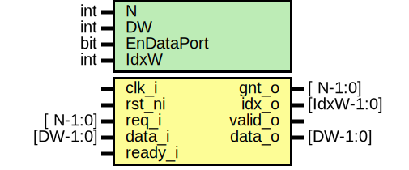

# Entity: prim_arbiter_fixed

- **File**: prim_arbiter_fixed.sv
## Diagram

## Description

 Copyright lowRISC contributors.
 Licensed under the Apache License, Version 2.0, see LICENSE for details.
 SPDX-License-Identifier: Apache-2.0

 N:1 fixed priority arbiter module (index 0 has highest prio)

 Verilog parameter
   N:           Number of request ports
   DW:          Data width
   DataPort:    Set to 1 to enable the data port. Otherwise that port will be ignored.

 See also: prim_arbiter_ppc, prim_arbiter_tree

## Generics

| Generic name | Type | Value     | Description                                                            |
| ------------ | ---- | --------- | ---------------------------------------------------------------------- |
| N            | int  | 8         |                                                                        |
| DW           | int  | 32        |                                                                        |
| EnDataPort   | bit  | 1         |  Configurations  EnDataPort: {0, 1}, if 0, input data will be ignored  |
| IdxW         | int  | $clog2(N) |  Derived parameters                                                    |
## Ports

| Port name | Direction | Type       | Description               |
| --------- | --------- | ---------- | ------------------------- |
| clk_i     | input     |            |  used for assertions only |
| rst_ni    | input     |            |                           |
| req_i     | input     | [ N-1:0]   |                           |
| data_i    | input     | [DW-1:0]   |                           |
| gnt_o     | output    | [ N-1:0]   |                           |
| idx_o     | output    | [IdxW-1:0] |                           |
| valid_o   | output    |            |                           |
| data_o    | output    | [DW-1:0]   |                           |
| ready_i   | input     |            |                           |
## Constants

| Name | Type | Value     | Description          |
| ---- | ---- | --------- | -------------------- |
| IdxW | int  | $clog2(N) |  Derived parameters  |
