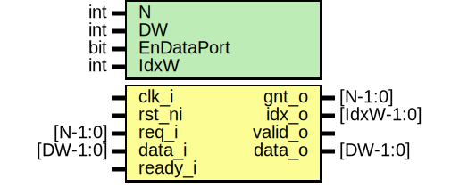

# Entity: prim_arbiter_fixed_fpv
## Diagram

## Description
Copyright lowRISC contributors.
 Licensed under the Apache License, Version 2.0, see LICENSE for details.
 SPDX-License-Identifier: Apache-2.0
 Testbench module for prim_arbiter_fixed.
 Intended to be used with a formal tool.
 
## Generics
| Generic name | Type | Value     | Description |
| ------------ | ---- | --------- | ----------- |
| N            | int  | 8         |             |
| DW           | int  | 32        |             |
| EnDataPort   | bit  | 1         |             |
| IdxW         | int  | $clog2(N) |             |
## Ports
| Port name | Direction | Type       | Description |
| --------- | --------- | ---------- | ----------- |
| clk_i     | input     |            |             |
| rst_ni    | input     |            |             |
| req_i     | input     | [N-1:0]    |             |
| data_i    | input     | [DW-1:0]   |             |
| gnt_o     | output    | [N-1:0]    |             |
| idx_o     | output    | [IdxW-1:0] |             |
| valid_o   | output    |            |             |
| data_o    | output    | [DW-1:0]   |             |
| ready_i   | input     |            |             |
## Constants
| Name | Type | Value     | Description |
| ---- | ---- | --------- | ----------- |
| IdxW | int  | $clog2(N) |             |
## Instantiations
- i_prim_arbiter_fixed: prim_arbiter_fixed
