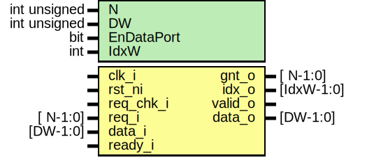

# Entity: prim_arbiter_ppc

- **File**: prim_arbiter_ppc.sv
## Diagram

## Description

 Copyright lowRISC contributors.
 Licensed under the Apache License, Version 2.0, see LICENSE for details.
 SPDX-License-Identifier: Apache-2.0

 N:1 arbiter module

 Verilog parameter
   N:           Number of request ports
   DW:          Data width
   DataPort:    Set to 1 to enable the data port. Otherwise that port will be ignored.

 This is the original implementation of the arbiter which relies on parallel prefix computing
 optimization to optimize the request / arbiter tree. Not all synthesis tools may support this.

 Note that the currently winning request is held if the data sink is not ready. This behavior is
 required by some interconnect protocols (AXI, TL). The module contains an assertion that checks
 this behavior.

 Also, this module contains a request stability assertion that checks that requests stay asserted
 until they have been served. This assertion can be gated by driving the req_chk_i low. This is
 a non-functional input and does not affect the designs behavior.

 See also: prim_arbiter_tree

## Generics

| Generic name | Type         | Value     | Description                                                            |
| ------------ | ------------ | --------- | ---------------------------------------------------------------------- |
| N            | int unsigned | 8         |                                                                        |
| DW           | int unsigned | 32        |                                                                        |
| EnDataPort   | bit          | 1         |  Configurations  EnDataPort: {0, 1}, if 0, input data will be ignored  |
| IdxW         | int          | $clog2(N) |  Derived parameters                                                    |
## Ports

| Port name | Direction | Type       | Description                                          |
| --------- | --------- | ---------- | ---------------------------------------------------- |
| clk_i     | input     |            |                                                      |
| rst_ni    | input     |            |                                                      |
| req_chk_i | input     |            | Used for gating assertions. Drive to 1 during normal |
| req_i     | input     | [ N-1:0]   |  operation.                                          |
| data_i    | input     | [DW-1:0]   |                                                      |
| gnt_o     | output    | [ N-1:0]   |                                                      |
| idx_o     | output    | [IdxW-1:0] |                                                      |
| valid_o   | output    |            |                                                      |
| data_o    | output    | [DW-1:0]   |                                                      |
| ready_i   | input     |            |                                                      |
## Signals

| Name           | Type         | Description                                     |
| -------------- | ------------ | ----------------------------------------------- |
| unused_req_chk | logic        |  req_chk_i is used for gating assertions only.  |
| k              | int unsigned |  symbolic variables                             |
| ReadyIsStable  | bit          |                                                 |
| ReqsAreStable  | bit          |                                                 |
## Constants

| Name | Type | Value     | Description          |
| ---- | ---- | --------- | -------------------- |
| IdxW | int  | $clog2(N) |  Derived parameters  |
