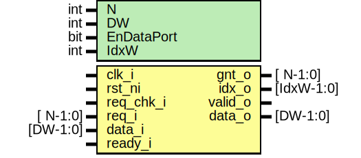

# Entity: prim_arbiter_tree

- **File**: prim_arbiter_tree.sv
## Diagram

## Description

 Copyright lowRISC contributors.
 Licensed under the Apache License, Version 2.0, see LICENSE for details.
 SPDX-License-Identifier: Apache-2.0

 N:1 arbiter module

 Verilog parameter
   N:           Number of request ports
   DW:          Data width
   DataPort:    Set to 1 to enable the data port. Otherwise that port will be ignored.

 This is a tree implementation of a round robin arbiter. It has the same behavior as the PPC
 implementation in prim_arbiter_ppc, and also uses a prefix summing approach to determine the next
 request to be granted. The main difference with respect to the PPC arbiter is that the leading 1
 detection and the prefix summation are performed with a binary tree instead of a sequential loop.
 Also, if the data port is enabled, the data is muxed based on the local arbitration decisions  at
 each node of the arbiter tree. This means that the data can propagate through the tree
 simultaneously with the requests, instead of waiting for the arbitration to determine the winner
 index first. As a result, this design has a shorter critical path than other implementations,
 leading to better ovberall timing.

 Note that the currently winning request is held if the data sink is not ready. This behavior is
 required by some interconnect protocols (AXI, TL). The module contains an assertion that checks
 this behavior.

 Also, this module contains a request stability assertion that checks that requests stay asserted
 until they have been served. This assertion can be gated by driving the req_chk_i low. This is
 a non-functional input and does not affect the designs behavior.

 See also: prim_arbiter_ppc

## Generics

| Generic name | Type | Value     | Description                                                            |
| ------------ | ---- | --------- | ---------------------------------------------------------------------- |
| N            | int  | 8         |                                                                        |
| DW           | int  | 32        |                                                                        |
| EnDataPort   | bit  | 1         |  Configurations  EnDataPort: {0, 1}, if 0, input data will be ignored  |
| IdxW         | int  | $clog2(N) |  Derived parameters                                                    |
## Ports

| Port name | Direction | Type       | Description                                          |
| --------- | --------- | ---------- | ---------------------------------------------------- |
| clk_i     | input     |            |                                                      |
| rst_ni    | input     |            |                                                      |
| req_chk_i | input     |            | Used for gating assertions. Drive to 1 during normal |
| req_i     | input     | [ N-1:0]   |  operation.                                          |
| data_i    | input     | [DW-1:0]   |                                                      |
| gnt_o     | output    | [ N-1:0]   |                                                      |
| idx_o     | output    | [IdxW-1:0] |                                                      |
| valid_o   | output    |            |                                                      |
| data_o    | output    | [DW-1:0]   |                                                      |
| ready_i   | input     |            |                                                      |
## Signals

| Name           | Type         | Description                                     |
| -------------- | ------------ | ----------------------------------------------- |
| unused_req_chk | logic        |  req_chk_i is used for gating assertions only.  |
| k              | int unsigned |  symbolic variables                             |
| ReadyIsStable  | bit          |                                                 |
| ReqsAreStable  | bit          |                                                 |
## Constants

| Name | Type | Value     | Description          |
| ---- | ---- | --------- | -------------------- |
| IdxW | int  | $clog2(N) |  Derived parameters  |
