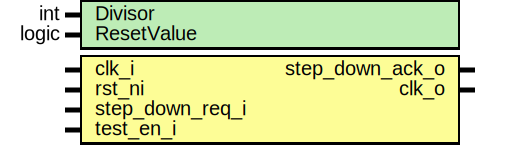

# Entity: prim_clock_div

- **File**: prim_clock_div.sv
## Diagram

## Description

 Copyright lowRISC contributors.
 Licensed under the Apache License, Version 2.0, see LICENSE for details.
 SPDX-License-Identifier: Apache-2.0

## Generics

| Generic name | Type  | Value | Description |
| ------------ | ----- | ----- | ----------- |
| Divisor      | int   | 2     |             |
| ResetValue   | logic | 0     |             |
## Ports

| Port name       | Direction | Type | Description             |
| --------------- | --------- | ---- | ----------------------- |
| clk_i           | input     |      |                         |
| rst_ni          | input     |      |                         |
| step_down_req_i | input     |      | step down divisor by 2x |
| step_down_ack_o | output    |      | step down acknowledge   |
| test_en_i       | input     |      |                         |
| clk_o           | output    |      |                         |
## Signals

| Name          | Type  | Description                                                                                                        |
| ------------- | ----- | ------------------------------------------------------------------------------------------------------------------ |
| step_down_req | logic |  It is assumed the flops in this module are NOT on the scan-chain, as a result only  the input values are guarded  |
| clk_int       | logic |                                                                                                                    |
| clk_muxed     | logic |  anchor points for constraints                                                                                     |
## Instantiations

- u_clk_mux: prim_clock_mux2
- u_clk_div_buf: prim_clock_buf
