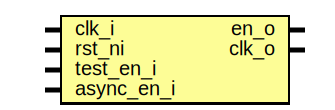

# Entity: prim_clock_gating_sync

- **File**: prim_clock_gating_sync.sv
## Diagram

## Description

 Copyright lowRISC contributors.
 Licensed under the Apache License, Version 2.0, see LICENSE for details.
 SPDX-License-Identifier: Apache-2.0

 Common Library: Clock Gating cell with synchronizer

## Ports

| Port name  | Direction | Type | Description |
| ---------- | --------- | ---- | ----------- |
| clk_i      | input     |      |             |
| rst_ni     | input     |      |             |
| test_en_i  | input     |      |             |
| async_en_i | input     |      |             |
| en_o       | output    |      |             |
| clk_o      | output    |      |             |
## Instantiations

- i_sync: prim_flop_2sync
- i_cg: prim_clock_gating
