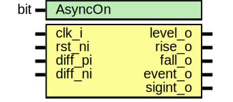

# Entity: prim_diff_decode

- **File**: prim_diff_decode.sv
## Diagram

## Description

Copyright lowRISC contributors.
 Licensed under the Apache License, Version 2.0, see LICENSE for details.
 SPDX-License-Identifier: Apache-2.0
 This module decodes a differentially encoded signal and detects
 incorrectly encoded differential states.
 In case the differential pair crosses an asynchronous boundary, it has
 to be re-synchronized to the local clock. This can be achieved by
 setting the AsyncOn parameter to 1'b1. In that case, two additional
 input registers are added (to counteract metastability), and
 a pattern detector is instantiated that detects skewed level changes on
 the differential pair (i.e., when level changes on the diff pair are
 sampled one cycle apart due to a timing skew between the two wires).
 See also: prim_alert_sender, prim_alert_receiver, alert_handler
 
## Generics

| Generic name | Type | Value | Description                               |
| ------------ | ---- | ----- | ----------------------------------------- |
| AsyncOn      | bit  | 1'b0  | enables additional synchronization logic  |
## Ports

| Port name | Direction | Type | Description                      |
| --------- | --------- | ---- | -------------------------------- |
| clk_i     | input     |      |                                  |
| rst_ni    | input     |      |                                  |
| diff_pi   | input     |      | input diff pair                  |
| diff_ni   | input     |      |                                  |
| level_o   | output    |      | logical level anddetected edges  |
| rise_o    | output    |      |                                  |
| fall_o    | output    |      |                                  |
| event_o   | output    |      | either rise or fall              |
| sigint_o  | output    |      |                                  |
## Signals

| Name    | Type  | Description |
| ------- | ----- | ----------- |
| level_d | logic |             |
| level_q | logic |             |
